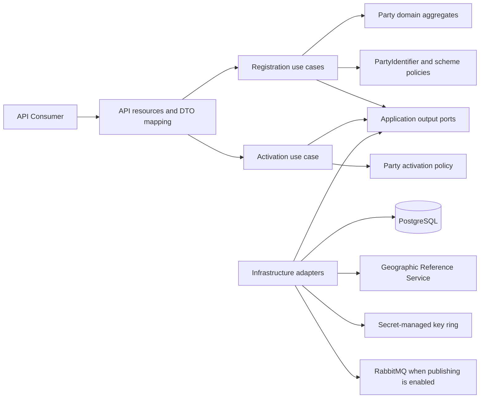
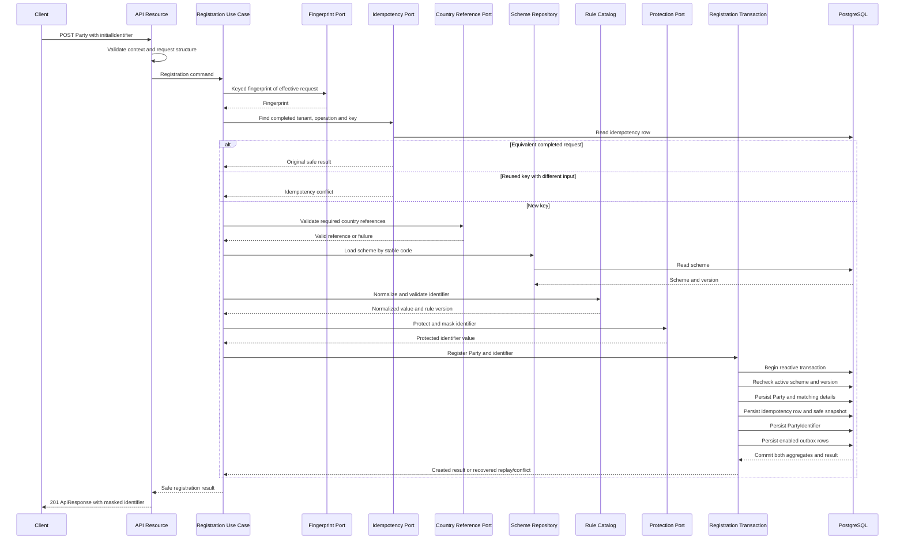
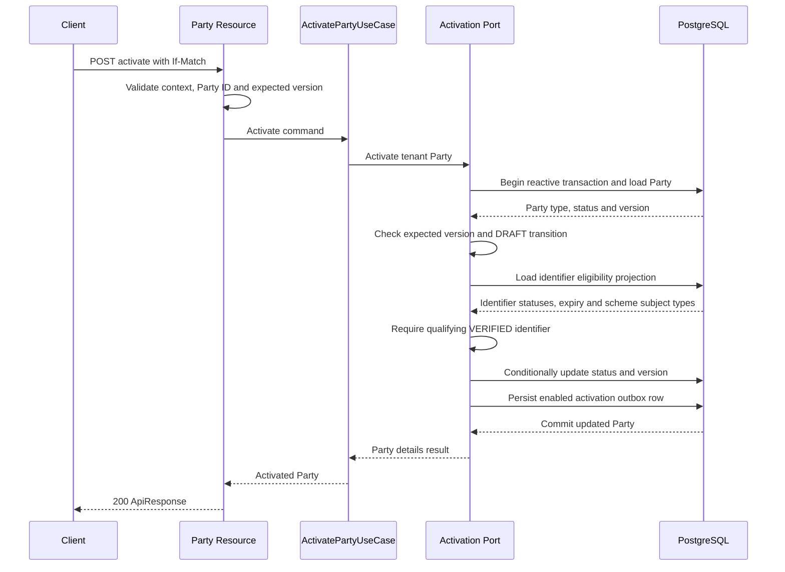

## Context

The service currently implements only natural-person create, retrieve, replace, and patch operations. Natural-person creation validates optional country data, creates a `NaturalPerson` aggregate in `DRAFT`, and persists the Party plus a versioned idempotency snapshot through one Hibernate Reactive transaction. The Java request, command, application result, response, and snapshot do not yet contain an official identifier. Legal-entity creation, Party activation, identifier-scheme lookup, Party-Identifier behavior, identifier protection, and outbox persistence/publication have no production Java implementation.

The approved OpenAPI contract now requires one `initialIdentifier` for `POST /v1/natural-person` and the planned `POST /v1/legal-entity`. Their `201` responses contain the created Party plus a protected identifier projection. The contract also requires a qualifying `VERIFIED` identifier before `POST /v1/parties/{partyId}/activate` can move a Party from `DRAFT` to `ACTIVE`.

The immutable `V1__create_party_registry_schema.sql` migration already defines `identifier_schemes`, `party_identifiers`, their statuses and uniqueness indexes, and `party_outbox_events`. The immutable `V2__create_api_idempotency_records.sql` migration already provides an operation-scoped request fingerprint and versioned JSON result snapshot. No core table is missing, but a fresh database contains no active identifier-scheme reference data. Production scheme values must come from an independently approved catalog; this design does not invent jurisdiction-specific schemes.

The service explicitly uses strict Clean Architecture and an end-to-end reactive execution model. Domain behavior remains synchronous and framework independent. Application orchestration and I/O ports may use Mutiny. Database access must use Hibernate Reactive, and Flyway remains the only schema and production reference-data authority.

## Requirements Traceability

| Requirement | Design Element |
|---|---|
| Initial official identifier is mandatory | Create request DTOs, API validation, registration commands |
| Initial identifier scheme eligibility | `IdentifierScheme`, scheme policy, `IdentifierSchemeRepository` |
| Initial identifier semantic validity | Identifier rule catalog, identifier validity policy |
| Party and initial identifier creation is all-or-nothing | Registration use cases, `IdempotentPartyRegistrationPort`, reactive transaction adapter |
| Initial identifier confidentiality | Identifier protection adapter, safe application/API results, safe event payloads |
| Tenant-scoped initial identifier uniqueness | Tenant-derived fingerprint, existing partial unique index, conflict translation |
| Idempotent Party registration includes the initial identifier | Keyed registration fingerprint, preflight lookup, version-two safe snapshots, race recovery |
| Party creation success response includes the protected identifier | Create-only response DTOs and API mapper |
| Additional identifiers remain independently registrable | `RegisterPartyIdentifierUseCase`, existing nested identifier endpoint |
| Activation requires a qualifying verified identifier | `PartyActivationPolicy`, activation state query and transaction adapter |
| Party activation transition | `ActivatePartyUseCase`, Party lifecycle policy |
| Activation optimistic concurrency | Required `If-Match`, conditional Party version update |
| Activation is tenant-scoped | Tenant-qualified activation lookup and not-found concealment |
| Activation has one observable outcome | Activation transaction and outbox candidate storage |

## Goals / Non-Goals

**Goals:**

- Make natural-person and legal-entity registration comply with the required initial-identifier contract.
- Preserve Party and PartyIdentifier as independent domain and lifecycle aggregates while coordinating their initial persistence atomically.
- Reuse the existing identifier, idempotency, and outbox tables without changing `V1` or `V2`.
- Prevent plaintext or reversibly exposed identifier material in responses, logs, traces, events, and idempotency snapshots.
- Preserve replay-before-validation behavior without storing an unkeyed digest of the complete identifier.
- Enforce tenant-scoped active-identifier uniqueness and deterministic concurrency outcomes.
- Implement Party activation with verified-identifier eligibility, tenant isolation, and optimistic concurrency.
- Preserve native-image compatibility and event-loop safety.

**Non-Goals:**

- Merge PartyIdentifier into the NaturalPerson or LegalEntity aggregate.
- Implement automatic document verification or integrate an external verification authority.
- Define or seed jurisdiction-specific identifier schemes without an approved catalog.
- Implement legal-entity operations other than the create operation required by this change.
- Change natural-person GET, PUT, or PATCH response shapes.
- Require an identifier to be primary for activation; the approved requirement accepts any qualifying verified identifier.
- Automatically deactivate an active Party if its last qualifying identifier later expires or is revoked.
- Design HMAC-index key rotation, identifier prefix search, or bulk re-encryption.
- Backfill or delete existing Parties that have no identifier.

## Architecture

The API continues to expose type-specific Party creation operations. Each resource maps the request to an application registration command. A type-specific registration use case coordinates Party validation, identifier scheme policy, protection, idempotency, and a single use-case-specific persistence port. That port persists both aggregate roots without turning one into a child of the other.



- Domain owns Party type, lifecycle, identifier eligibility, identifier validity, and PartyIdentifier lifecycle invariants.
- Application owns registration and activation workflows, command equivalence, failure precedence, and atomic-operation contracts.
- API owns structural validation, HTTP parsing, response DTOs, success envelopes, and translation to stable response codes.
- Infrastructure owns Hibernate mappings, transaction execution, cryptographic primitives and key configuration, catalog queries, outbox delivery, and technology-failure translation.

No domain type depends on Mutiny, Quarkus, Hibernate, Jackson, HTTP, cryptographic providers, or response-envelope types. `PartyEntity` does not cascade PartyIdentifier persistence.

## Components and Responsibilities

### NaturalPerson and LegalEntity

**Responsibility:** Represent the two Party aggregate forms with immutable Party type, matching details, lifecycle status, aggregate version, and audit information.

**Collaborators:** Party value objects, type-specific detail values, lifecycle policies.

`NaturalPerson` remains the natural-person Party aggregate. A new `LegalEntity` aggregate follows the same Party identity, status, version, and audit rules and owns only `LegalEntityDetails`. Both factories initialize status `DRAFT` and version `0`. Neither aggregate contains PartyIdentifier objects.

### IdentifierScheme

**Responsibility:** Represent the stable identifier-scheme identity and the rules required to determine registration eligibility.

**Collaborators:** `PartyType`, identifier subject type, category, scheme status, and rule catalog.

The model exposes synchronous policies for `ACTIVE` registration eligibility, Party-type compatibility, normalized length limits, expiration requirements, and scheme version. Registration length checks apply to the normalized value. An active scheme referencing an unsupported normalizer or validator key is treated as an internal catalog invariant failure rather than invalid client data.

### PartyIdentifier

**Responsibility:** Represent one independently versioned official identifier and enforce its initial status, validity dates, audit state, and safe protected-value representation.

**Collaborators:** Identifier identity and version values, `IdentifierScheme`, `ProtectedIdentifierValue`, identifier lifecycle policy.

The creation factory requires an identifier ID, tenant and Party identity, scheme identity, protected value, optional issuer and validity metadata, initial `PENDING_VERIFICATION` status, version `0`, and audit subject. The aggregate stores no plaintext or normalized plaintext. `isPrimary` preserves the request value and defaults to `false`; activation does not depend on it.

### Identifier Rule Catalog

**Responsibility:** Resolve versioned, pure normalizer and validator strategies by the stable keys held by an active scheme.

**Collaborators:** `IdentifierScheme` and synchronous domain policies.

Normalizers and validators are deterministic, side-effect-free strategies. The normalized value exists only in request memory long enough to validate, fingerprint, encrypt, and mask the identifier. Supported keys are explicit and covered by contract fixtures; reflective class loading or executable expressions from database values are forbidden.

### Registration Fingerprint Port

**Responsibility:** Produce a keyed, deterministic fingerprint for idempotency comparison without exposing low-entropy identifier values through an offline digest.

**Collaborators:** Natural-person and legal-entity registration commands, secret-managed idempotency MAC key.

The canonical form includes operation, tenant, all effective Party fields, scheme code, exact submitted identifier value, issuer, dates, and effective `isPrimary`. It excludes `Idempotency-Key`, user, process, and generated IDs. Exact submitted identifier formatting is significant for idempotency so a completed replay never needs the current scheme or normalizer. Fingerprint comparison uses constant-time byte comparison.

### Identifier Protection Port

**Responsibility:** Convert a validated complete and normalized identifier into the opaque values required for secure persistence and safe presentation.

**Collaborators:** Key configuration, tenant and aggregate IDs, scheme ID, normalization version.

The port returns ciphertext, encryption key version, tenant-isolated normalized fingerprint, normalization version, and masked value. It never returns secrets and does not log inputs. The initial adapter uses local Java cryptography with keys loaded from a secret provider at startup, so request processing performs no blocking key lookup.

### CreateNaturalPersonUseCase and CreateLegalEntityUseCase

**Responsibility:** Coordinate idempotent Party registration as returned `Uni` pipelines.

**Collaborators:** Registration fingerprint, completed-result lookup, country reference port, scheme repository, rule catalog, protection port, clock, UUIDv7 generator, and atomic registration port.

Both use cases apply the same ordering:

1. Compute the keyed fingerprint and resolve a completed current-operation result.
2. Reject reuse of a legacy natural-person idempotency key because the new request cannot be equivalent to the identifier-free contract.
3. For a new key, validate Party domain data and required country references outside a database transaction.
4. Load the scheme by stable code, require `ACTIVE` and compatible subject type, and apply identifier rules.
5. Generate Party and identifier IDs, protect the identifier, and build two independent aggregates.
6. Submit the complete registration candidate to one atomic persistence port.

The use cases return composite application results. They do not return API DTOs or response envelopes.

### RegisterPartyIdentifierUseCase

**Responsibility:** Reuse scheme validation and protection for post-creation identifiers without recreating or reclassifying the Party.

**Collaborators:** Party query port, scheme repository, rule catalog, protection port, identifier registration port.

The existing nested endpoint delegates to this use case. The Party type is loaded tenant-safely and used for scheme compatibility. The identifier remains a separate aggregate and starts in `PENDING_VERIFICATION`.

### ActivatePartyUseCase

**Responsibility:** Coordinate tenant-scoped activation using the expected Party version and verified-identifier requirement.

**Collaborators:** Clock, lifecycle policy, activation persistence port, outbox policy.

The use case delegates the read-check-update unit to one transactional port so a separate repository session cannot invalidate the expected-version decision. Failure precedence is Party absence, stale version, invalid lifecycle transition, then missing qualifying identifier.

### API Resources and Mappers

**Responsibility:** Enforce structural contracts and map application outcomes to shared API envelopes.

**Collaborators:** Registration and activation use cases, API error translator, `ResponseManager`.

- `NaturalPersonCreateRequest` gains a required nested `InitialPartyIdentifierCreateRequest` validated with `@NotNull` and `@Valid`.
- A new `NaturalPersonCreateResponse` combines the existing natural-person response with `InitialPartyIdentifierResponse`; GET, PUT, and PATCH retain `NaturalPersonResponse`.
- A new `LegalEntityResource` implements the create operation with corresponding request and create-response DTOs.
- `PartyIdentifierResource` implements additional identifier registration through the existing nested path.
- `PartyResource` implements activation and parses required `If-Match` consistently with existing update endpoints.
- Every business JSON method returns `Uni<RestResponse<ApiResponse<T>>>` and creates success responses through the CDI-managed `ResponseManager`.

### Persistence Adapters

**Responsibility:** Map independent aggregates and execute use-case-specific reactive transactions.

**Collaborators:** Hibernate Reactive session factory, persistence entities and mappers, idempotency snapshots, outbox candidates.

New persistence mappings cover `LegalEntityDetailsEntity`, `IdentifierSchemeEntity`, `PartyIdentifierEntity`, and `PartyOutboxEventEntity`. `PartyEntity` may map either type-specific one-to-one detail but does not own identifiers. A generalized registration adapter replaces the natural-person-only creation adapter while preserving its completed-result preflight and unique-key recovery behavior.

### Outbox Publisher

**Responsibility:** Deliver enabled stored events without changing business transaction outcomes.

**Collaborators:** Outbox repository, reactive scheduler, RabbitMQ connector, event-mode configuration.

Registration creates candidates for `party.created.v1` and `party.identifier-created.v1`; activation creates `party.activated.v1`. Configuration decides whether each candidate is disabled, stored only, or published. One outbox row is stored for each enabled aggregate/event identity. Publication remains at least once; a stable event ID and aggregate identity allow consumers to deduplicate deliveries.

## Interfaces and Contracts

### REST API

| Method | Path | Application input | Success data |
|---|---|---|---|
| `POST` | `/v1/natural-person` | Natural-person fields, required initial identifier, idempotency and request context | `NaturalPersonCreateResponse` |
| `POST` | `/v1/legal-entity` | Legal-entity fields, required initial identifier, idempotency and request context | `LegalEntityCreateResponse` |
| `POST` | `/v1/parties/{partyId}/identifiers` | Existing Party ID and additional identifier | `PartyIdentifierResponse` |
| `POST` | `/v1/parties/{partyId}/activate` | Party ID, expected version and request context | `PartyDetailResponse` |

Create response DTOs expose identifier ID, Party ID, scheme ID and code, masked value, status, `isPrimary`, safe issuer/validity/verification metadata, version, and timestamps. They contain no ciphertext, key versions, normalized value, fingerprint, or complete value.

### Application Ports

The application defines capability-oriented contracts rather than technology-oriented repositories:

```java
interface IdentifierSchemeRepository {
    Uni<IdentifierScheme> findByCode(String code);
}

interface RegistrationFingerprintPort {
    String fingerprint(PartyRegistrationCommand command);
}

interface IdentifierProtectionPort {
    ProtectedIdentifierValue protect(IdentifierProtectionRequest request);
}

interface IdempotentPartyRegistrationPort {
    Uni<Optional<PartyRegistrationResult>> findCompleted(
            TenantId tenantId, String operation, String key, String fingerprint);

    Uni<PartyRegistrationResult> registerNaturalPerson(
            NaturalPersonRegistrationCandidate candidate);

    Uni<PartyRegistrationResult> registerLegalEntity(
            LegalEntityRegistrationCandidate candidate);
}

interface PartyActivationPort {
    Uni<PartyDetailsResult> activate(ActivatePartyCommand command);
}
```

The exact Java type layout may use sealed application command/result interfaces to share behavior without exposing persistence entities. The ports return transport-neutral failures and never expose Hibernate sessions, SQL errors, cryptographic provider types, or API envelopes.

### Integration Events

Event payloads remain minimal and versioned:

- `party.created.v1`: Party aggregate, version `0`, payload containing only `partyType` as required by the existing database constraint.
- `party.identifier-created.v1`: PartyIdentifier aggregate, version `0`, payload containing Party ID, scheme code, and `PENDING_VERIFICATION` status; no complete value, normalized value, ciphertext, fingerprint, or key version.
- `party.activated.v1`: Party aggregate at the incremented version, payload containing Party type and `ACTIVE` status.

The event envelope carries event ID, tenant, aggregate type and ID, aggregate version, event type/schema version, occurrence time, and correlation information. Publisher retries reuse the same event ID.

## Data Model

The existing schema remains authoritative:

| Domain/Application concept | Persistence structure |
|---|---|
| Natural-person or legal-entity Party | `parties` plus exactly one matching detail table |
| Identifier scheme policy | `identifier_schemes` |
| Independent PartyIdentifier aggregate | `party_identifiers` |
| Registration and activation event candidates | `party_outbox_events` |
| Idempotent creation fingerprint and safe replay result | `api_idempotency_records` |

`party_identifiers.encrypted_value` stores a versioned authenticated-ciphertext envelope. `encryption_key_version` selects the decryption key, `normalized_value_hash` stores the tenant-isolated HMAC-SHA-256 fingerprint, `masked_value` stores the safe projection, and `normalization_version` records the rule version used at creation.

The existing `uq_party_identifiers_active_value` partial index remains the final tenant/scheme uniqueness arbiter for `PENDING_VERIFICATION` and `VERIFIED`. The existing Party and scheme foreign keys preserve tenant ownership and scheme identity. No identifier association is added to the Party aggregate mapping.

New registration snapshots use schema version `2` and contain the application Party result plus the safe identifier result. They exclude API envelope fields, process ID, complete and normalized values, ciphertext, HMACs, and key material. Natural-person version-one rows remain untouched. New operation identifiers distinguish the breaking registration contract, while a legacy-key check returns `409 conflict` when an old natural-person key is reused under the new contract.

No schema migration is required for the core implementation. If approved production identifier schemes must be installed with this release, they are inserted by a new immutable `V3` Flyway migration supplied from an approved reference-data catalog. Tests use controlled scheme fixtures and never enable automatic schema generation.

## Interaction Flows

### Register Party With Initial Identifier



No external I/O or cryptographic key lookup occurs inside the database transaction. The transaction rechecks the scheme identity, version, status, and subject compatibility before writes. Party persistence and the idempotency row are flushed before PartyIdentifier so a same-key race is resolved by `pk_api_idempotency_records` before active-identifier uniqueness. The losing transaction rolls back completely and resolves the committed winner in a new reactive session.

### Activate Party



Activation evaluates expiry using the injected UTC request date. Registration requires an `ACTIVE` scheme, but activation does not invalidate a previously verified identifier solely because its scheme was later deprecated or retired; the approved activation requirement only requires current compatibility, verification, and non-expiration.

## Error Handling

| Condition | Expected handling |
|---|---|
| Missing, null, blank, duplicated, or structurally invalid initial identifier input | API validation returns `400 bad-request` |
| Unknown, inactive, or Party-type-incompatible scheme during initial registration | Application failure maps to `422 unprocessable-entity` |
| Identifier length, format, validator, issuance, or expiration rule fails | Domain/application failure maps to `422 unprocessable-entity` |
| Country or identifier protection dependency is unavailable | Infrastructure translates to dependency-unavailable; API returns `503 dependency-unavailable` |
| Same idempotency key identifies different Party or identifier input | Application emits idempotency conflict; API returns `409 conflict` |
| Active identifier fingerprint already belongs to another Party in tenant/scheme | Named unique-constraint translation returns `409 conflict` and rolls back registration |
| Same-key race has equal fingerprint | Losing transaction rolls back, loads winner in a new session, and replays `201` |
| Party absent or belongs to another tenant during activation | API returns concealed `404 not-found` |
| Activation expected version is stale | API returns `412 precondition-failed` |
| Current Party state cannot transition to `ACTIVE` | API returns `409 conflict` |
| No qualifying verified identifier exists | API returns `422 unprocessable-entity` without changing Party state |
| Active scheme references an unsupported internal rule key | Sanitized `500 server-error`; active catalog data is internally inconsistent |
| Unexpected persistence, serialization, or cryptographic failure | Shared mapper logs internal diagnostics and returns sanitized `500 server-error` |

API resources translate only known transport-neutral failures through `ApiResponseException`. The shared global mapper remains responsible for final `ApiResponse<Void>` error envelopes. No local overlapping global exception mapper or generic success filter is added.

## Security

- Use HMAC-SHA-256 over the normalized identifier for exact lookup and active uniqueness.
- Derive the tenant-specific index key by applying HMAC-SHA-256 to a dedicated master key, tenant UUID, and a fixed `party-identifier-index` context; use the derived key only for the normalized-value HMAC.
- Use a separate HMAC-SHA-256 key and context for idempotency request fingerprints. A database-only compromise must not permit offline enumeration of low-entropy identifiers.
- Encrypt the exact complete submitted value with AES-256-GCM, a random 96-bit nonce, and a 128-bit authentication tag.
- Bind tenant ID, Party ID, identifier ID, scheme ID, normalization version, and encryption key version as authenticated additional data.
- Store nonce and ciphertext/tag in a versioned Base64url envelope in `encrypted_value`; keep the key version in its existing column.
- Generate the mask from the normalized value using a fixed conservative policy that reveals at most the final four characters and fully masks values of four or fewer characters.
- Load a versioned encryption key ring, the stable identifier-index HMAC key, and the stable idempotency HMAC key from secret-backed configuration. Provide no source-controlled development or production key default.
- Validate key lengths and the configured current encryption version at startup and fail closed if registration cannot safely protect identifiers.
- Never attach complete values, normalized values, fingerprints, ciphertext, or key material to logs, metrics, traces, exceptions, API validation details, snapshots, or events.
- Keep scheme codes and identifier categories out of unbounded metric labels unless the configured catalog bounds them.
- Compare request fingerprints and security-sensitive byte values in constant time.

Local JCA primitives operate synchronously over small values and do not perform blocking I/O. If a future external KMS replaces local encryption, its adapter must be reactive, use finite timeouts, and complete before the database transaction begins.

## Resilience

- Preserve completed-result preflight before mutable reference checks and identifier protection so successful retries do not depend on current country, scheme, broker, or protection availability.
- Do not retry registration writes automatically. A caller can safely retry with the same idempotency key, while blind retries could amplify conflicts and dependency load.
- Keep Geographic Reference and any future remote key-provider timeouts finite and propagate cancellation.
- Do not hold a reactive session or transaction across remote calls.
- Use the idempotency primary key as the same-key race arbiter and the existing partial identifier index as the different-key duplicate arbiter.
- Store outbox rows in the business transaction; broker availability never controls Party registration or activation commit.
- Publish outbox messages at least once with bounded batches, finite broker timeout, retry backoff, maximum attempts, and stable event IDs.
- Treat encryption-key rotation independently from the stable lookup-HMAC key. Existing `encryption_key_version` supports new-write rotation and retained old decryption keys.
- Defer lookup-HMAC rotation until a dual-fingerprint migration and duplicate-safe reindexing strategy are approved; naive rotation would bypass uniqueness against existing rows.

## Observability

- Extend operation metrics and spans for natural-person registration, legal-entity registration, additional-identifier registration, activation, scheme validation, protection, transaction outcome, idempotency replay/conflict, identifier conflict, and outbox publication.
- Record bounded outcome labels such as `created`, `replayed`, `validation-failed`, `identifier-conflict`, `precondition-failed`, and `dependency-unavailable`.
- Preserve `processId`, `userId`, and `tenantId` MDC propagation and the required console format across every returned reactive pipeline.
- Include operation name, duration, HTTP status, stable response code, aggregate IDs after successful creation, and dependency outcome without logging names, dates, complete identifiers, masks, scheme-specific values, ciphertext, or fingerprints.
- Trace Geographic Reference, PostgreSQL, and RabbitMQ boundaries without recording request or event bodies.
- Add readiness diagnostics for required cryptographic configuration without exposing whether a particular key value exists or its version inventory.
- Monitor idempotency-table growth, identifier conflicts, Parties remaining in `DRAFT`, outbox backlog, publication attempts, and terminal failures.

## Testing Strategy

### Unit Tests

- Test `LegalEntity`, `PartyIdentifier`, scheme eligibility, normalized-length rules, expiration requirements, Party-type compatibility, and activation eligibility without Quarkus or Mutiny.
- Test every supported normalizer and validator key with valid, invalid, and boundary values.
- Test registration use cases with port doubles for preflight replay, changed-key conflict, country/scheme failures, protection failure, and correct call ordering.
- Test activation failure precedence and the `DRAFT` to `ACTIVE` transition.
- Test keyed fingerprint determinism, field sensitivity, canonical escaping, constant-time comparison, and absence of identifier values from diagnostics.
- Test tenant-HMAC separation, AES-GCM non-deterministic ciphertext, round-trip decryption, incorrect AAD, tampering, mask boundaries, and current/retained encryption-key versions.
- Extend ArchUnit checks so Domain remains free of Mutiny, Quarkus, Hibernate, Jackson, HTTP, and cryptographic provider imports.

### Integration Tests

- Use PostgreSQL Dev Services, `@RunOnVertxContext`, and `UniAsserter` for all Hibernate Reactive flows.
- Verify Party, matching details, PartyIdentifier, idempotency snapshot, and enabled outbox rows commit together for natural and legal registration.
- Inject failures after each write stage and verify complete rollback.
- Verify the existing active-identifier partial index for pending and verified states, cross-tenant allowance, and reuse after terminal states where the schema permits it.
- Verify same-key concurrent registration produces one committed Party and one replayed result.
- Verify different-key concurrent registration of the same tenant/scheme/normalized identifier produces one winner and one `409` conflict with no orphaned Party.
- Verify version-two snapshots replay the original safe Party and identifier result after later aggregate changes.
- Verify legacy natural-person keys conflict under the new contract without decoding or exposing the legacy snapshot.
- Verify no complete or normalized identifier appears in PartyIdentifier columns other than authenticated ciphertext, idempotency JSON, outbox JSON, or captured logs.
- Verify activation with pending, expired, incompatible, absent, and qualifying verified identifiers and verify one winner for concurrent expected-version requests.
- Verify Flyway applies immutable `V1` and `V2` plus any approved additive migration and Hibernate performs validation-only startup.

### Contract Tests

- Extend the static OpenAPI test to require `initialIdentifier`, create-only response schemas, `PENDING_VERIFICATION`, activation semantics, and all declared error responses.
- Update HTTP creation tests so omitted/null/blank identifier fields return `400`, scheme and semantic failures return `422`, uniqueness and idempotency conflicts return `409`, and dependencies return `503`.
- Assert every success and failure uses the shared envelope and HTTP/body status equality.
- Assert natural and legal `201` responses contain all required safe PartyIdentifier fields and no complete, normalized, encrypted, fingerprint, key, stack-trace, or internal error data.
- Exercise additional identifier registration and activation through HTTP, including tenant concealment, malformed/stale `If-Match`, and concurrent activation.
- Extend packaged JVM and native tests with representative natural registration, legal registration, replay, identifier conflict, additional identifier, and activation flows.

## Decisions

### Decision: Coordinate two aggregates without merging them

**Choice:** NaturalPerson or LegalEntity and PartyIdentifier are created by one application registration workflow and one transaction-specific persistence port, but remain separate domain aggregates with separate IDs, versions, lifecycle policies, mappings, and events.

**Rationale:** Atomic registration is a use-case invariant, not aggregate ownership. Separate lifecycles are required for adding, verifying, expiring, rejecting, and revoking identifiers without changing Party identity.

**Alternatives considered:**

* Add identifiers to the Party aggregate and cascade them, rejected because it couples independent lifecycle and concurrency boundaries.
* Call the existing additional-identifier endpoint after Party creation, rejected because a failure would leave an incomplete Party observable.

### Decision: Use keyed exact-request fingerprints for idempotency

**Choice:** Replace the unkeyed SHA-256 creation fingerprint with HMAC-SHA-256 over a canonical form containing the exact complete identifier input and all other effective fields.

**Rationale:** Official identifiers are often enumerable. An unkeyed database fingerprint would enable offline guessing, while exact input equivalence permits replay before scheme lookup, normalization, or protection.

**Alternatives considered:**

* Continue unkeyed SHA-256, rejected because adding a low-entropy official identifier creates a disclosure risk.
* Treat differently formatted values that normalize identically as idempotently equivalent, deferred because it requires the original scheme-rule version before completed-result comparison.

### Decision: Use local JCA protection with secret-managed versioned keys

**Choice:** Use HMAC-SHA-256 for tenant-isolated lookup, a separate HMAC key for idempotency, and AES-256-GCM for authenticated encryption. Load keys at startup from secret-backed configuration.

**Rationale:** The JDK primitives are native-compatible, non-blocking for these small inputs, require no new runtime service, and fit the existing `encrypted_value` and key-version columns.

**Alternatives considered:**

* Add an external KMS immediately, rejected because no provider or contract is approved and it would add latency and availability coupling.
* Store only a hash and discard the complete value, rejected because the existing model explicitly supports controlled decryption and key rotation.

### Decision: Store a safe version-two registration snapshot

**Choice:** Persist a new application-result snapshot containing Party data and the safe PartyIdentifier projection, under new registration operation keys and schema version `2`.

**Rationale:** Replays must return original IDs, masks, statuses, versions, and timestamps even after later mutations, but must not persist an API envelope or sensitive identifier material.

**Alternatives considered:**

* Reload current aggregates by Party ID, rejected because that would not reproduce the original `201` result.
* Replace version-one snapshot decoding in place, rejected because retained rows and rollback isolation require explicit operation and schema versions.

### Decision: Reuse V1 and V2 without a core schema migration

**Choice:** Map and use the existing scheme, PartyIdentifier, outbox, and idempotency structures. Add a migration only if an approved production scheme catalog is supplied.

**Rationale:** The existing schema already expresses the required aggregate split, protected data, lifecycle state, uniqueness, and replay storage. Editing immutable migrations is prohibited.

**Alternatives considered:**

* Add identifiers directly to Party detail tables, rejected because it prevents multiple independent identifiers and contradicts the existing model.
* Seed assumed country-specific schemes, rejected because no approved reference catalog exists.

### Decision: Require scheme activity only for registration

**Choice:** New identifier registration requires an `ACTIVE` scheme. Activation accepts a verified, non-expired identifier under any later scheme lifecycle state as long as subject compatibility remains valid.

**Rationale:** The activation requirement does not require current scheme activity, and deprecation commonly prevents new issuance without invalidating previously verified identifiers.

**Alternatives considered:**

* Reject activation after scheme deprecation or retirement, rejected because it introduces behavior not approved by the specification.

### Decision: Separate stored-event uniqueness from delivery semantics

**Choice:** Store one outbox row per enabled event identity in the same transaction, then publish at least once with a stable event ID.

**Rationale:** PostgreSQL can guarantee one event record for a business outcome, while broker failures make exactly-once delivery impractical. Consumers can deduplicate stable event IDs.

**Alternatives considered:**

* Publish directly inside registration, rejected because broker availability would break atomic business persistence.
* Claim exactly-once message delivery, rejected because the broker contract does not provide that guarantee end to end.

### Decision: Keep external work outside reactive transactions

**Choice:** Country validation and any protection dependency complete before the Hibernate Reactive transaction. The transaction rechecks mutable scheme state before writes.

**Rationale:** This protects the event loop and avoids holding database resources across remote latency while still closing the scheme-status race.

**Alternatives considered:**

* Open the transaction before all validation, rejected because remote waits would lengthen locks and reduce concurrency.

## Risks / Trade-offs

| Risk / Trade-off | Mitigation |
|---|---|
| No active scheme exists in a fresh production database | Make approved catalog provisioning a release prerequisite; add only approved Flyway reference data |
| Identifier verification is independent and not implemented by this change | Keep initial status pending, implement activation defensively, and deliver verification through its own approved capability |
| Legal-entity creation materially expands the current natural-only runtime | Keep shared policies and ports type-neutral while retaining type-specific aggregates, DTOs, and use cases |
| Long-lived lookup HMAC key has no version column | Keep it stable and secret-managed; require a future dual-fingerprint migration before rotation |
| Active scheme rule mutation could make old normalization behavior unavailable | Persist normalization version, restrict supported rule evolution operationally, and design versioned rule migration before enabling rule changes |
| Complete identifier temporarily exists in Java strings | Minimize lifetime and references, prohibit logging, clear derived byte buffers where practical, and never persist plaintext |
| Version-two snapshots are incompatible with the old natural-person adapter | Use new operation keys, preserve legacy rows, and treat rollback as a breaking-contract rollback requiring write traffic control |
| Combined registration has more failure points | Validate and protect before the transaction, use typed failures, and cover rollback at every persistence stage |
| At-least-once publication can deliver duplicates | Keep stable event IDs and document consumer deduplication |
| Current LikeC4 sequences still show Party creation without the required identifier | Update Create Party and activation sequence views in the central architecture repository as a coordinated documentation change |
| Existing OpenAPI and runtime are temporarily inconsistent | Keep the change open until API contract tests and implementation converge |
| An active Party may later lose its last qualifying identifier | Track as a separate lifecycle-policy decision; do not silently auto-deactivate in this change |

## Migration / Rollback

- Never edit or reorder `V1__create_party_registry_schema.sql` or `V2__create_api_idempotency_records.sql`.
- Deploy no core DDL migration because the required tables, constraints, indexes, and snapshot-version column already exist.
- If production identifier schemes are approved for this release, add them through a new immutable Flyway migration; do not execute manual production DML.
- Keep existing identifier-free Parties and version-one idempotency rows unchanged. No automatic backfill or deletion occurs.
- Use new operation keys for identifier-required registrations. A reused legacy natural-person key returns `409 conflict` because the new request cannot equal the old effective request.
- Deploy required secret references before enabling the new application version; startup fails closed when current protection configuration is invalid.
- Rollback does not remove PartyIdentifier, outbox, or idempotency data. Because the old application cannot satisfy the new request contract or decode new operation results, an application rollback requires stopping create traffic or restoring a contract-compatible version rather than exposing the old endpoint behavior.
- Any later hardening, key-rotation support, catalog rule versioning, or schema correction uses a new forward-only migration.
