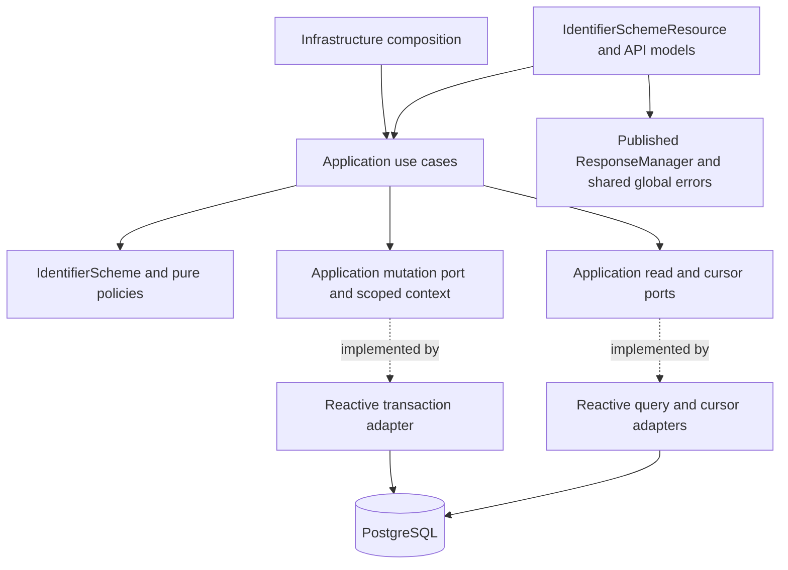
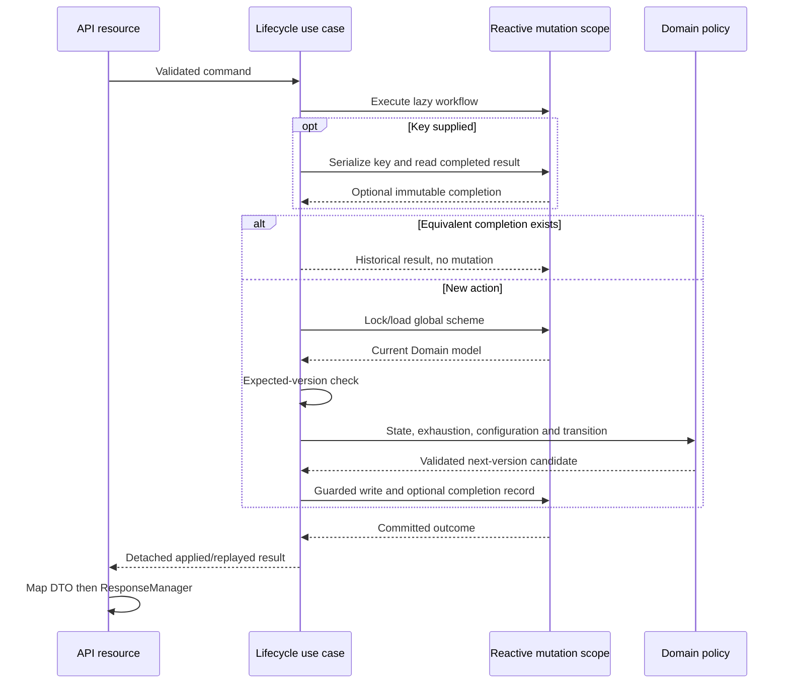

## Context

The service uses Java 25, Quarkus BOM 3.33.3.1, Mutiny, Hibernate Reactive with Panache, and PostgreSQL. `ApplicationUseCaseProducer` assembles framework-independent use cases. ArchUnit permits Mutiny and nullability annotations in Application but prohibits HTTP, CDI, persistence, and response-library dependencies there; Domain is synchronous and framework-independent.

`IdentifierScheme` already represents global identity, configuration, lifecycle state, version, and audit information, but exposes no maintenance or transition behavior. `IdentifierSchemeVersion` cannot yet advance. `IdentifierRuleCatalog` contains the supported versioned normalizer/validator keys. `IdentifierSchemeRepository` and its reactive adapter currently offer only exact code lookup for identifier registration. There is no identifier-scheme REST resource.

The approved static contract at `docs/contracts/party-registry.openapi.yaml` declares all eight operations. Gradle packages it as `META-INF/openapi.yaml`, and annotation scanning is disabled. The contract already establishes creation idempotency, mutation preconditions, `201`/`200` successes, and `412`/`422` errors. The new specifications make its previously incomplete behavior explicit.

Existing `identifier_schemes` storage has global code uniqueness, audit columns, a version, and SMALLINT length bounds. `api_idempotency_records` cannot store scheme outcomes: its mandatory `(tenant_id, party_id)` foreign key points to `parties`. A dedicated replay table is therefore necessary. The latest production migration is currently V6.

The user-approved transition matrix permits activation only from DRAFT, deprecation only from ACTIVE, and direct retirement from every nonretired state. All supported PATCH fields are editable in DRAFT, only name/description in ACTIVE or DEPRECATED, and none in RETIRED.

## Requirements Traceability

Requirement names refer to the two delta specifications in this change.

| Requirement | Design Element |
| --- | --- |
| Complete published identifier-scheme contract | Static OpenAPI completion, eight resource methods, served-contract and example validation |
| Trusted context and process correlation | Existing request-context filter, `RequestMetadataContext`, shared failure boundary |
| Global catalog ownership | Global scheme queries and locks; tenant-scoped replay identities only |
| Creation request and initial state | Strict create decoder, creation use case, existing draft factory |
| Supported configuration and coherent length bounds | Pure configuration policy, checked Domain bounds, exact rule catalog |
| Global code uniqueness and creation atomicity | Global code serialization, existing unique constraint, mutation scope and replay table |
| Safe current representation and lookup | Read port, presence-to-failure mapping, detached results and API mapper |
| Listing and filter semantics | Strict query parser, exact conjunctive criteria, global read adapter |
| Cursor pagination and list metadata | Scheme-specific cursor port, authenticated keyset navigation, count-only metadata |
| Path and query validation | Scheme request/query helpers, canonical ID and exact code parsing |
| Partial update presence and immutable fields | Typed request decoder, existing `FieldUpdate`, Domain changes and merge |
| State-dependent maintenance | Domain maintenance policy before configuration evaluation |
| Mutation concurrency and audit outcome | Expected-version check, locked global row, version-guarded write, operation clock |
| Durable creation idempotency | Effective-input model, tenant/create key serialization, immutable snapshot codec |
| Standard response and failure boundary | API-owned codes, `PartyApiErrorTranslator`, CDI `ResponseManager`, shared global errors |
| Identifier-scheme lifecycle transition matrix | Synchronous lifecycle behavior on `IdentifierScheme` |
| Draft activation and configuration eligibility | Lifecycle use case invokes pure configuration policy after state/version checks |
| Active scheme deprecation | Domain transition without rule-catalog revalidation |
| Direct retirement and terminal state | Domain transition and retention of the existing scheme row |
| Lifecycle request validation and failure precedence | Body-presence check, existing header parsing conventions, ordered use-case evaluation |
| Lifecycle idempotency scope and equivalence | Action-specific operation identities and effective `(schemeId, expectedVersion)` inputs |
| Durable successful lifecycle replay | Completed-result resolution before current-state evaluation, transactional snapshots |
| Lifecycle atomicity and historical retention | One scheme/replay transaction, no Party mutations or outbox calls |
| Lifecycle effects on new identifier admission | Existing registration eligibility and historical Party activation regression tests |

## Goals / Non-Goals

**Goals:**

- Deliver all eight operations as vertically aligned, nonblocking, native-compatible slices.
- Keep business decisions in Domain/Application, HTTP decisions in API, and persistence/cryptography in Infrastructure.
- Make absence, invalid configuration, forbidden edits, invalid transitions, concurrency, and replay deterministic.
- Deliver implementation through mandatory test-first red-green-refactor increments, with traceable verification at the cheapest meaningful boundary.

**Non-Goals:**

- Additional endpoints, new processing algorithms, jurisdiction-specific seed data, or Party lifecycle changes.
- Repository-wide architecture changes or replacing existing Party/nationality persistence flows.
- Adding a new authentication provider, roles, or tenant-specific scheme ownership.
- Generic CRUD frameworks, copied response-library classes, success-wrapping filters, or overlapping global exception mappers.

## Architecture



The arrows from use cases end at abstractions defined by Application. Concrete adapters implement those abstractions and depend inward. Infrastructure does not import API DTOs, codes, or mappers. Resources do not import repositories, ORM types, or Domain policies.

Application owns complete mutation orchestration through a transaction-scoped callback, following the existing `PartyMutationPort` pattern. The adapter owns the session, transaction, locks, SQL, commit/rollback, and resource cleanup. The callback receives only Domain/Application types and sequential I/O capabilities; it never receives a live Hibernate session.

The strict project rule that Application depends inward coexists with its explicitly selected reactive profile: Mutiny is the existing, narrow permitted Application/I/O-port dependency. It does not authorize Quarkus/CDI/REST/Hibernate imports. Reactive I/O ports remain in `application.port`; Domain ports and policies must not acquire Mutiny dependencies.

## Components and Responsibilities

### Domain model and policies

**Responsibility:** Own invariants, editable-field restrictions, lifecycle transitions, version advancement, and immutable scheme identity.

**Collaborators:** Existing `IdentifierScheme`, `IdentifierSchemeVersion`, `AuditInfo`, `FieldUpdate`, `IdentifierRuleCatalog`, and Domain errors.

- Add a Domain-owned `IdentifierSchemeChanges` value carrying presence-aware fields. Do not pass API PATCH DTOs or Application commands into Domain.
- Add pure maintenance/transition methods or a cohesive scheme maintenance policy. State restrictions precede candidate configuration checks. An attempted locked property remains an attempt even if its value is unchanged.
- Add checked version advancement and a transport-neutral exhausted-version violation. Check state eligibility before exhaustion for lifecycle actions.
- Preserve exact code/text values and count code points. Enforce bounds 1–32767 in candidate configuration and retain the mapper's defensive checked conversion.
- Add an explicit pure configuration check using the supported-key sets; do not validate support by processing an invented sample identifier. Supported-key validation is an admission rule, not a record-construction rule: deprecated/retired schemes with obsolete keys must remain readable and withdrawable.
- Activation performs the configuration check. Deprecation and retirement do not require supported rules. Existing `IdentifierSchemePolicy` registration checks and historical Party activation evidence rules remain intact.

### Application operations and results

**Responsibility:** Coordinate replay, lookup, expected versions, pure policy evaluation, time/audit attribution, persistence, and detached results.

**Collaborators:** Domain types, the ports below, an injected `Clock`, and existing `OperationObservationPort`.

Provide `CreateIdentifierSchemeUseCase`, `GetIdentifierSchemeUseCase`, `ListIdentifierSchemesUseCase`, `PatchIdentifierSchemeUseCase`, and `ChangeIdentifierSchemeLifecycleUseCase`. One retrieval use case supports typed ID or exact-code selectors; one lifecycle use case accepts an explicit action enum. These operations own meaningful absence, validation, replay, pagination, or mutation behavior rather than being mechanical forwarding wrappers.

Commands/queries carry validated `RequestMetadata`, typed IDs/versions, exact configuration, PATCH presence, and optional keys. `IdentifierSchemeResult`, page models, completed-operation models, and an applied/replayed mutation outcome are transport-neutral. Capture accepted operation time at microsecond precision; creation timestamps are equal, and mutations use a time later than the previous modification time when necessary. Use the existing UUIDv7 helper for creation. Historical replay returns its recorded time and actor without recomputation.

Add scheme-specific cases to the existing sealed `ApplicationFailure` catalog and map Domain violations deliberately. Update every affected exhaustive switch and its tests. Do not encode HTTP statuses or public response strings in these failures.

### Application ports

**Responsibility:** Express catalog I/O and replay/navigation capabilities without persistence or cryptographic details.

**Collaborators:** Domain/Application models and Mutiny only.

- `IdentifierSchemeReadPort`: optional ID/code lookup and a bounded keyset page slice. Keep the existing registration-facing `IdentifierSchemeRepository.findByCode` compatible.
- `IdentifierSchemeMutationPort`: execute one lazily supplied Application workflow inside an atomic scope and emit the outcome only after commit.
- `IdentifierSchemeMutationContext`: serialize a completed-operation key, find its completed result, serialize creation for an exact code, test code presence, lock/load a scheme, insert a candidate, persist a version-guarded candidate, and record successful completion. These describe required capabilities, not generic session APIs.
- `IdentifierSchemeCursorPort`: encode/decode a boundary against a typed tenant/filter/limit scope. Cryptographic operations remain synchronous, bounded, and exclusively in the adapter.

Use a fixed mutation outcome rather than an unbounded generic transaction framework. The context is valid only inside one callback; no parallel operations or escaped context/session are allowed. No event-publication capability is exposed for catalog writes.

### API delivery

**Responsibility:** Strict transport validation, conversion to Application input, mapping detached results to API DTOs, and explicit response/error translation.

**Collaborators:** Use cases, `RequestMetadataContext`, existing request/header support, API-owned codes, `PartyApiErrorTranslator`, and CDI-managed `ResponseManager`.

Add `IdentifierSchemeResource`, create/PATCH DTOs, a response DTO, API mapper, exact path/query helpers, and type-specific strict JSON decoding. Reuse `FieldUpdate` for omission versus explicit null. Decoders reject duplicate/unknown fields, nonobject payloads, coercion, wrong tokens, and invalid enums. Parse integer tokens exactly: values outside 1–32767, including values beyond Java integer capacity, must reach the documented semantic range failure rather than wrap, truncate, or accidentally become a server error. Preserve raw integral bounds as `BigInteger` in transport/Application inputs until pure configuration validation runs at the specified business precedence; convert to the existing bounded Domain `Integer` representation only after that check. Presence-aware PATCH merging uses retained stored bounds when a property is omitted. Resource decoding must not preempt absence, version, or state errors by performing the semantic range check early.

Reuse the project's body-validation ordering and shared validation policy; code required/length failures retain their specific codes and other structural/field-format failures use `bad-request`. Validate only transport constraints here. Bound coherence, supported rule keys, mutable-state rules, and transitions remain inner-layer responsibilities.

A narrow scheme JSON reader interceptor may translate binding failures for these two DTO types into `ApiResponseException`, following existing resource-specific interceptors. It is not a new global mapper. Lifecycle methods use Quarkus REST's nonblocking buffered-body support to reject any nonzero body bytes, including `{}`, whitespace, or `null`; they must not read an `InputStream` synchronously or add another context filter.

### Infrastructure adapters and composition

**Responsibility:** Implement reactive storage, key serialization, cursor authentication, snapshot encoding, timeout classification, and CDI composition.

**Collaborators:** Hibernate Reactive/Panache, existing scheme entity/mapper, PostgreSQL, Jackson snapshot trees, cursor key material, and Application ports.

Add reactive read/mutation adapters, a scoped persistence context, scheme replay persistence and snapshot codec, and an authenticated scheme cursor adapter. Extend `ApplicationUseCaseProducer` to construct use cases with plain constructors. The existing registration adapter can share targeted private query/mapping helpers with the new read adapter without changing its public contract or imposing mutation capabilities on registration consumers.

## Interfaces and Contracts

### HTTP operations

| Operation | Operation inputs after context | Success |
| --- | --- | --- |
| POST collection | Strict create object; required creation key | `201`, scheme DTO |
| GET collection | Four optional exact filters; cursor; limit | `200`, list of scheme DTOs and pagination metadata |
| GET by code | Exact decoded nonblank code, at most 64 code points | `200`, scheme DTO |
| GET by ID | Canonical lowercase UUID | `200`, scheme DTO |
| PATCH by ID | Presence-aware permitted fields; canonical ID; required current version | `200`, scheme DTO |
| POST activate/deprecate/retire | No body; optional key; canonical ID; required expected version | `200`, accepted or historical scheme DTO |

Single-item resources return exactly `Uni<RestResponse<ApiResponse<IdentifierSchemeResponse>>>`; listing returns `Uni<RestResponse<ApiResponse<List<IdentifierSchemeResponse>>>>`. Map the Application result before wrapping. Use `successHttp` for 200, `customHttp` with the API-owned 201 successful code for creation, and `paginatedHttp` for listing. Never construct `ApiResponse`/`RestResponse` manually or expose a Domain/persistence entity.

Use the published `api-response-quarkus-errors` dependency already managed by this project. Extend the existing API-owned response-code catalog and translator with the declared scheme codes. Resources transform known failures and allow the shared global mapper to emit final errors; they do not recover failures into success DTOs.

### Contract completion and narrow overrides

- Publish scheme-specific parameter descriptions for ID, exact code, `If-Match`, replay keys, and list criteria without changing unrelated Party/nationality descriptions.
- Preserve 412 for stale scheme versions and 422 for semantic configuration failures. The explicit OpenAPI/specification choice overrides the generic project preference for 409 version-conflict only for this resource's preconditions.
- Preserve the project error shape with only status/code. This explicit contract overrides the shared library's default field-error details; reuse the existing application-wide validation behavior rather than adding another global handler.
- Add `additionalProperties: false`, precise create/PATCH nullability, the numeric upper bound, maximum version, transition/state restrictions, new error codes, process-echo headers, and valid examples.
- For scheme collections, make navigation/totals optional as specified. Existing `PartyPaginationObjectMapperCustomizer` forces null cursors only when both totals and element counts exist. Scheme pages therefore supply only `numberOfElements` and available navigation to shared `PaginationMetadata`, leaving both totals null. The library's null omission then satisfies scheme requirements without changing Party/nationality serialization. Contract tests must prove this behavior.
- Required schema properties reflect actual serialized output: absent optional scheme fields are omitted, while `requiresExpiration` is always a boolean. Every applicable framework error is documented explicitly rather than hidden solely behind `default`.

## Data Model

### Scheme storage

Continue using `identifier_schemes`, its existing UUID identity, exact global unique code (`uq_identifier_schemes_code`), enums, configuration, audit columns, and BIGINT version. The upper bound of 32767 is both an explicit business/API limit and a safe SMALLINT mapping. Retain the existing activated-identity immutability trigger; the API's closed PATCH allowlist prevents identity edits in every state and does not weaken that database protection. Existing rows and applied migrations remain unchanged.

Add an ascending `(created_at, id)` listing index. Existing filter indexes remain useful; do not add one index for every optional filter without measured need. Parameterized predicates match country/category/subject/status exactly.

### Dedicated completed-operation storage

Create `identifier_scheme_idempotency_records` through the next available immutable migration, currently planned as `V7__add_identifier_scheme_management.sql`, together with the listing index. Reconfirm the next version when implementing.

| Column | Role |
| --- | --- |
| `tenant_id uuid` | Request/replay scope, not scheme ownership |
| `operation varchar(64)` | Fixed create/activate/deprecate/retire operation identity |
| `idempotency_key varchar(128)` | Exact validated request key |
| `request_hash char(64)` | Canonical effective-request digest |
| `identifier_scheme_id uuid` | Global target, FK to `identifier_schemes(id)` with delete restriction |
| `result_snapshot_schema_version smallint` | Positive explicitly supported codec version |
| `result_snapshot jsonb` | Immutable completed request/result object |
| `created_at timestamptz`, `created_by varchar(128)` | Original successful acceptance attribution |

Use `(tenant_id, operation, idempotency_key)` as the primary key and an index on the referenced scheme ID. Add named nonblank operation/key/actor, canonical digest, positive snapshot-version, and JSON-object checks. Do not copy Party foreign keys or store a scheme UUID in `party_id`.

Operation identities are `identifier-scheme.create.v1`, `identifier-scheme.activate.v1`, `identifier-scheme.deprecate.v1`, and `identifier-scheme.retire.v1`. They never collide with Party or nationality namespaces.

The version-one codec stores effective input plus a detached result including the original scheme version and full audit attribution; it does not serialize API DTOs or a raw ORM object. Use explicit fields/native-compatible mapping like the existing snapshot codecs. Validate stored scope, target, operation, snapshot version, effective-input digest, and result consistency on decode. Unexpected snapshot corruption remains an internal sanitized failure, not a new client conflict.

Canonical creation equivalence materializes defaults, represents omitted/null description and bounds identically, preserves all other exact values, and is independent of JSON ordering. Lifecycle equivalence includes typed scheme ID and expected version in its action scope. A deterministic length-delimited encoding and SHA-256 digest are sufficient for this nonsensitive catalog input; comparisons also retain full effective input. Do not reuse Party-registration codecs or change their historical fingerprints.

## Interaction Flows

### Creation

1. Existing context filter accepts trusted headers and owns correlation cleanup.
2. API strictly decodes/validates the body, then validates the required key and maps a command.
3. Application opens one mutation scope through its port and requests transaction-scoped serialization of the full tenant/create/key identity.
4. Application resolves completed success: an equivalent input returns the original result; a different input fails with key conflict.
5. For new work, serialize the exact global code independently of tenant, then check code presence. This preserves uniqueness-before-semantic-configuration precedence even for competing creations.
6. Application invokes pure configuration validation, captures time/UUID, and creates the Domain draft.
7. Infrastructure inserts the scheme; Application requests recording the original completed result within that same transaction.
8. The transaction commits before the result becomes a success response. API maps the result and uses the 201 `ResponseManager` path.

### PATCH and new lifecycle mutation

1. Validate context and operation input. Create/PATCH structural checks precede operation headers; lifecycle key parsing precedes ID/version parsing. Nonempty lifecycle bodies are rejected before business evaluation.
2. For keyed lifecycle work, acquire key serialization and resolve completed replay before acquiring a scheme row lock.
3. Lock the global scheme by ID without a tenant predicate; convert absence to the typed not-found failure.
4. Application compares expected/current scheme versions, then invokes Domain state restrictions, exhaustion checks, and applicable configuration/transition behavior.
5. Infrastructure applies a conditional update guarded by ID and expected version and reloads the accepted row.
6. A keyed lifecycle action records its accepted result in the same transaction. PATCH and unkeyed actions record no replay result.
7. Commit, map, and wrap the accepted result; no Party event or identifier mutation occurs.



### Reactive transactions, locks, and exactly-one version advance

Use programmatic Hibernate Reactive/Panache transactions, not blocking `@Transactional`. A Panache transaction/session boundary supplies the session internally to the scope. Each subscription owns its complete scope and returns its composed `Uni`; cancellation or failure releases resources and rolls back unaccepted work. Never run concurrent operations on one session or manually subscribe.

For keyed work acquire the key lock before any code/scheme lock. Creation subsequently acquires a global code lock; mutation acquires one scheme row lock. PostgreSQL transaction-scoped advisory locks provide key/code serialization; use separate stable namespaces with length-delimited full identities. A truncated digest collision only causes extra serialization; completed-record lookup/equivalence and unique constraints still use full identities.

Retain the existing scheme entity's `@Version` mapping but do not merge a Domain next-version candidate into a managed entity and trigger a second automatic increment. Use an explicit conditional bulk update that sets the validated next version exactly once. Do not dirty the loaded entity. Clear its stale persistence-context state and reload inside the same transaction before creating a completion snapshot; the database row lock remains held until transaction end. Zero updated rows produce a typed expected-version conflict, not silent success. Creation inserts version zero. Identical-value PATCH still writes next version/audit.

The code lock and existing `uq_identifier_schemes_code` unique constraint both guard global uniqueness. Translate only that named unique constraint to code conflict; unrelated integrity errors must not be mislabeled. Key completion and mutation are atomic, so an equivalent contender observes the winner's snapshot instead of receiving a stale-version/code conflict from reexecuting the command.

### Listing

The API parses the complete query multimap and rejects unknown/repeated/blank inputs. Application constructs exact criteria, a tenant-bound cursor scope, and a decoded optional boundary. Infrastructure executes a parameterized global query ordered by `(created_at ASC, id ASC)`, fetching at most limit plus one.

Forward continuation uses tuples strictly greater than the last position. Backward continuation uses tuples strictly less than the first position, fetches descending, and reverses the bounded result before returning ascending order. Probe the opposite boundary sequentially when necessary to return only genuinely available navigation. No offset traversal or full-catalog count is needed. Application builds detached results and authenticates available cursor boundaries through its port; API provides count-only shared pagination metadata.

`HmacIdentifierSchemeCursorAdapter` reuses existing provisioned cursor key material with a new scheme-list domain-separation string. The token binds format version/key ID, direction, exact timestamp/UUID tuple, tenant, all four filter values, and effective limit. Reject tampering, malformed encoding, unknown key ID, another resource's token, and scope changes before querying. Preserve exact code-point/text semantics; there is no snapshot promise across catalog changes and no new token-expiration behavior.

## Error Handling

| Condition | Expected handling |
| --- | --- |
| Invalid/missing/duplicated context | Existing specific header code, 400; accepted process echo preserved |
| Missing/null required body | `400 request-body-required` |
| Missing/blank or oversized code | `400 identifier-scheme-code-required` / `identifier-scheme-code-too-long` |
| Empty PATCH | `400 patch-property-required` |
| Noncanonical scheme ID | `400 identifier-scheme-id-invalid` |
| JSON structure/type, enum, text format, nonempty lifecycle body, invalid query/cursor | `400 bad-request` |
| Invalid key/version headers | Existing specific `idempotency-key-*` / `if-match-*` code, 400 |
| Valid absent scheme target | `404 identifier-scheme-not-found` |
| Existing exact code | `409 identifier-scheme-code-conflict` |
| Changed effective input for completed scoped key | `409 idempotency-key-conflict` |
| Stale version or independent losing race | `412 expected-version-mismatch` |
| Locked PATCH property after activation | `409 identifier-scheme-rules-locked` |
| PATCH against retired scheme | `409 identifier-scheme-retired` |
| Disallowed current-version action | `409 invalid-identifier-scheme-lifecycle` |
| Maximum-version otherwise permitted mutation | `409 identifier-scheme-version-exhausted` |
| Out-of-range/incoherent resulting bounds | `422 identifier-scheme-length-range-invalid` |
| Unsupported processing rules or ineligible activation configuration | `422 invalid-identifier-scheme-configuration` |
| Classified connection/lock/statement/operation dependency timeout | `503 dependency-unavailable` |
| Unknown route, method/media failures, enforced authentication | Shared `404 not-found`, `405 method-not-allowed`, `415 unsupported-media-type`, conditional `401 unauthorized` |
| Unexpected failure or corrupted completion | Shared logged, sanitized `500 server-error` |

Domain violations are transport-neutral; Application emits classified failures; API translates known failures to `ApiResponseException`; the shared global mapper creates the final error. Preserve cancellations and unknown exceptions. Do not recover all failures as not-found, conflict, or dependency unavailable. Input/body syntax stays separate from semantic bounds/configuration so 400 and 422 remain consistent.

## Security

Preserve the existing deployment authentication behavior and conditional shared authentication challenge. Tenant/User headers are request context, not a new authorization scheme. Global catalog ownership is explicit; replay results and cursors remain request-tenant scoped even though scheme rows are global.

Use parameterized queries, closed DTO schemas, strict JSON types, bounded keys/text/page sizes, and authenticated cursors. Schemes contain processing keys, never executable scripts. Reuse externally provisioned pagination signing keys and their current/retained verification-key rotation behavior; introduce no embedded production secrets. Catalog outputs and snapshots contain only approved configuration/audit data, never Party identifier values or protection material. Logs omit request bodies, keys, cursors, and rejected values.

## Resilience

Reuse existing query and mutation timeout configuration: query statement/traversal defaults 5s/15s and mutation lock/statement/operation defaults 5s/10s/15s. Configure limits within reactive session/transaction boundaries and classify genuine dependency timeouts after rollback. Reads and writes remain bounded by database pool capacity and page limits.

No automatic mutation retries are introduced. HTTP retry safety comes from completed durable keys, with keyless PATCH/actions protected only by expected versions. Failed attempts consume no completed result. Do not cache failures or introduce a replay TTL that could invalidate the specified restart behavior.

Loss of an HTTP response after commit does not undo acceptance. A keyed retry returns its original outcome; a keyless caller retrieves current state and applies the documented version rules. Do not perform external country calls while holding locks: the scheme contract requires only country format validation and supported local processing configuration.

## Observability

Retain exactly:

```text
%d{yyyy-MM-dd HH:mm:ss,SSS} %-5p [%c{3}] (%t) [pid=%X{processId}] [userId=%X{userId}] [tenantId=%X{tenantId}] %s%e%n
```

The existing filter owns MDC population/completion/cleanup and accepted process echo. Extend semantic observed-operation values for scheme create, lookup/list, PATCH, and the three actions using the existing Application observation port; concrete metrics/traces remain Infrastructure/API concerns. Record applied/replayed/error/cancelled outcomes and transaction/lock duration with bounded operation/outcome labels. Do not use IDs, codes, tenants, users, keys, or cursors as metric labels. Observation must not subscribe, block, or change a committed result.

Persist original creation/modification actors and times as Domain audit information. Replay retains original audit attribution while correlation identifies the current attempt. Catalog changes produce no tenant Party outbox events, even in stored-only or published outbox modes.

## Testing Strategy

### Mandatory TDD execution

Before every implementation increment, reread the relevant global steerings and current project decisions. Start with a failing behavioral test mapped to a specification requirement/scenario. Run it and confirm that it fails for the intended missing behavior, implement the minimum satisfying change, run it green, then refactor while keeping relevant tests green. Record the red/green verification in task progress. Adding tests after production behavior is implemented does not satisfy this change's TDD requirement.

Use small vertical increments: Domain rules, Application orchestration/ports, Flyway and reactive adapters, API binding/mapping, contract documentation, then packaged/native verification. Test expected failures and boundary precedence first as well as success; do not merely mirror private implementation methods. Every new class/interface/record/enum receives concise English Javadoc. Modified Java files require resolved JDTLS/LSP diagnostics and no new compiler warnings or unjustified suppression.

### Unit Tests

- Domain: full 12-pair state/action matrix; all PATCH state/property combinations including equal locked values; omission/null merge; immutable identity; exact text and Unicode code-point boundaries; coherent/range bounds; supported-key checks without sample identifiers; maximum version; creation/audit retention; pure withdrawal of obsolete keys.
- Application: absence versus version/state/configuration precedence; creation replay before uniqueness/configuration; version advancement once; failed-attempt rollback contract; effective defaults/equivalence; action/tenant scope independence; historical replay without Domain reexecution; controlled clock and detached outputs. Use in-memory scoped port doubles and bounded Mutiny assertions.
- API: strict create/PATCH token and presence decoding, oversized integer handling, duplicate/unknown properties, invalid enum/string/null/boolean inputs, exact UUID/code/query/header cardinality, nonempty lifecycle body rejection, DTO and pagination mapping.
- Infrastructure helpers: fingerprint equivalence and inequality, snapshot validation/version failures, authenticated cursor direction/scope/resource separation/key rotation, named-constraint translation, and checked SMALLINT mapping.
- Architecture: existing inward-dependency/framework-isolation/cycle rules plus explicit resource response-signature/DTO checks. Assert no new Domain Mutiny dependency, Application HTTP/CDI/ORM dependency, API repository access, or Infrastructure API import.

### Integration Tests

- Apply Flyway to fresh and V6-upgraded PostgreSQL databases and verify migration immutability, replay-table constraints/FK, and listing index. Test fixtures use versioned test migrations for legacy states; create normal scenario data through the API or reactive ports.
- Exercise reactive adapters in the required Vert.x context with `UniAsserter` and supported reactive test transaction boundaries. Verify transaction rollback, cancellation/resource cleanup, finite lock/statement timeouts, exact-code uniqueness across tenants, stable ordering/ties, and forward/backward pages.
- Coordinate real concurrent requests without sleeps: same key/equivalent input, same key/conflicting targets, different keys/same code, and different operations/same expected version. Assert exact winning state and replay row counts; no losing writes or Party events.
- Fault-inject completion recording or commit failure to prove scheme/replay atomicity. Confirm a failed key can be reused after a valid repair and that no independent session escapes the mutation context.
- Add `PackagedIdentifierSchemeContractIT` under the existing integration test source set for all eight routes and served OpenAPI. Add a scheme restart test following the real-process JVM/native launch pattern: retain PostgreSQL, discard accepted creation/action responses, change later lifecycle state, restart the executable, and replay original results with fresh correlation.

### Contract Tests

- HTTP tests cover all eight successes, missing schemes, strict request and query validation, every lifecycle pair, state-limited PATCH, null/omission behavior, range/rule failures, all header conditions, precondition/idempotency conflicts, and standard framework errors.
- Assert actual HTTP status equals `ApiResponse.status`; successful envelopes contain `status`, `code`, and API DTO `data`. Errors have exactly status/code and expose no messages/details. Verify accepted process echo on successes, failures, and retries and omission for invalid process context.
- Prove scheme pagination omits unavailable cursors and totals with count-only metadata while existing Party/nationality responses retain their documented complete-count/null-cursor shapes.
- Parse OpenAPI with the existing Swagger parser, resolve references, compare packaged/served definitions, and validate request/response examples and observed JSON against their declared schemas. Parser success alone is insufficient to prove schema/runtime agreement.
- Preserve regression coverage for unknown/inactive schemes in initial/additional identifier admission, optional expiration, and nonprimary verified historical evidence whose compatible scheme is deprecated/retired.

### Completion commands

After implementing Java changes, run `./gradlew test` and then `./gradlew build`; the latter includes configured packaged integration verification. Maintain and run native verification with the existing documented commands:

```shell
./gradlew buildNative -Dquarkus.native.container-build=true
./gradlew testNative -Dquarkus.native.container-build=true
```

Use documented Podman/socket/test-port environment overrides when needed and report any genuine environment blocker rather than representing an unexecuted check as passed. Native tests must exercise strict custom decoding, snapshot replay, cursor verification, served OpenAPI resources, and every route; register only actually required serialization/reflection metadata and never rely on blanket reflection registration. Reconcile LSP/Gradle discrepancies. Review affected resource signatures and HTTP assertions explicitly before completion.

## Decisions

### Decision: Business orchestration inside an Application-owned mutation callback

**Choice:** Application decides replay, expected versions, configuration, Domain mutations, and completed result identity; Infrastructure executes the atomic persistence scope.

**Rationale:** This matches the existing Party mutation-port pattern and keeps framework transactions outside Application while preventing business rules from moving into persistence adapters.

**Alternatives considered:** Resource-owned transactions would couple delivery to orchestration; adapter-owned command workflows would place business decisions in Infrastructure; independently transactional repository calls cannot guarantee scheme/replay atomicity.

### Decision: Dedicated scheme replay storage

**Choice:** Add a specific completed-operation table without altering Party replay storage.

**Rationale:** The existing replay table's mandatory Party foreign key is incompatible with a global catalog target. A separate table preserves historical Party snapshots and enforces the correct scheme FK.

**Alternatives considered:** Making Party columns nullable/general-purpose would broaden schema and codec contracts; storing fake Party references is invalid; in-memory keys cannot provide restart-safe atomic replay.

### Decision: Global serialization plus guarded explicit version writes

**Choice:** Serialize keyed intent, global create codes, and affected scheme rows; apply one explicit next-version CAS update and reload before recording success.

**Rationale:** This provides deterministic precedence, prevents equivalent contenders from becoming stale failures, and avoids accidental double advancement through `@Version` plus a preincremented candidate.

**Alternatives considered:** Unique violations alone do not serialize effective-key intent; optimistic ORM merges require careful next-version handling and postfailure replay recovery; locking a whole catalog would unnecessarily serialize independent codes/schemes.

### Decision: Count-only scheme pagination with an isolated cursor domain

**Choice:** Bounded ascending keyset pages, available navigation only, `numberOfElements`, and omitted totals, using existing signing keys with scheme-specific domain separation.

**Rationale:** The specifications permit omitted totals, and this avoids full counts and the existing complete-count null-cursor customization while preserving shared envelopes and other resource contracts.

**Alternatives considered:** Complete totals would require additional count/capacity work and serializer scoping; offsets weaken stable traversal; unauthenticated cursors cannot enforce the declared tamper/scope rules; a shared cursor namespace could accept another resource's continuation.

### Decision: Preserve catalog text and local configuration semantics

**Choice:** Exact text/code/key values, uppercase two-letter country format, supported local rule keys, and explicit 1–32767 bounds.

**Rationale:** These follow approved scheme specifications and existing global catalog semantics; Party-name canonicalization and external country validation are different responsibilities.

**Alternatives considered:** Reusing Party normalization would change stable code/key identity; an external country call would introduce an undocumented dependency; unchecked integer narrowing would turn expected input failures into storage errors.

## Risks / Trade-offs

| Risk / Trade-off | Mitigation |
| --- | --- |
| Global catalog mistakenly treated as tenant-owned | Cross-tenant read/uniqueness tests; separate tenant-bound replay identity from global row queries |
| Scheme ID placed in existing Party replay storage | Dedicated Flyway table and actual scheme FK; leave Party codecs/migrations intact |
| Managed `@Version` plus Domain next version increments twice | Explicit guarded update, no managed entity mutation, fresh reload, race/version/audit assertions |
| Same-key contender returns stale/conflict instead of original success | Acquire full-scope key serialization before code/row locks and resolve completion first |
| Advisory digest collision or inconsistent lock ordering | Domain-separated locks, full identity/equivalence checks, fixed lock order, bounded waits |
| Shared pagination customization changes omitted cursor behavior | Count-only metadata and exact-key-set HTTP/native regression assertions |
| Unsupported historical rule prevents withdrawal or breaks historical evidence | Supported-key checks only for configuration admission/activation; withdrawal and Party evidence regressions |
| Strict Domain reconstruction encounters genuinely corrupted rows | Preserve known admission-failure classification; sanitize unexpected corruption, never weaken public output |
| Migration rollback destroys accepted catalog/replay history | Additive schema, backward-compatible existing rows, retain tables/snapshots on application rollback |
| Documentation claims checks not exercised in native runtime | Packaged/native route, decoder, cursor, snapshot, and real restart coverage with explicit execution evidence |

## Migration and Rollback

Apply the new additive migration before enabling the new binary's scheme operations. Reuse immutable bootstrap/reference-data migrations; normal accepted catalog maintenance is business DML through the explicitly specified API, not a mechanism for manual schema or reference-data provisioning. Update README catalog guidance to distinguish migration-controlled schema/initial seeds from API-managed administrative records.

Do not edit V1–V6, enable schema generation, rewrite existing identifiers, modify historical Party snapshots, or introduce new jurisdictional reference data. Add any required test seed states through new test-only migrations. Database constraints/index changes occur only through Flyway.

An application rollback removes these routes but retains accepted scheme rows, states/versions, the new replay table, and all old/new foreign keys. Do not downgrade lifecycle values, drop completed outcomes, or undo accepted mutations. The earlier application can still resolve the same global scheme records through its existing code lookup. Restore a contract-compatible binary before offering the declared scheme API again; never remove accepted history to make an old binary appear compatible.

No unresolved domain transition or PATCH-state decision remains. Implementation details must follow the actual next migration version and currently published response-library APIs; dependency verification does not authorize changing the approved behavioral contract.
