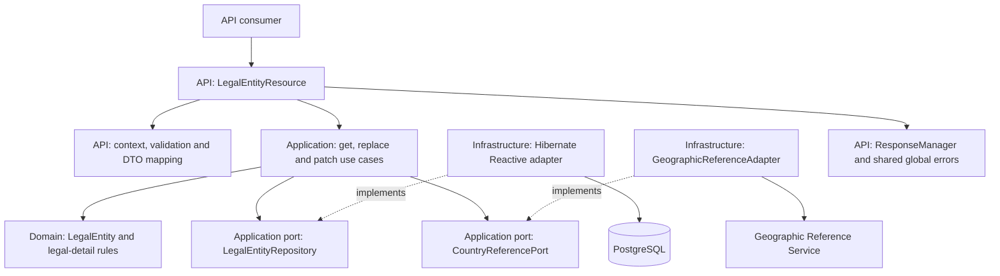

## Context

The service uses Java 25, Quarkus 3.33.3.1, Mutiny, and the Hibernate Reactive/Panache stack. The existing persistence adapters use the programmatic `Mutiny.SessionFactory` session/transaction API. Application use cases are framework-independent objects composed by `ApplicationUseCaseProducer`; asynchronous I/O ports live in `application.port`, keeping Mutiny out of Domain.

`LegalEntityResource` currently exposes creation. Existing building blocks include `LegalEntity`, `LegalEntityDetails`, `LegalEntityResult`, `LegalEntityPersistenceMapper`, `LegalEntityDetailsResponse`, and the creation-only API mapper/response. `NaturalPersonResource` and its read/update flows provide the closest working patterns, including explicit body validation and version-guarded root/detail updates.

The enterprise architecture identifies this service as the owner of Party details and independent identifiers. Its update sequence loads the tenant-qualified aggregate, validates changes and country references, then executes a short reactive transaction with an expected-version guard:

- [Party Registry Service definition](/home/alex/Documents/Development/architecture/alex-astudillo-architecture/catalog/system/microservices.c4:9), element `alexAstudilloPlatform.partyRegistryService`.
- [Update Party sequence](/home/alex/Documents/Development/architecture/alex-astudillo-architecture/architectures/party-registry/party-registry-sequences.c4:35), view `updatePartySequence`.

The approved `legal-entity-details` delta is the behavioral authority for this change. Two existing details need explicit handling:

1. Some existing `PartyApiErrorTranslator` mappings produce specific codes such as `expected-version-mismatch` and `unrecognized-incorporation-country`; the new detail operations require the approved generic `precondition-failed` and `unprocessable-entity` codes.
2. Unknown-property rejection is configured globally, but it does not by itself guarantee rejection of scalar coercion or every non-string date representation. The new update models must enforce their declared JSON types.

The project OpenAPI also intentionally narrows the shared library's default validation envelope to one stable code without field-error details. This API-specific contract governs the new operations; the published `api-response-quarkus-errors` module remains the envelope and global-error implementation.

## Requirements Traceability

All requirement names below refer to `specs/legal-entity-details/spec.md`.

| Requirement | Design Element |
|---|---|
| Retrieve legal-entity details | `GetLegalEntityUseCase`, type-qualified repository lookup, `LegalEntityResponse` |
| Trusted request context and path validation | Existing `RequestContextFilter`, `RequestMetadataContext`, `ApiRequestSupport` |
| Tenant and Party-type isolation | Repository tenant/ID/type predicates, `LegalEntityNotFound`, detail error translator |
| Complete replacement of legal details | `LegalEntityPutRequest`, `ReplaceLegalEntityCommand`, `LegalEntity.replaceDetails` |
| Presence-aware partial legal-detail updates | `LegalEntityPatchRequest`, `LegalEntityPatch`, existing `FieldUpdate<T>` |
| Strict body validation and canonical text | Scoped JSON value deserializers, normalized validation copies, API constraints, Domain write guards |
| Derived display-name behavior | Canonical legal-name comparison inside `LegalEntity` |
| Coherent legal lifecycle dates | Domain date invariants and one UTC evaluation instant per update |
| Incorporation-country recognition | Changed-country coordinator, existing `CountryReferencePort` and geographic adapter |
| Version preconditions and concurrent updates | Early application check plus transactional conditional root update |
| Atomic update and audit outcome | Single root/detail transaction, mandatory root version increment, reload before completion |
| Consistent public responses and confidential failures | DTO mapping, CDI `ResponseManager`, scoped failure translation, shared global handler |
| Compatibility with registration and independent identifiers | Separate detail response, unchanged registration snapshots, no identifier access in the new flow |
| Consumer documentation reflects the implemented operations | Static OpenAPI updates, README coverage, targeted Postman updates under Legal Entities |

## Goals / Non-Goals

**Goals:**

- Add the declared GET, PUT, and PATCH detail operations with the same public behavior in JVM and native executables.
- Keep business decisions in Domain/Application and HTTP concerns in API.
- Guarantee tenant/type isolation, one accepted root version increment per update, and rollback of incomplete root/detail writes.
- Reuse existing persistence, geographic validation, response, correlation, and serialization infrastructure where its behavior matches the delta.
- Make acceptance scenarios directly executable at the appropriate testing boundary.

**Non-Goals:**

- Reworking natural-person endpoints, registration, identifier management, activation rules, or historical snapshots.
- Adding new dependencies, schema objects, endpoint families, or generic CRUD abstractions.
- Adding a new legal-detail event contract, broker interaction, or outbox publisher behavior. The central sequence's optional event stage remains conditional; this delta does not enable an update event.
- Introducing authentication infrastructure, a generic response-wrapping filter, or a second global error handler.

## Architecture



These are internal responsibilities within the existing service, not new enterprise containers. API never calls persistence directly. Infrastructure maps persistence and remote representations into the inner contracts. Domain contains no Mutiny, HTTP, Jackson, persistence, or CDI types. Application may use Mutiny under the selected reactive profile, but no HTTP status or response-envelope types.

All request-path work remains nonblocking. Use returned `Uni` pipelines and sequential operations within each reactive session. Reads return detached Domain values; no session or managed entity crosses the geographic call. Write transactions belong to the infrastructure implementation of the application's atomic update port operation.

## Components and Responsibilities

### API models, mapping, and resource

**Responsibility:** Bind and validate the declared wire contract, map request inputs into commands, and map application results into typed HTTP responses.

**Collaborators:** New detail use cases; existing context/support components; `LegalEntityApiMapper`; detail error translation; `ResponseManager`.

- Add `api.model.request.LegalEntityPutRequest` with the six detail properties. Its normalized validation copy follows `LegalEntityCreateRequest` conventions without accepting creation-only fields.
- Add `api.model.request.LegalEntityPatchRequest` with per-field presence flags and `@JsonSetter` methods. Omission and explicit null remain distinct through the validation copy and command mapping.
- Keep presence-aware required checks at the corresponding JSON property paths. A class-level validation constraint may attach violations to `legalName` or `incorporationCountryCode`; helper-method names must not change the documented lexicographic error precedence.
- Add `api.model.response.LegalEntityResponse`, containing the declared Party fields and `LegalEntityDetailsResponse`. It has no `initialIdentifier` field. Keep `LegalEntityCreateResponse` as the separate existing creation shape.
- Extend `LegalEntityApiMapper` with a detail-result mapping method. It projects `LegalEntityResult` explicitly, does not serialize it directly, and does not map identifiers for these operations.
- Extend `LegalEntityResource` with GET/PUT/PATCH at `/{partyId}`. Keep the existing create method and creation mapper behavior intact.

### Scoped strict JSON binding

**Responsibility:** Reject unsupported JSON token types before semantic validation without changing serialization behavior for other operations.

**Collaborators:** Only `LegalEntityPutRequest` and `LegalEntityPatchRequest`; Jackson binding; the shared error boundary.

Use API-owned, model-local string and date deserializers for the new update properties:

- String properties accept JSON strings or null, not numbers, booleans, arrays, or objects. They do not trim or uppercase input during binding.
- Date properties accept ISO `YYYY-MM-DD` strings or null. They reject invalid calendar dates, numeric timestamps, and array representations.
- Nullability and requiredness remain validation rules, so explicit null in a mandatory field produces its required-field code rather than a generic JSON error.
- Retain `quarkus.jackson.fail-on-unknown-properties=true`. Unsupported fields fail even when a supported field is also present.

Add a narrow `LegalEntityUpdateJsonReaderInterceptor` scoped to these two request types to translate Jackson syntax/binding failures to `ApiResponseException(PartyResponseCode.BAD_REQUEST)`. It calls the normal reader, emits no HTTP response, and delegates final handling to the shared module. Treat a JSON null body as a body-required failure through `ApiRequestSupport`, not as a malformed object. Log only a fixed rule and known field path, never parser messages, source content, or client-controlled unknown property names.

This leaves the existing legal-entity creation-local mismatch mapper and natural-person reader translation outside the new binding path. Do not disable coercion on a globally shared mapper or add a general success/error interception layer.

### Application use cases and I/O port

**Responsibility:** Resolve tenant-qualified state, apply version preconditions, coordinate Domain behavior and geographic validation, and request one atomic update.

**Collaborators:** `LegalEntityRepository`, `CountryReferencePort`, `Clock`, Domain models, and existing application result/failure contracts.

Add:

- `GetLegalEntityCommand`, `ReplaceLegalEntityCommand`, `PatchLegalEntityCommand` in `application.command`.
- `GetLegalEntityUseCase`, `ReplaceLegalEntityUseCase`, `PatchLegalEntityUseCase` in `application.usecase`.
- `LegalEntityRepository` in `application.port`, following the existing natural-person I/O port location.
- `ApplicationFailure.LegalEntityNotFound`, representing absent, concealed, or wrong-type results. Update exhaustive failure handling in `ApplicationException`, `PartyApiErrorTranslator`, and `OperationObservation` as required by this new variant, without changing mappings of existing variants.

GET is more than a forwarding layer: it converts repository absence into a transport-neutral operation failure and projects the result into `LegalEntityResult`.

Update commands carry validated structural inputs, not a preconstructed replacement Domain aggregate. Constructing date-dependent Domain state before the early version check would violate the stale-version precedence requirement.

Capture one `Instant` from the injected clock per attempted update, derive the evaluation date explicitly with `ZoneOffset.UTC`, and use that instant for the candidate audit update. Wire the three use cases in `ApplicationUseCaseProducer` using its existing UTC clock and infrastructure-provided ports.

### Domain legal-detail behavior

**Responsibility:** Maintain legal-detail invariants, PATCH presence semantics, and derived display names independently of delivery and storage mechanisms.

**Collaborators:** `LegalEntityDetails`, `PartyTextNormalization`, `FieldUpdate<T>`, `AuditInfo`, and Domain violations.

Extend `LegalEntity` with `replaceDetails` and `patchDetails`, analogous to the existing natural-person behavior. Add `LegalEntityPatch` containing six `FieldUpdate<T>` values.

- PUT normalizes all supplied text and clears omitted nullable fields.
- PATCH normalizes supplied text only; omitted values are selected unchanged from the current entity. It rejects an empty update and attempts to clear required fields.
- Compare the current and resulting legalName using the same canonical normalization. A real change derives displayName from the resulting legalName; canonical equivalence preserves the existing displayName.
- Validate the complete resulting date pair and future-date rules after merging PATCH fields.
- Apply normalized UTF-16 write limits to newly supplied values. Keep restoration capable of reading historical representations; do not tighten the existing rehydration constructor or normalize retained historical text to enforce a new-write rule.
- Retain immutable identity/type, recordStatus, and creation audit information. Match the existing update-candidate convention: Domain returns updated details/audit with the current version; the atomic repository update owns the single persisted version increment and returns the new version.

API Bean Validation establishes public `400` classifications before the use case. Domain still enforces its write invariants for non-HTTP callers and raises transport-neutral failures. Domain never chooses response codes.

### Geographic coordination

**Responsibility:** Validate a changed incorporation country while preserving the difference between an unrecognized country and an unavailable dependency.

**Collaborators:** Existing `CountryReferencePort`, `GeographicReferenceAdapter`, and incorporation-country failures.

Add a changed-incorporation-country helper in `CountryValidation`. Compare current/resulting codes canonically; skip the remote lookup when equivalent. For a changed code, invoke the existing port with the canonical code and the original validated `RequestMetadata`.

Do not reuse the current `validateChangedCountry` helper unchanged: it classifies negative results as `UnrecognizedBirthCountry`. The new path uses `UnrecognizedIncorporationCountry`. A `true` result means recognized, `false` means unrecognized, and an unexpected null result is a dependency failure, not a business rejection. Preserve the existing adapter's handling of transport failures, invalid response envelopes, mismatched process echoes, and cancellation.

### Reactive persistence adapter

**Responsibility:** Load the matching legal aggregate and atomically persist root/detail changes guarded by the expected Party version.

**Collaborators:** `Mutiny.SessionFactory`, `LegalEntityPersistenceMapper`, existing mapped entities, and `PersistenceExceptionTranslator`.

Add `HibernateReactiveLegalEntityRepository`, using the existing programmatic Hibernate Reactive session/transaction style within the installed reactive persistence stack. Retain the same build-property activation convention as the existing resource, composition, and persistence beans.

Read with a query joining the legal-detail row and filtering by tenant ID, Party ID, and `PartyType.LEGAL_ENTITY`. Map within the session using the mapper overload accepting the fetched legal details, avoiding incidental access to unrelated lazy associations. Return `Optional.empty()` for a nonmatching aggregate.

The update protocol is specified in Data Model and Interaction Flows. No identifiers, scheme catalog, idempotency snapshots, or natural-person rows participate.

### Legal-detail error translation

**Responsibility:** Translate transport-neutral failures into the exact response codes approved for the new detail operations.

**Collaborators:** `ApplicationException`, `ApplicationFailure`, existing `PartyResponseCode` generic entries, and the published `ApiResponseException`.

Add an API-scoped `LegalEntityDetailsErrorTranslator` used only by the three new resource methods. Map legal absence to `NOT_FOUND`, expected-version mismatch to `PRECONDITION_FAILED`, Domain semantic and unrecognized-incorporation-country failures to `UNPROCESSABLE_ENTITY`, and geographic dependency failures to `DEPENDENCY_UNAVAILABLE`. Leave unexpected/persistence failures and cancellation untouched for their established handling.

This is pipeline failure translation, not a new exception mapper. Creation continues to use its existing translator. Existing generic enum entries already provide the required wire values; no new public code strings are needed.

## Interfaces and Contracts

### HTTP boundary

| Method and route | Input | Success |
|---|---|---|
| `GET /v1/legal-entity/{partyId}` | Validated context and canonical Party ID | `200 LegalEntityApiResponse` |
| `PUT /v1/legal-entity/{partyId}` | Context, Party ID, If-Match, `LegalEntityPutRequest` | `200 LegalEntityApiResponse` |
| `PATCH /v1/legal-entity/{partyId}` | Context, Party ID, If-Match, `LegalEntityPatchRequest` | `200 LegalEntityApiResponse` |

Every method returns `Uni<RestResponse<ApiResponse<LegalEntityResponse>>>`. The success pipeline maps `LegalEntityResult` to `LegalEntityResponse` before calling the CDI-managed `ResponseManager.successHttp`. No raw response, bare result, Domain entity, persistence entity, or creation-only DTO is exposed.

The shared global module produces error responses from `ApiResponseException` and unexpected failures. Do not instantiate envelopes manually. Nullable response properties follow existing Jackson omission behavior permitted by OpenAPI; tests distinguish clearing a value from requiring a literal null property.

For updates, validate a normalized DTO copy using `ApiRequestSupport`, then parse partyId, then require If-Match. Keep automatic resource-parameter Bean Validation from replacing the explicit single-code selection. Bind JSON syntax/types before these validations. The request filter's trusted-context checks retain their existing earlier precedence.

### Application port

```java
Uni<Optional<LegalEntity>> findByTenantAndId(TenantId tenantId, PartyId partyId);
Uni<LegalEntity> update(LegalEntity candidate, PartyVersion expectedVersion);
```

The second operation promises all-or-nothing root/detail persistence, concealment-aware absence handling, exact expected-version enforcement, and the returned committed version. No session or database exception appears in the port contract. The three use cases return `Uni<LegalEntityResult>`.

### OpenAPI alignment

Update only the new detail-operation declarations and relevant reusable documentation:

- Replace future-operation descriptions with implemented GET/PUT/PATCH semantics, including display-name rules and canonical country comparison.
- Close both update schemas with `additionalProperties: false`; retain mandatory PUT properties, PATCH `minProperties: 1`, field nullability, normalized limits, and declared response shape.
- Extend existing legal-field `400` code applicability to updates and `patch-property-required` to legal PATCH. Specify deterministic property-path precedence without changing creation behavior.
- Add `503 DependencyUnavailable` to PUT/PATCH, Process-Id echo documentation to the three successes, and shared framework-error documentation for applicable media/method failures.
- Preserve existing declared generic 404/412/422 codes. A reserved 409 declaration does not justify adding a lifecycle restriction or a new conflict rule to legal-detail updates.

The build copies `docs/contracts/party-registry.openapi.yaml` into `META-INF/openapi.yaml` and disables annotation scanning. Resource annotations alone do not update the published contract; verify the packaged `/q/openapi` content as well as the source file.

## Data Model

The existing Flyway schema already contains the required data:

| Store | Read or updated fields |
|---|---|
| `parties` | Read identity, tenant, type, status and audit; update display_name, updated_at, updated_by and version |
| `legal_entity_details` | Read/update the six legal fields and modification audit; retain party_id and creation audit |

`parties.id` is globally unique and `(tenant_id, id)` is also unique. The legal-detail primary/foreign key is `party_id`; it has no independent version. The root's bigint version serializes both legal-detail changes and existing Party activation.

No schema or reference-data migration is required. Retain Flyway as the exclusive authority and Hibernate schema validation. If implementation discovers a genuine schema requirement, it must be handled by a new reviewed versioned migration, never by editing V1-V4 or running manual DDL.

### Atomic update protocol

Within one `sessionFactory.withTransaction` operation:

1. Conditionally update the root with predicates for tenant, ID, `LEGAL_ENTITY`, and expected version. Set the candidate displayName and modification audit, and explicitly increment `version = version + 1`.
2. Require exactly one affected row. On zero rows, perform a tenant/ID/type-qualified lookup to distinguish concealed/absent state from a version mismatch; do not issue an unqualified diagnostic lookup.
3. Update the legal-detail row's six fields and modification audit. Its party_id is usable only after the preceding tenant-qualified root update succeeded. Require exactly one affected row; otherwise fail the transaction.
4. Clear the session's cached managed state after bulk mutation and reload the matching root plus legal details. Map the detached aggregate before the transaction completes.
5. Emit the repository item only after successful transaction completion. A mutation, reload, mapping, flush, or commit failure fails the operation and rolls back writes before acceptance.

The root mutation deliberately omits recordStatus, type, tenant, ID, and creation audit assignments. Explicit version arithmetic advances even detail-only or identical updates, independently of dirty checking and equal audit timestamps. Do not increment again in Domain or through a second managed-entity flush. Handle version overflow as a failed, sanitized persistence outcome; never wrap to a negative version or misclassify a valid decimal header as malformed.

Translate recognized Hibernate optimistic-lock failures after transaction termination, resolving current state in a fresh qualified session when necessary. Preserve existing application failures and cancellation. A lost version race is 412, not an unconditional retry.

## Interaction Flows

### Retrieval

1. Existing filter validates trusted context and initializes correlation.
2. Resource parses partyId and invokes `GetLegalEntityUseCase`.
3. Repository opens a reactive read session, loads the tenant/ID/type-qualified root and legal details, maps a detached aggregate, and closes the session.
4. Use case rejects absence or projects `LegalEntityResult`.
5. API maps the response DTO and calls `successHttp`; response completion echoes accepted Process-Id and records/clears owned context.

GET performs no geographic call and no identifier lookup. It does not normalize persisted text or write audit information.

### Update

```mermaid
sequenceDiagram
    participant Client
    participant API as LegalEntityResource
    participant UseCase as Replace/PatchLegalEntityUseCase
    participant Repo as LegalEntityRepository
    participant Country as CountryReferencePort
    participant DB as PostgreSQL

    Client->>API: PUT/PATCH with context, body and If-Match
    API->>API: Bind strictly; validate copy, path and version header
    API->>UseCase: Valid structural command
    UseCase->>Repo: findByTenantAndId
    Repo->>DB: Qualified root + legal-detail read
    DB-->>Repo: Current legal aggregate
    Repo-->>UseCase: Detached aggregate; read session closed
    UseCase->>UseCase: Check expected version, merge/replace, validate Domain state
    opt Canonical country changed
        UseCase->>Country: Validate canonical country with trusted context
        Country-->>UseCase: Recognized
    end
    UseCase->>Repo: update(candidate, expectedVersion)
    Repo->>DB: Begin transaction; conditional root version increment
    alt Root matches expected version
        Repo->>DB: Update details; reload; complete transaction
        DB-->>Repo: Accepted aggregate at next version
        Repo-->>UseCase: Persisted legal entity
        UseCase-->>API: LegalEntityResult
        API-->>Client: 200 successful with response DTO
    else Lost version race or absent aggregate
        Repo->>DB: Qualified diagnosis; terminate transaction
        Repo-->>UseCase: Transport-neutral failure
        UseCase-->>API: Failure
        API-->>Client: Shared 412 or 404 envelope
    end
```

Pure Domain validation and country validation happen after the early version check and before the write transaction. A Domain or geographic failure terminates the pipeline through the API error translator without invoking the write port. A concurrent update occurring during the country call is caught by the final root predicate. No reactive session is shared across concurrent operations, and no row lock is held while waiting for the geographic dependency.

## Error Handling

| Condition | Expected handling |
|---|---|
| Missing/invalid trusted context | Existing filter raises the exact header-specific 400 code; accepted process echo rules remain authoritative |
| Null/missing update body | `ApiRequestSupport` emits `400 request-body-required` |
| Invalid JSON token, syntax, date syntax, or unknown property | Scoped binding translation emits `400 bad-request` |
| Invalid submitted field or empty PATCH | Normalized DTO validation selects the exact existing 400 code by required-rule/path/code precedence |
| Invalid partyId or If-Match representation | Existing support emits `party-id-invalid` or the appropriate If-Match 400 code |
| Absent, cross-tenant, or wrong-type aggregate | `LegalEntityNotFound` becomes `404 not-found` |
| Stale initial version or lost commit-time race | `ExpectedVersionMismatch` becomes `412 precondition-failed` |
| Invalid resulting legal lifecycle dates | Domain failure becomes application `InvalidBusinessState`, then `422 unprocessable-entity` |
| Changed country definitively unrecognized | `UnrecognizedIncorporationCountry` becomes `422 unprocessable-entity` |
| Geographic timeout, unusable response, or unavailable dependency | `DependencyUnavailable` becomes `503 dependency-unavailable` |
| Unsupported method/media type | Shared framework handling preserves 405/415; verify the exact library media-type code rather than inventing a local one |
| Unexpected persistence/mapping/internal failure | Preserve cause internally; shared mapper emits only `500 server-error` |
| Cancellation | Preserve cancellation semantics and resource cleanup; do not convert it into a business result or retry |

The feature translator is essential: simply reusing the existing broad translator would leak different public code strings despite producing the correct HTTP status. Tests must assert both values and the absence of additional error properties.

## Security

- Reuse the existing trust boundary and header validation; this change adds no new authentication mechanism. Where authentication is deployed, its established unauthorized behavior remains in effect.
- Enforce tenant and type constraints in reads, writes, and post-conflict lookups. Never load by ID alone and reveal a later type/tenant mismatch.
- Reject root identity/status/version fields and identifier fields in update JSON. This prevents mass assignment and keeps legal-detail correction independent from lifecycle and evidence management.
- Use parameterized persistence queries. Keep request and response DTOs explicit and deny unknown body properties.
- Query only root/legal-detail data; no ciphertext, hashes, scheme metadata, or encryption keys are needed. Avoid logging legal names, request bodies, or raw validation values.
- Keep validation rule/path logging safe for client-supplied unknown property names and malformed source content.

## Resilience

- Reuse the geographic client's configured finite connect/read timeouts, currently 2000/5000 milliseconds by default, and its typed dependency translation.
- Skip geographic validation for reads and canonically unchanged incorporation countries. This is a semantic rule, not a fallback that accepts an unvalidated changed country during an outage.
- Add no automatic update retry: a write may already have completed, and the next attempt must use the current Party version. Idempotency-Key neither participates in these operations nor bypasses If-Match.
- Preserve cancellation and allow reactive session/transaction scopes to release resources. Do not add `await`, `join`, blocking I/O, manual subscriptions, or fire-and-forget writes.
- HTTP delivery failure after an already completed commit cannot roll back an accepted database outcome. Loss of a commit acknowledgement can likewise leave the caller uncertain about acceptance, although root/detail atomicity still holds. Clients recover by GET and current-version comparison before attempting another write; failure-before-acceptance tests target the transactional boundary.

## Observability

Extend `PartyHttpObservability` to recognize only the single-ID legal-detail routes using bounded labels such as `retrieve-legal-entity`, `replace-legal-entity`, and `patch-legal-entity`. Include both update labels in the existing optimistic-conflict metric path. Never use a raw Party ID or arbitrary path as a metric label.

Add resource spans `legal-entity.retrieve`, `legal-entity.replace`, and `legal-entity.patch`, following current naming conventions. Existing geographic telemetry records dependency outcomes. The existing filter continues to own request completion logging, Process-Id echo, and cleanup; no second context filter is introduced.

Preserve the configured log format exactly:

```text
%d{yyyy-MM-dd HH:mm:ss,SSS} %-5p [%c{3}] (%t) [pid=%X{processId}] [userId=%X{userId}] [tenantId=%X{tenantId}] %s%e%n
```

Tests cover simultaneous requests with distinct context, failure cleanup, and accepted process propagation to geographic calls. Log and metric changes explain operational outcomes without exposing sensitive payloads.

## Testing Strategy

### Unit Tests

- Extend `LegalEntityTest` for PUT clearing, PATCH omission/null distinctions, canonical writes, historical retention, display-name equivalence, lifecycle dates, immutable fields, and audit updates. Include supplementary Unicode and uppercase-expansion length cases on new-write paths.
- Test PATCH presence mapping and normalized validation copies independently, including mandatory null, empty objects, and property-path ordering.
- Test local string/date deserialization with valid strings/null and invalid scalar, array, object, malformed date, and root-body shapes.
- Test all three use cases with deterministic clocks and port doubles. Assert absence concealment, early version failure before Domain/country work, one canonical country lookup only when changed, null/unusable dependency handling, preserved cancellation, and returned persisted version.
- Test the new feature error translator with exact generic public codes and unknown failure identity preservation.
- Extend legal API mapping tests to verify the detail shape excludes identifiers and tenant internals while creation mappings remain compatible.

### Integration Tests

- Test `HibernateReactiveLegalEntityRepository` against the existing PostgreSQL Dev Service and Flyway migrations, using `@RunOnVertxContext` with `UniAsserter` or the appropriate reactive test-transaction support.
- Verify root/detail reads, tenant/type-qualified absence, exactly-once version increments, identical updates, both audit rows, and preservation of creation metadata and identifiers.
- Exercise rollback after the root mutation, and after detail mutation but before completion, with controlled test-only failure during the repository's existing reload/mapping boundary. Do not add a production failure endpoint or manual DDL solely to manufacture the failure.
- Run competing PUT/PATCH updates in separate sessions/requests. Include a race against existing activation on the same root version, using prepared verified-identifier fixtures. Verify the legal-detail loser is 412 and cannot revert the winning lifecycle state.
- Verify no session is retained across the geographic round trip and no blocking-thread warnings are introduced.

### Contract Tests

Add a focused `LegalEntityDetailsResourceContractTest` using the existing contract-test conventions and geographic test resource. Cover every delta requirement, including:

- POST legal entity, GET, PUT, GET, PATCH, GET, and creation replay retaining its original snapshot.
- Success envelope status/code/data, legal-only fields, nullable clearing, and absence of identifier material.
- Context cardinality/canonicality, cross-tenant/wrong-type 404, field-code precedence, malformed JSON, incompatible types, unknown properties, and empty PATCH.
- If-Match zero, duplicate/quoted/wildcard/fraction/leading-zero/out-of-range forms, stale versions, identical updates, and concurrent winners/losers.
- Country recognized/unrecognized/unavailable/malformed-response cases; a stale version and unchanged country must not be masked by dependency failure.
- Sanitized 500, 405, supported media-type 415 envelope, and Process-Id presence/absence rules.

Extend `OpenApiContractTest` to cover closed update schemas, legal-field code applicability, response headers, 503 declarations, and the exact detail response shape. Keep existing registration, natural-person, activation, and ArchUnit checks in the validation suite.

Extend packaged integration coverage under `src/integrationTest`, using the existing `PackagedApplicationIT`/geographic resource conventions. Exercise legal creation/read/update/replay, null presence, strict binding, exact failure codes, and dependency validation through the packaged HTTP boundary. The same coverage must execute for native builds. Model annotations or API-local registration must make all new DTOs, nested responses, and custom deserializers reachable in native images; do not register Domain/persistence objects for public serialization or add broad reflection configuration.

Implementation checks:

1. Resolve JDTLS/LSP diagnostics for every modified Java file and investigate disagreement with Gradle; introduce no new compiler warnings or unjustified suppressions.
2. Run `./gradlew test`.
3. Run `./gradlew build`; this build wires `check` to `quarkusIntTest` for packaged coverage.
4. Run `./gradlew buildNative -Dquarkus.native.container-build=true` and `./gradlew testNative -Dquarkus.native.container-build=true` for native verification.

Compilation alone does not establish the public response contract. Inspect resource signatures and run the HTTP assertions explicitly.

### Consumer documentation verification

After implementation, update README's implemented endpoint list and the existing collection through Postman MCP. Retrieve the collection map and use its **Legal Entities** folder ID when adding requests. Use targeted request/example operations, preserving existing request IDs, scripts, examples, variables, and the other entity folders.

The minimal MCP collection-replacement schema can omit nested descriptions, scripts, and responses. Avoid whole-collection replacement for this update. Read back the collection and verify legal POST/GET/PUT/PATCH each appears once, required headers/body fields are correct, examples match the updated OpenAPI, and the overall implemented-operation count becomes ten. Update collection coverage notes that currently list legal GET/PUT/PATCH as future work. Do not treat illustrative saved examples or unexecuted Postman scripts as runtime verification.

## Decisions

### Decision: Add a legal-specific slice using existing inner contracts

**Choice:** Separate legal commands/use cases/repository, reuse `LegalEntityResult`, shared context support, existing Domain values, and persistence models.

**Rationale:** Legal replacement rules and response shapes differ from natural-person detail retrieval. A small explicit slice preserves boundaries and type safety.

**Alternatives considered:**

- A generic Party CRUD framework would add indirection and risk mixing type-specific details.
- Exposing the registration result or creation DTO would incorrectly include initialIdentifier in detail responses.

### Decision: Keep remote validation outside a short conditional transaction

**Choice:** Detached read, early expected-version validation, pure Domain preparation, optional geographic check, then conditional root/detail transaction.

**Rationale:** Satisfies the enterprise update sequence and avoids holding database resources during external latency while preserving commit-time correctness.

**Alternatives considered:**

- Holding a transaction/lock across the remote call increases contention and couples database capacity to dependency availability.
- An early version check without the final predicate permits lost updates.
- Independent root/detail transactions expose partial state.

### Decision: Explicit root version increment and unchanged lifecycle

**Choice:** A guarded bulk mutation increments the root version for every accepted update; it does not assign recordStatus. The repository reload supplies the persisted version.

**Rationale:** Handles identical/detail-only writes deterministically and serializes with activation without reverting its result.

**Alternatives considered:**

- Dirty checking alone may not increment for identical details/audit values.
- A separate legal-detail version would not coordinate with existing Party lifecycle concurrency.

### Decision: Scope binding and error translation to the new operations

**Choice:** Model-local strict token handling, a two-model JSON failure translator, and an API-scoped legal-detail failure translator using existing generic codes.

**Rationale:** The approved delta requires stricter wire typing and different public business codes than some current paths. This meets the new contract without silently changing existing creation or natural-person behavior.

**Alternatives considered:**

- Reconfiguring all Jackson coercion globally has unrelated compatibility consequences.
- Reusing existing broad business-code mappings verbatim violates the delta.
- Copying the shared library or adding a global exception mapper duplicates cross-cutting policy.

## Risks / Trade-offs

| Risk / Trade-off | Mitigation |
|---|---|
| Existing error enum names look appropriate but carry different wire values | Use the generic enum entries in the scoped translator; assert exact codes in HTTP tests |
| Missing versus null PATCH properties are collapsed during copying/mapping | Carry presence flags through validation and `FieldUpdate<T>`; test each nullable/mandatory field |
| Helper validation method names alter error precedence | Attach violations to declared JSON field paths and test simultaneous failures |
| Global Jackson configuration still allows unwanted scalar/date coercion | Apply local strict value deserializers and native contract tests |
| Historical text is rewritten or rejected by new-write limits | Normalize/validate supplied values only; preserve the restoration path and test historical records |
| Remote validation introduces a race between read and write | Conditional root update rechecks tenant, type, ID, and expected version |
| Bulk mutations leave stale managed state or double-increment a version | Clear/reload before completion; do not also dirty a managed root or increment in Domain |
| A detail-write failure leaves a changed root | One transaction and rollback assertions after each mutation boundary |
| New routes are invisible to existing telemetry | Extend the bounded route classifier and conflict labels, retaining the single context filter |
| Snapshot dependency behavior changes, especially framework errors/native binding | Use the resolved shared dependency and mandatory contract/native checks; add no assumed library APIs |
| Postman tooling strips nested content during broad replacement | Use folder-scoped request/example operations and complete read-back verification |

## Migration and Rollback

Deploy this as an additive endpoint release against the existing Flyway-managed schema. No historical normalization, identifier re-encryption, new migration, or registration snapshot rewrite is part of the rollout. Existing configuration keys and deployment prerequisites remain applicable.

Publish the aligned static OpenAPI and update consumer documentation when the endpoints are available. Releasing documentation does not itself establish runtime availability; the packaged contract tests provide that evidence.

Rolling back the application removes the new detail operations but does not reverse accepted corrections or reset versions. Existing code can continue reading the same tables and replaying unchanged creation snapshots. Coordinate consumers that began using GET/PUT/PATCH before rollback, and restore documentation availability notes accordingly. Do not downgrade or rewrite database rows to imitate the previous application version.
