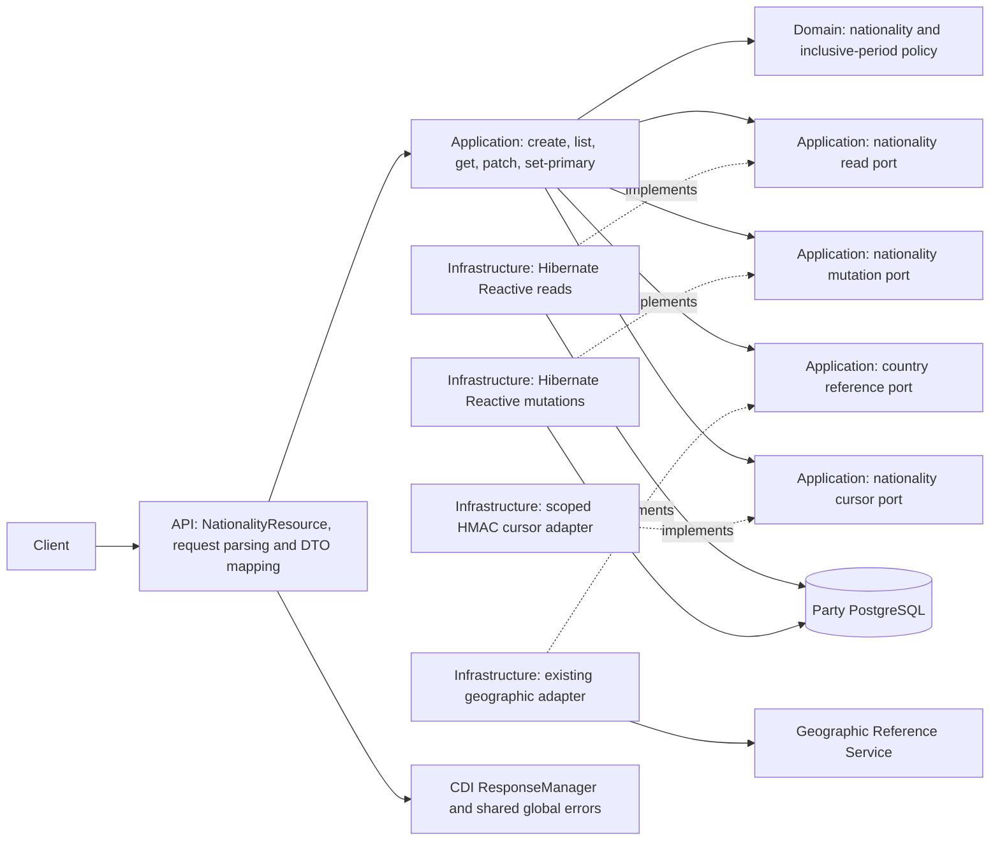

## Context

The five nationality routes and their DTO schemas exist in `docs/contracts/party-registry.openapi.yaml`, but no nationality resource, domain model, or operational repository exists. The Flyway V1 schema already owns `party_nationalities`, with inclusive-date coherence and PostgreSQL exclusion constraints for same-country and primary-period overlaps; V2 provides a tenant/operation/key-scoped `api_idempotency_records` table. The running service is Java 25 / Quarkus with Mutiny, Hibernate Reactive, a static packaged OpenAPI, a shared response/error module, and tested Party query, mutation, idempotency, country-reference, and cursor patterns.

The enterprise [Change Party Nationalities sequence](/home/alex/Documents/Development/architecture/alex-astudillo-architecture/architectures/party-registry/party-registry-sequences.c4#L75) establishes reactive country validation and atomic nationality writes. It also describes `NATURAL_PERSON`-only mutations with a client-supplied expected Party version. The approved nationality API and the `party-nationalities` delta explicitly cover both Party types and declare no `If-Match` header. For these routes, that more specific contract takes precedence; keep the sequence's transactional and consistency intent without adding an unapproved type restriction or precondition. The existing [service-to-geographic-reference relationship](/home/alex/Documents/Development/architecture/alex-astudillo-architecture/catalog/system/relationships.c4#L13) remains the external validation boundary.

The static OpenAPI and shared `ApiResponse` module are an intentional project-specific narrowing of the generic library's validation error shape: every public error here has only `status` and one stable `code`. Use the published module, not local envelopes or overlapping exception mappers.

## Requirements Traceability

All requirement names refer to `specs/party-nationalities/spec.md`.

| Requirement | Design Element |
|---|---|
| Nationality request context and correlation | Existing `RequestContextFilter`, `RequestMetadataContext`, and bounded operation classification |
| Nationality identity and tenant isolation | `ApiRequestSupport`, qualified Party/nationality lookups and root lock |
| Nationality create input and country validation | Strict API request DTO, normalization, `CountryReferencePort` |
| Inclusive nationality validity and conflict prevention | Domain period policy, root serialization, existing exclusion constraints |
| Creation response and required idempotency | Key validation, nationality mutation port and transactional snapshot storage |
| Nationality list filters and input validation | Strict API query parser, typed criteria and one UTC evaluation date |
| Scoped nationality pagination and collection envelope | Scoped HMAC cursor port, repeatable-read query adapter, `ResponseManager.paginatedHttp` |
| Nationality detail and public representation | Qualified read port, DTO mapper, `ResponseManager.successHttp` |
| Validity PATCH changes only supplied dates | Presence-aware DTO/command, Domain merge, transactional update |
| Primary designation and optional idempotency | Atomic primary-transfer mutation and distinct replay scope |
| Nationality response and error contract | `PartyResponseCode`, API failure translation, static OpenAPI, HTTP/native tests |

## Goals / Non-Goals

**Goals:**

- Deliver all five declared reactive nationality operations with exact success/error envelopes and query semantics.
- Preserve tenant isolation, coherent inclusive validity, one primary per intersecting period, safe replay across restarts, and correct concurrent outcomes.
- Keep pure business rules in Domain, orchestration in Application, transport behavior in API, and Hibernate/remote I/O in Infrastructure.
- Extend the approved static OpenAPI and executable JVM/packaged/native contract coverage.

**Non-Goals:**

- Add deletion, a new Party type/lifecycle rule, a new `If-Match` contract, or nationality fields to root Party responses.
- Add a nationality event, generic CRUD framework, second global error handler, or automatic ORM schema generation.
- Revalidate previously stored countries on reads or rewrite historical nationality records on deployment.

## Architecture



The Domain model is synchronous and has no framework, persistence, JSON, or HTTP dependencies. Application I/O ports return `Uni` under this project's reactive profile; pure interval comparisons remain synchronous. Only Infrastructure owns Hibernate sessions, SQL, key serialization, and the remote client. All REST methods return `Uni<RestResponse<ApiResponse<T>>>` with API DTOs as `T`. Neither a session nor a managed entity crosses the API or remote-country boundary; no blocking waits or manual subscriptions occur in request paths.

## Components and Responsibilities

### API boundary

**Responsibility:** Bind only the declared five routes, reject invalid wire shapes, select deterministic input errors, and map application results into the shared success envelope.

**Collaborators:** `NationalityResource`, `NationalityCreateRequest`, `NationalityPatchRequest`, `NationalityQueryParameters`, `NationalityResponse`, `NationalityApiMapper`, existing `ApiRequestSupport`, `RequestMetadataContext`, `PartyApiErrorTranslator`, and CDI `ResponseManager`.

- Scope `@Consumes(application/json)` to POST create and PATCH; set-primary has no request body. Use raw path/query/header strings so custom validation controls cardinality and exact codes. Reuse `parsePartyId`, `requireIdempotencyKey`, and `optionalIdempotencyKey`; add a narrowly scoped UUID parser for `nationalityId` returning `bad-request` on invalid format. Do not require `If-Match`.
- Create DTO uses a required nullable-aware `countryCode`, nullable dates, and an optional boxed boolean so explicit null fails while omission defaults to false. Validate a normalized copy for the field-specific 400 codes and preserve the normalized canonical value in the application command. Use `PartyTextNormalization.countryCode` only after checking the original is a string; never uppercase non-ASCII text into an apparently valid country.
- PATCH DTO tracks presence separately from nullable dates, like `LegalEntityPatchRequest`; omit means retain and explicit null means clear. Reject an empty object with `patch-property-required`. Reuse the scoped ISO calendar-date deserializer pattern and explicitly disallow coercion of booleans, numbers, arrays, and objects; reject duplicate and unknown properties for these two models without changing unrelated request compatibility. Translate Jackson binding failures to `ApiResponseException(BAD_REQUEST)` through narrow request handling; null/missing bodies use `request-body-required`. No new global mapper/filter.
- List query parser accepts exactly the six declared parameters, requires one value each when supplied, validates uppercase country, lower-case boolean literals, ISO date, decimal page size 1..200, and opaque cursor. Capture the UTC date once from the injected clock when omitted; reuse it for filters and cursor scope. Parse before querying, without logging raw inputs.
- Map a detached `NationalityResult` to `NationalityResponse`. `ResponseManager.customHttp(PartyResponseCode.CREATED, dto)` produces 201 for create; `successHttp` produces the remaining detail successes; `paginatedHttp` produces the list. The existing pagination serializer emits explicit null `nextCursor`/`prevCursor` on pages; null dates may follow existing non-null-property serialization. On replay, reconstruct the historical body but let the current filter echo the current accepted `Process-Id`.

### Domain and Application

**Responsibility:** Maintain identity/period invariants, coordinate tenant-qualified operations, country recognition and historical replay, and return transport-neutral failures/results.

**Collaborators:** `PartyNationality` and `NationalityPeriod` (or equivalently small Domain types), `NationalityPeriodPolicy`, commands/queries and results in `application`, `CountryReferencePort`, `NationalityReadPort`, `NationalityMutationPort`, `NationalityCursorPort`, and the existing UTC `Clock` in `ApplicationUseCaseProducer`.

- Domain validates `validUntil >= validFrom` with null as an unbounded end, inclusive overlap for same-country and primary assignments, and the target's UTC-date eligibility for set-primary. PATCH merges `FieldUpdate<LocalDate>` values into the complete candidate before applying invariants. No Domain error contains a public HTTP code.
- Application read/list use cases distinguish absent Party from missing nationality and compose an authenticated list cursor with a tenant/Party/filter/date/page-size scope. They return detached result projections, not persistence or HTTP DTOs. List count and page boundaries are grouped under one read snapshot.
- Create use case requires a key, canonicalizes input and computes the effective fingerprint, then composes country validation within the mutation port's new-request branch after replay resolution. It consults the country port exactly once for a new request and not at all for a replay. A definite country miss becomes `UnrecognizedNationalityCountry`; null/unusable remote outcomes become `DependencyUnavailable`.
- PATCH use case requests an atomic read/merge/write and updates audit even for identical accepted input. Set-primary captures one UTC date, rejects not-yet-effective or ended targets, demotes only other intersecting primary records, and treats an already-primary/no-other-change unkeyed request as a no-op. No call to the country service is needed for reads, PATCH, or set-primary.
- Add transport-neutral application failure variants for nationality absence, unrecognized country, invalid interval, non-effective target, and both overlap categories; extend exhaustive API error translation with the delta's specific status/code pairs. Existing `IdempotencyKeyConflict`, `PartyNotFound`, `DependencyUnavailable`, and `PersistenceFailure` remain reusable. Do not repurpose birth/incorporation-country failures or leak raw database causes.

### Persistence, idempotency, and cursor adapters

**Responsibility:** Enforce tenant-qualified reads, serializable Party-scoped nationality writes, precise conflict translation, historical result snapshots, and authentic continuations.

**Collaborators:** `PartyEntity`, a mapped `PartyNationalityEntity`, `Mutiny.SessionFactory`, existing `ApiIdempotencyRecordEntity`, `PartyQueryTimeouts`, `PartyMutationTimeouts`, `PersistenceExceptionTranslator`, and `PartyCursorKeyMaterial`.

- Implement nationality-specific read/write ports with the existing programmatic reactive session/transaction style. Every record query joins or first validates `parties.tenant_id` and `parties.id`; `party_nationalities` alone has no tenant column. Read-only list count, page and navigation queries execute sequentially in a repeatable-read transaction; apply bound statement/traversal timeouts. Avoid loading all nationalities to paginate.
- The write adapter uses one root Party row lock per new mutation, then loads related nationalities in that same session and validates resulting periods. It persists create, PATCH or primary transfer and audit, increments the root Party version exactly once for a changed accepted mutation, and returns a detached committed result. A no-op primary designation or keyed replay does not bump version or audit. This internal root version advance maintains serialization with existing root mutations; it is not a request precondition or a new nationality response field. When no key is supplied, the root lock is the first write lock.
- For keyed create/set-primary, serialize the `(tenant, nationality-operation, key)` scope before acquiring a root lock, using the existing transaction-scoped lock pattern and a distinct nationality namespace. Check the existing completed snapshot before state/dependency checks; an equivalent retry returns the stored result and a mismatched fingerprint fails with `IdempotencyKeyConflict`. New successful results are versioned snapshots persisted in `api_idempotency_records` in the same transaction as all nationality/root changes; failures roll back without consuming a key. Separate create and set-primary operation labels prevent accidental cross-action replay. Fingerprint only the effective values in the delta, using unambiguous length-prefixed encoding; exclude user/process. The saved snapshot contains the original nationality result (including timestamps), not a live query of current state or the response's Process-Id header.
- Authenticate versioned nationality cursors with the existing HMAC key ring and a distinct domain separator. Encode the direction, exact `(created_at, id)` boundary, tenant, Party, normalized filters, effective UTC date and limit; verify signature, bounded/canonical encoding, and full scope before any data read. Use a nationality-specific cursor port/model rather than accepting root Party cursor tokens. A new request after UTC midnight with omitted `asOfDate` gets a new effective date: a previous day's cursor is invalid; callers can supply a fixed `asOfDate` across pages.

## Interfaces and Contracts

| Method and route | Inputs in addition to trusted context | HTTP success |
|---|---|---|
| `POST /v1/parties/{partyId}/nationalities` | Canonical Party ID, required key, `countryCode`, optional primary/bounds | `201 ApiResponse<NationalityResponse>` |
| `GET /v1/parties/{partyId}/nationalities` | Party ID, optional six list parameters | `200 ApiResponse<List<NationalityResponse>>` plus five pagination properties |
| `GET /v1/parties/{partyId}/nationalities/{nationalityId}` | Party/nationality UUIDs | `200 ApiResponse<NationalityResponse>` |
| `PATCH /v1/parties/{partyId}/nationalities/{nationalityId}` | IDs and nonempty, presence-aware date object | `200 ApiResponse<NationalityResponse>` |
| `POST /v1/parties/{partyId}/nationalities/{nationalityId}/set-primary` | IDs and optional key; no body | `200 ApiResponse<NationalityResponse>` |

REST success and error bodies use the published module, with actual HTTP/body status equality and success code `successful`. The resource maps the application result to an API DTO before wrapping. `RequestContextFilter` alone owns validation of exactly one process/tenant/user header, Process-Id echo, MDC lifecycle and completion logging; `/q` behavior remains unchanged.

Update `docs/contracts/party-registry.openapi.yaml` (packaged verbatim as `META-INF/openapi.yaml`): remove the future-operation statement, define the chosen date/filter/replay/primary semantics, strict create/PATCH schema, process echo on five successes, 503 on create, and nationality-specific 400/404/409/422 examples and applicability under shared error responses. Keep the approved field names, route set and success DTO shapes. The file currently defines generic errors without nationality-specific codes; no annotations alone can change the published document. Update `OpenApiContractTest`'s old assertion that the nationality request is "not implemented".

## Data Model

| Existing storage | Use in this change |
|---|---|
| `parties` | Tenant/Party existence, per-Party write lock, version coordination with root operations; preserve Party type/status/details |
| `party_nationalities` | UUIDv7 ID, Party FK, uppercase `country_code`, `is_primary`, nullable date bounds, creation and modification audit |
| `api_idempotency_records` | Existing `(tenant_id, operation, idempotency_key)` unique scope, fingerprint and immutable versioned JSON result for each successful keyed action |

`party_nationalities` V1 already has `ck_party_nationality_validity` and two named GiST exclusion constraints: `ex_party_nationalities_country_validity` and `ex_party_nationalities_primary_validity`. PostgreSQL `daterange(valid_from, valid_until, '[]')` handles inclusive shared dates and null open bounds; Domain checks provide early business failures, while constraints close concurrent-race gaps. Demote intersecting primary records before promoting the target to satisfy the immediate exclusion check. Map `23P01` plus the **named** exclusion constraint to its specific 409 failure after the failed transaction terminates. Never turn arbitrary database failures into business conflicts.

Add a new ordered Flyway migration (next version, not an edit to V1-V5) only for a tenant-safe supporting index on `(party_id, created_at DESC, id DESC)` if the planned list/count/navigation query plan needs it; document and verify the query plan before including the migration. Existing tables and historical rows are retained. Neither runtime DDL nor Hibernate schema generation is permitted. Ensure UUID generation and all result-snapshot shapes work in native mode; schema-version the two new nationality snapshot formats independently of existing registration/lifecycle codecs.

## Interaction Flows

### Create or replay

```mermaid
sequenceDiagram
    participant Client
    participant API as NationalityResource
    participant App as CreateNationalityUseCase
    participant Store as NationalityMutationPort
    participant Geo as CountryReferencePort
    participant DB as PostgreSQL

    Client->>API: POST + validated context, body, required key
    API->>App: Canonical command
    App->>Store: Run scoped keyed mutation
    Store->>DB: Begin transaction; serialize tenant/action/key
    Store->>DB: Find completed result
    alt Existing equivalent result
        Store-->>App: Historical snapshot (replay)
    else New request
        Store->>DB: Check tenant-owned Party
        Store->>Geo: Validate canonical country with request context
        Geo-->>Store: Recognized / failure
        Store->>DB: Lock Party; read related periods; insert nationality
        Store->>DB: Advance root version; persist immutable snapshot; commit
        Store-->>App: Accepted detached result
    end
    App-->>API: Result and applied/replayed disposition
    API-->>Client: 201 successful with historical/new response DTO
```

The new keyed request holds the key's transaction-scoped lock through the finite geographic call to guarantee equivalent concurrent requests see the same committed result. It does **not** hold the Party row lock during that call. Recheck Party ownership after locking because it may have changed during validation; do not call the remote service for a concealed/absent Party. Keyed replay and changed-key conflict are resolved before the remote lookup. Failed remote calls terminate the transaction and release the key without consuming it. Apply finite remote and transaction budgets and measure key-lock wait; a failed/uncertain attempt never returns a fabricated success.

### Reads and mutations

1. List/detail: parse context/parameters and qualified Party ID; authenticate cursor (when present); verify tenant Party existence. GET loads the target under that Party, including historical/future rows. LIST counts and pages within one consistent read transaction; the application signs the next/previous boundaries, and API emits the declared metadata.
2. PATCH: after strict binding and tenant-qualified Party/record lookup, load current bounds under the locked root, merge presence-aware changes, validate interval and both overlap rules, update only bounds and modification audit, advance root version, reload detached result, commit. No country call or physical deletion. Failed checks and named exclusion errors roll back all changed rows.
3. Set-primary: optional key lock/replay precedes the root lock. Validate target existence and current UTC eligibility; select intersecting primaries, demote them in the same transaction, promote target, update only affected modification audit/root version, snapshot if keyed, and commit. If already primary with no intersecting alternative, return the existing row without audit/version changes; a new key for this successful no-op still records its snapshot for replay. Update/reload before emitting any result so errors cannot expose a partially changed designation.
4. Concurrent writers for the same Party serialize on its root row, including other Party root updates. Row changes, replay snapshot, and root-version increment are one transaction. ORM exclusion checks protect against unintended writers outside the application protocol.

## Error Handling

| Condition | Expected handling |
|---|---|
| Invalid trusted context | Existing filter's specific 400 codes, including accepted-process echo rules |
| Missing/null create or PATCH body | `400 request-body-required` via API support |
| Missing/null or invalid create country | `400 country-code-required` / `400 country-code-invalid` |
| Strict JSON/query/date/cursor/invalid nationality UUID | `400 bad-request`; empty PATCH is `400 patch-property-required` |
| Malformed/noncanonical Party UUID | `400 party-id-invalid` |
| Required/optional key cardinality/blank/length | Existing specific `idempotency-key-*` 400 codes |
| Absent or cross-tenant Party | `404 party-not-found`, irrespective of nationality ID |
| Absent, cross-Party, or concealed nationality | `404 nationality-not-found` |
| Country definitely unrecognized / service unavailable or malformed | `422 unrecognized-nationality-country` / `503 dependency-unavailable` |
| Inverted inclusive dates / ineffective primary target | `422 nationality-validity-invalid` / `422 nationality-not-effective` |
| Same-country overlap / overlapping primary on create or PATCH | `409 nationality-validity-conflict` / `409 primary-nationality-conflict` |
| Reused key with different effective input | `409 idempotency-key-conflict` before geographic/current-state checks |
| Unsupported method/media type or unknown route | Shared `405 method-not-allowed`, `415 unsupported-media-type`, or `404 not-found` envelope |
| Unclassified storage failure / unexpected error | Shared sanitized `500 server-error`, internal diagnostic only |

The API adds corresponding `PartyResponseCode` entries and maps only typed application/domain failures. Database exclusion translation is based on recognized constraint names; preserve cancellation and unknown failures for the shared handler. Invalid context precedes operation checks. Bind body syntax and validate its structural fields before path/key handling on create/PATCH; validate path/key before business/remote work. A tenant-qualified Party existence check precedes country validation on new creates. Do not install a new global exception mapper or success filter; never log rejected values, keys, JSON bodies, or cursor tokens.

## Security

- Parameterize all queries and qualify nationality access by validated tenant plus Party ID; use the same predicates for diagnosis after failed writes. Cross-Party and cross-tenant IDs are indistinguishable to the caller.
- Treat process/user/tenant context as trusted only after the existing filter accepts it. Propagate the same values to the geographic client; do not expose tenant IDs, replay hashes, full database errors, or snapshots in the public DTO.
- Authenticate cursors with the existing key rotation support, a distinct scope and MAC context, a bounded canonical payload, and constant-time MAC comparison. Sign filter values and evaluation date; do not trust data from a cursor before authentication.
- Separate operation-scoped idempotency records prevent using a nationality key to replay a registration or Party lifecycle action. Never log keys, fingerprints or raw cursor material.

## Resilience

- Reuse the configured finite geographic client connect/read timeouts and typed error translation. Never accept an unverified new country when the dependency fails; do not call it for historical reads, PATCH, set-primary, or completed create replays.
- Bound transaction statement/lock/overall operation timeouts, including country lookup while a new create holds a replay-key lock. Use nonblocking `Uni` composition, one session per transaction, sequential session operations, and cancellation-safe release; do not retry non-idempotent writes automatically. The two write protocols have deterministic lock order: key (if present), then Party root, then nationality rows.
- After an uncertain network or commit acknowledgement, a client may retry with the same key to recover an original completed result. Unkeyed PATCH/set-primary has no replay guarantee; callers can use GET to inspect current state. Concurrent same-Party writers either serialize successfully or receive a specific constraint failure; no partial primary transfer is observable.
- A list cursor's default as-of date changes after UTC midnight; explicit `asOfDate` stabilizes a traversal across days. Cursor authentication rejects mismatched scope rather than silently mixing snapshots.

## Observability

Extend `PartyHttpObservability` with bounded, shape-specific labels for the five nationality routes (check them before root/unmatched classification). Track applied/replayed/conflict dispositions for keyed create and set-primary; retain existing request completion logging, MDC propagation and cleanup in the single filter. Use safe operation spans and bounded response-code labels; never label metrics with raw Party/nationality IDs, country input, keys, or cursors. The geographic adapter already records recognized/unrecognized/unavailable outcomes; record bounded transaction/key-wait and named-conflict outcomes without leaking database statements or client content.

Keep the project log format unchanged:

```text
%d{yyyy-MM-dd HH:mm:ss,SSS} %-5p [%c{3}] (%t) [pid=%X{processId}] [userId=%X{userId}] [tenantId=%X{tenantId}] %s%e%n
```

## Testing Strategy

### Unit Tests

- Domain period policy: null bounds, equal day, inclusive adjacent endpoints, same-country overlap, disjoint primary intervals, merged PATCH after explicit null, and currently effective primary eligibility. Verify Domain stays free of HTTP/reactive imports.
- Request binding/parser: wrong JSON tokens, duplicate/unknown fields, missing/null bodies and country, ASCII normalization (including Unicode exterior whitespace), impossible dates, absent versus null PATCH properties, exactly one optional/required key, strict list parameter cardinality and range.
- Application workflows with deterministic UTC clocks and port doubles: tenant/record absence, country reference recognized/miss/null/failure, replay before remote work, scoped fingerprints, no-op primary, affected-only demotion, cursor binding and date rollover, cancellation/unknown failure preservation.

### Integration Tests

- Exercise the new Hibernate Reactive adapter against Flyway-managed PostgreSQL in a Vert.x-aware test context: both Party types/statuses, tenant/Party-qualified reads, old/future records, count/page snapshot, timestamp ties, exact index ordering, unchanged and changed PATCH audits, root version coordination, transactional primary transfer, constraint-name mapping, and rollback after each mutation boundary.
- Run competing creates/PATCH/primary actions in separate sessions with overlapping intervals and keys. Assert one accepted result or a typed conflict, no duplicate row, no partially demoted primary, and correct retry after process restart. Include a competing root Party change without requiring an `If-Match` on nationality operations. No production-only failure endpoint or manual DDL is needed for tests.
- Validate key-lock wait and geographic latency budgets without blocking the event loop; test persistence/query timeouts and cancellation cleanup where supported.

### Contract Tests

- Add `@QuarkusTest` HTTP coverage for each scenario in the nationality delta: exact response DTO keys and five list metadata fields, 201/200 status equality, required headers and Process-Id echo, tenant concealment, body/date/filter/key errors, country recognition/outage, inclusive conflicts, demotion/no-op/replay, forward/back cursor and empty pages, 404/405/415, sanitized 500 and no internal field leakage.
- Assert the updated source and packaged OpenAPI: five operation IDs, schemas and strict request validation, success headers, code-specific errors and new create 503. Remove the old test assertion that nationality routes are not implemented. Inspect all new resource signatures explicitly for `Uni<RestResponse<ApiResponse<NationalityResponse>>>` or the typed list equivalent.
- Extend packaged JVM and native integration tests under `src/integrationTest` for all five routes, an actual geographic dependency response, period conflict, a keyed replay and a scoped cursor. Keep new DTOs and snapshot codecs reachable in native images without serializing Domain or persistence entities publicly.
- During implementation resolve JDTLS/LSP diagnostics on every changed Java file; run `./gradlew test`, `./gradlew build`, and the project's native build/test targets after code changes. Compilation alone is insufficient for the response contract.

## Decisions

### Decision: Honor the route-specific contract over the generic nationality sequence

**Choice:** Both Party types may have nationalities; the HTTP mutation routes have no client `If-Match`. A server-side Party row lock and internal version advance maintain atomicity with root updates.

**Rationale:** The approved endpoint contract and new delta explicitly determine allowed clients and inputs, while the central sequence supplies the reactive consistency pattern. Introducing `If-Match` or restricting to natural persons would change the declared API.

**Alternatives considered:** Enforcing the older sequence literally would reject documented legal-entity operations and require an undocumented header; ignoring Party serialization entirely could race root updates.

### Decision: Serialize per-Party writes and use DB exclusion constraints as the final guard

**Choice:** Perform pure Domain validation under a tenant-qualified Party root lock, write in one reactive transaction, and translate only the two named exclusion constraints to the corresponding 409 codes.

**Rationale:** Prechecks provide clear errors, the root lock coordinates existing root writers, and database constraints remain authoritative under concurrency. In-place demotion before promotion avoids transient immediate-constraint failures.

**Alternatives considered:** Checking overlaps only in memory races other writers; relying only on SQL error text leaks implementation details and produces unstable codes; globally demoting every primary would unnecessarily change nonintersecting history.

### Decision: Persist scoped completed results using the existing idempotency table

**Choice:** Add distinct nationality operation labels, scoped fingerprints and codecs; acquire key lock before Party lock, then record the success snapshot atomically with the mutation.

**Rationale:** Guarantees identical historical 201/200 results through retries, concurrency and restart, while changed input yields 409 and failures consume no key. Completed replay avoids dependence on current country service or primary state.

**Alternatives considered:** A cache or in-memory map loses results on restart; recomputing from live rows changes historical outcomes; country validation before key serialization can make equivalent concurrent retries differ during an outage.

### Decision: Keep nationality pagination distinct but reuse key rotation and response metadata

**Choice:** A nationality-scoped HMAC cursor binds filters, UTC date, Party, tenant and limit to `(created_at, id)` ordering. Reuse the existing key ring and paginated response manager, not root Party cursor tokens.

**Rationale:** Prevents cross-Party/date/filter reuse and supports stable ties with bounded output; the existing pagination contract already handles explicit null navigation fields.

**Alternatives considered:** Offset pagination can duplicate/skip tied rows on changes; unsigned positions leak scope and admit tampering; reusing root cursors accepts the wrong data/filters.

## Risks / Trade-offs

| Risk / Trade-off | Mitigation |
|---|---|
| Key lock held through external validation can consume a connection under a slow dependency | Finite connect/read/transaction deadlines, no root row lock until the remote check returns, contention metrics and load tests |
| Historical primary flag changes across a prior interval when an intersecting primary is demoted | Document the delta's whole-record designation behavior; test old and new periods and retain all nationality rows/dates |
| Same-country and primary conflicts are confused if multiple constraints fail | Deterministic pure checks under the root lock; translate only a recognized named constraint, test both race outcomes |
| Replays accidentally revalidate country or recompute a mutable response | Read completed versioned snapshot before remote/current-state checks; test retry after an intervening change and restart |
| Nullable dates/pagination fields disappear unintentionally | Presence-aware PATCH, response DTO tests, and existing pagination null-cursor serializer |
| A cursor crosses UTC midnight or key rotation | Bind effective date, retain configured verification keys, document explicit as-of date for cross-day traversal |
| Old native/OpenAPI tests still assert future nationality status | Update static contract and packaged/native tests together; inspect exact public HTTP shapes |

## Migration and Rollback

Keep all existing Flyway migrations immutable. Add only the next versioned migration if a measured nationality listing plan requires the supporting index; deployment uses Flyway exclusively and validates ORM mappings, with no automatic schema generation or historical backfill. Existing nationality rows, including seeded/historical fixtures, must remain valid and readable. Version new snapshot codecs so older registration/lifecycle records are never reinterpreted.

Rolling back the application removes the nationality routes but cannot undo accepted nationality rows, root version advances, or completed idempotency snapshots. Earlier binaries must continue tolerating these existing tables and harmless new operation labels; the optional index can remain in place. Coordinate client availability and restore documentation status on rollback rather than deleting history or rewriting migration files.
