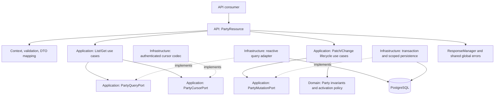

## Context

The service uses Java 25, Quarkus 3.33.3.1, Mutiny, and Hibernate Reactive/Panache. Existing adapters use programmatic `Mutiny.SessionFactory.withSession` and `withTransaction`. `ApplicationUseCaseProducer` composes framework-independent use cases. ArchUnit explicitly permits Mutiny in Application while excluding it, persistence, HTTP, Jackson, and cryptography from Domain.

`PartyResource` currently exposes activation under `/v1/parties/{partyId}`. Reusable contracts include the sealed `Party` and `PartyDetailsResult` hierarchies, `PartyApiMapper`, `PartyDetailResponse`, `ApiRequestSupport`, the context filter, and transport-neutral application failures. Natural-person and legal-entity updates already coordinate through the root Party version.

Several implementation details affect this design:

- `PartyActivationDecision` currently lives in Infrastructure and decides absence/version/lifecycle precedence. `HibernateReactivePartyActivationAdapter` also invokes the activation policy and constructs the outcome. Extending that arrangement would put more application orchestration in an adapter; this affected path will be moved behind an Application-owned transaction boundary.
- Lifecycle methods currently advance Domain versions, while existing type-specific detail updates keep the candidate version until persistence advances it. The new root mutation operations will follow the lifecycle convention explicitly without changing the independent detail-update contracts.
- Restoration validates historical display names by code points. New root display-name writes require the stricter normalized UTF-16 limit; restoration must continue accepting existing historical representations.
- Flyway V1 contains all four Party statuses, root/detail tables, and the optional outbox. V2 already contains tenant/operation/key-scoped idempotency records with versioned JSON snapshots. V3 and V4 govern identifier reference data and optional expiration.
- The resolved `api-response-quarkus-errors:1.0.0-SNAPSHOT` dependency provides `ResponseManager.paginatedHttp(List<T>, PaginationMetadata)`. Its Jackson adapter omits null envelope properties, and its pagination counts are `Integer`. Both facts require explicit treatment at the list boundary.
- The build currently configures neither a SonarQube scanner nor a SonarQube server/project. SonarQube evidence cannot be inferred from successful compilation or OpenSpec validation.

### Architectural authority and narrow contract overrides

The enterprise model remains the reference for service ownership, tenant-qualified persistence, root versioning, and optional atomic events:

- [Get Party sequence](file:///home/alex/Documents/Development/architecture/alex-astudillo-architecture/architectures/party-registry/party-registry-sequences.c4#L149).
- [Update Party sequence](file:///home/alex/Documents/Development/architecture/alex-astudillo-architecture/architectures/party-registry/party-registry-sequences.c4#L35).
- [Lifecycle sequence](file:///home/alex/Documents/Development/architecture/alex-astudillo-architecture/architectures/party-registry/party-registry-sequences.c4#L62).
- [Activation sequence](file:///home/alex/Documents/Development/architecture/alex-astudillo-architecture/architectures/party-registry/party-registry-sequences.c4#L113).
- [Search sequence](file:///home/alex/Documents/Development/architecture/alex-astudillo-architecture/architectures/party-registry/party-registry-sequences.c4#L167).

The central get sequence describes a broader aggregate including nationalities and masked identifiers. The approved root OpenAPI and this change's specs explicitly exclude those collections; that endpoint-specific contract takes precedence. The central update sequence includes country validation for detail changes; root display-name PATCH does not change a country and therefore needs no geographic call.

The project intentionally returns only `status` and `code` for errors, rather than the shared library's optional validation details. It also requires explicit null pagination cursors. These narrow wire-contract decisions do not change dependency direction, sanitization, the shared response/error implementation, or the mandatory typed resource signatures.

## Requirements Traceability

Requirement names refer to the corresponding files under this change's `specs/` directory.

| Capability / requirement | Design element |
|---|---|
| party-queries: Root Party request context | Existing `RequestContextFilter`, metadata context, bounded route telemetry |
| Root Party response and error contract | API DTO mapping, CDI `ResponseManager`, shared errors, pagination-only null serialization |
| Tenant-scoped Party summaries | `ListPartiesUseCase`, `PartyQueryPort`, explicit summary projections |
| Party listing filter semantics | Typed criteria, canonical name predicate, instant-qualified date bounds |
| Party listing input validation | `PartyQueryParameters` parser over the raw multivalue query map |
| Stable scoped Party pagination | Scoped authenticated cursors, stable tuple order, repeatable-read collection snapshot |
| Common Party detail retrieval | `GetPartyUseCase`, one qualified root/detail read, sealed result mapping |
| party-basic-update: Root Party PATCH input contract | `PartyUpdateRequest`, model-local strict deserializer, existing request support |
| Canonical display-name correction | Domain root write methods and `PartyTextNormalization`; separate write-length guard |
| Display-name update preconditions and precedence | API validation ordering and Application-owned mutation workflow |
| Display-name update observable outcome | Root-only conditional update, exact version increment, audit/event transaction |
| party-deactivation-and-archival: Party deactivation transition | Domain `deactivate` behavior and `ChangePartyLifecycleUseCase` |
| Party archival transition | Domain `archive` behavior and terminal lifecycle transition matrix |
| Lifecycle request validation | Shared support for optional keys, Party ID, and required expected version |
| Lifecycle tenant isolation and failure precedence | Application decisions after serialized replay resolution |
| Lifecycle idempotency scope and request equivalence | Tenant/action/key serialization and typed effective request identity |
| Lifecycle successful result replay | Operation-specific persisted snapshots and replay-aware outcome |
| Lifecycle retention and atomic outcomes | One reactive transaction for root, snapshot, and enabled outbox event |
| party-activation: Activation requires a qualifying verified identifier | Domain activation policy and minimal same-transaction evidence projection |
| Party activation transition | Existing draft-only eligibility plus shared lifecycle orchestration |
| Activation optimistic concurrency | Locked qualified root and final expected-version predicate; equivalent replay exception |
| Activation is tenant-scoped | Qualified reads, replay scopes, and conflict diagnostics |
| Activation has one observable outcome | Shared mutation boundary and existing activation event contract |
| Activation follows the shared lifecycle request and replay contract | One lifecycle command workflow for all three actions |
| Proposal: strict architecture and quality constraints | ArchUnit, class-level SonarQube/LSP evidence, Month-based fixtures, JVM/native checks |

## Goals / Non-Goals

**Goals:**

- Implement the six root operations with the approved request, response, concurrency, and retry semantics.
- Keep Domain responsible for invariants, Application for workflow and failure precedence, API for HTTP, and Infrastructure for technical mechanisms.
- Make root mutations, successful replay records, and enabled events indivisible while retaining independent identifiers and historical creation results.
- Provide exact pagination metadata and stable navigation with bounded application memory.
- Establish verifiable JVM/native behavior and the user's zero-findings/zero-new-warnings quality gates.

**Non-Goals:**

- A generic repository, transaction framework, or service-wide architecture rewrite.
- New Party types, reactivation, physical deletion, identifier/nationality APIs, or modifications to registration semantics.
- A new authentication mechanism or a replacement response envelope/global exception mapper.
- Historical data normalization, new search columns requiring backfills, or cleanup/expiration of stored idempotency results.

## Architecture



Domain remains synchronous and depends only on Domain/JDK types and permitted nullability annotations. Application may expose `Uni` through its selected reactive I/O profile, but contains no CDI, Hibernate, Jackson, REST, response-library, or SQL types. API and Infrastructure never import each other's project packages. CDI producers remain in outer composition.

The mutation port exposes a feature-specific, transaction-scoped capability object, not a Hibernate session. Application supplies the workflow executed within that scope. Infrastructure starts/finishes the transaction and implements its operations, but does not choose eligibility, failure precedence, or replay equivalence. The capability object cannot escape the returned pipeline or be used after transaction completion.

All I/O remains nonblocking. Operations sharing a reactive session are sequential. There are no manual subscriptions, synchronous waits, worker offloads around Hibernate Reactive, or JDBC request-path calls.

## Components and Responsibilities

### API resource and validation

**Responsibility:** Bind the public contract, construct application inputs, and produce explicit typed responses.

**Collaborators:** Existing context/support/error components, four root use cases, API mappers, and `ResponseManager`.

- Change the resource's base path to `/v1/parties`. Use method paths for `/{partyId}` and the three lifecycle suffixes. Verify routing remains compatible with existing nested identifier resources.
- Add `PartyQueryParameters` to read the complete multivalue query map before converting fields. Reject unknown names and repeated occurrences; default only absent values, never malformed ones. Count raw decoded name-filter length in Unicode code points, then apply canonical comparison rules. Parse date-time offsets into `Instant`; do not accept local date-times silently in the server timezone.
- Add `PartyUpdateRequest` with a nullable binding representation of `displayName`, a required-value constraint using `display-name-required`, and a normalized-copy maximum-length constraint using `display-name-too-long`. Preserve blank strings through structural validation so that business rejection occurs after absence/version checks.
- Use a request-local JSON deserializer accepting only an object and exactly the supported string/null property. Track seen field names to reject duplicate properties; reject scalar coercion and unknown properties. Keep missing/null body handling in `ApiRequestSupport`. A narrow reader translation may follow the existing legal-update interceptor pattern, scoped only to this model, and must emit `ApiResponseException` rather than an HTTP response.
- Validate PATCH in context/body/path/version order. Validate lifecycle inputs in context/optional-key/path/version order. Do not introduce automatic parameter validation that changes the public first-error selection.
- Add `PartySummaryResponse` and mapper methods. Reuse `PartyDetailResponse` and the existing sealed-result mapper for all five detail-returning operations.

### Domain root behavior

**Responsibility:** Enforce the transition matrix and canonical display-name invariants independently of transport and storage.

**Collaborators:** `Party`, `NaturalPerson`, `LegalEntity`, `PartyRecordStatus`, `PartyVersion`, `AuditInfo`, normalization, and the activation policy.

Extend the sealed Party contract with explicit display-name correction, deactivation, and archival operations. Avoid an unrestricted status setter. Both concrete aggregates preserve their original detail object and all untouched fields when copying root state.

| Operation | Permitted starting state | Result |
|---|---|---|
| activate | DRAFT, with qualifying evidence | ACTIVE |
| deactivate | ACTIVE | INACTIVE |
| archive | DRAFT, ACTIVE, INACTIVE | ARCHIVED |
| change display name | All four states | Same lifecycle state |

These root operations produce a candidate at `version.next()` with updated audit information. Domain guards overflow instead of allowing a negative version. Persistence stores that next version exactly once. Existing type-specific detail mutation methods keep their current candidate/version convention.

Display-name correction normalizes only the newly supplied label through `PartyTextNormalization.uppercase`. A write-specific invariant uses `String.length()` after normalization for the 300 UTF-16-unit limit and `isBlank()` for empty/blank rejection. Do not tighten restoration constructors or normalize retained historical detail fields. Reuse existing Domain violations where accurate and add explicit deactivation/archival violations as needed; they contain no HTTP codes.

Retain the activation policy's draft-only, ownership, scheme-identity, compatibility, verification, and expiration rules. Refine its input to minimal `PartyActivationEvidence` values so that evaluating eligibility does not load encrypted identifier material. This projection includes the ownership and scheme identities needed by the policy, status, expiration, and subject-type compatibility; primary flags and scheme lifecycle state do not gate activation.

### Application read workflows

**Responsibility:** Coordinate validated query criteria, cursor scope, absence handling, safe results, and observations.

**Collaborators:** `PartyQueryPort`, `PartyCursorPort`, Domain identifiers/types, and `OperationObservationPort`.

- `GetPartyUseCase` resolves a tenant-qualified result or emits `PartyNotFound`. It does not call the natural-person detail use case, which includes an identifier collection, or the geographic service.
- `ListPartiesUseCase` forms effective criteria, verifies and decodes cursors before data access, invokes one consistent collection read, then encodes previous/next continuation boundaries. It returns `PartyPageResult` with summary results and metadata, not an HTTP response.
- Application-owned criteria describe filtering and pagination independently of SQL. A small canonical name predicate is the authoritative literal prefix/substring comparison; Infrastructure may execute it over bounded projections but cannot redefine it using incompatible database collation rules.
- Invalid cursor content/scope is a transport-neutral `InvalidPartyCursor` failure. API maps it to the already specified `400 bad-request` without echoing the token.

### Application mutation workflows

**Responsibility:** Own transactional orchestration, replay decisions, failure precedence, Domain invocation, and event intent.

**Collaborators:** `PartyMutationPort`, Domain policies, `Clock`, existing failure/result contracts, and observations.

Add `PatchPartyUseCase` and `ChangePartyLifecycleUseCase`. The lifecycle command carries `PartyLifecycleAction` (`ACTIVATE`, `DEACTIVATE`, `ARCHIVE`), trusted request metadata, Party ID, expected version, and an optional key. Replace the affected activation-only orchestration with this workflow rather than retaining an additional pass-through activation facade.

Move the application decisions currently in Infrastructure's `PartyActivationDecision` into this workflow. Domain decides whether transitions and evidence are valid; Application checks tenant-qualified absence and expected version first and translates recognized Domain failures into the existing transport-neutral application catalog. Infrastructure's exception translator handles only technical failures.

Capture one UTC operation instant for a new mutation after replay resolution and the qualified root lock, and derive activation's evaluation date from it. Use database-compatible microsecond precision for accepted audit values, results, snapshots, and events so that original responses and later reads agree. A replay uses the saved values; the current request's user/process remains available solely for current request attribution.

Return `PartyMutationOutcome`, containing a `PartyDetailsResult` and an applied/replayed outcome for API-level completion telemetry. The API maps only its Party data into the response. The original user/timestamp stay in replayed data while the existing filter echoes the current accepted process identifier.

### Reactive query adapter

**Responsibility:** Return tenant-qualified detail projections and internally consistent summary pages with bounded memory.

**Collaborators:** Hibernate Reactive sessions, existing root/detail mappings, typed criteria, and the canonical name predicate.

- Detail reads use one qualified root plus left-joined detail query and map the matching subtype inside the session. Missing roots produce absence. A present root with missing/incompatible detail structure is corrupted state and becomes a sanitized internal failure, not a fabricated partial response.
- Summary reads select only the six summary fields. No identifier, protected value, or type-specific detail fetch is needed.
- Execute the collection read in a short `REPEATABLE READ READ ONLY` transaction, setting its mode before the first data query. Sequential count/page/neighbor reads then share a snapshot. Merely placing several queries in a default read-committed transaction is insufficient.
- Without effective name filters, push tenant/type/status/time predicates, exact count, keyset selection, and neighbor-existence checks to PostgreSQL.
- With name filters, preserve exact locale-independent normalization on historical Unicode text. Traverse the tenant/type/status/time-qualified summary projections in bounded keyset batches within the same snapshot, apply the canonical predicate, accumulate the exact match count, and retain only the requested page, its lookahead, and neighbor-existence/boundary information. Do not collect the whole tenant into memory. Each batch returns control through the reactive pipeline.

The name-filter path deliberately trades scan cost for exact Unicode behavior without a historical backfill. SQL `upper`/`ILIKE` must not be assumed equivalent to Java's root-locale uppercase, especially for expansion characters. A future SQL optimization is acceptable only with demonstrated semantic equivalence; this release has one authoritative comparator and a bounded implementation.

### Transaction adapter and scoped mutation operations

**Responsibility:** Provide one reactive transaction and persistence primitives while keeping the business workflow in Application.

**Collaborators:** `Mutiny.SessionFactory`, root/detail and evidence mapping, idempotency snapshots, outbox mapping, and technical error translation.

Implement `PartyMutationPort` with one programmatic transaction per attempted mutation. Its scoped context binds the trusted tenant and sequentially supports replay-key serialization, completed-result reads, qualified root locking, evidence reads, guarded root persistence, snapshot persistence, and enabled event persistence.

Use `READ COMMITTED` for mutation transactions, independently of collection reads. The completed-result lookup after waiting for a replay-scope lock must see the winner's newly committed snapshot; inheriting repeatable-read isolation from an earlier statement could hide that result. Establish the intended isolation before data access and keep the setting transaction-local.

For keyed lifecycle requests, acquire a PostgreSQL transaction-scoped advisory lock derived from the complete tenant/action/key scope before reading a saved result or locking a Party. The stable lock identifier is an Infrastructure concern with a dedicated namespace; hash collisions can only serialize unrelated requests, not merge scopes, because the actual lookup always uses the full key. The reactive driver waits asynchronously. Use transaction-scoped locks so rollback, cancellation, connection termination, and commit release ownership.

The fixed acquisition order is replay-scope lock, then one tenant-qualified Party row lock. Read completed results after acquiring the scope lock. Equivalent requests waiting for the winner therefore see its completed result before checking the now-stale Party version. Requests using the same key for different Party IDs also serialize before either can publish a conflicting outcome.

Retain the V2 primary key as the final uniqueness constraint. Technical recovery after any database failure happens outside the failed transaction; never continue queries on a failed session. Business failures and cancellation retain their identity.

### Snapshots, cursor protection, and optional events

**Responsibility:** Adapt stable inner contracts to persisted/protected wire representations.

**Collaborators:** Existing idempotency/outbox mappings, JDK cryptography, configuration, and inner result types.

- Add a lifecycle snapshot codec with a distinct schema version and operation namespace. Persist the original safe `PartyDetailsResult`, original effective Party ID/expected version, and action. Reuse/extract only the safe Party snapshot mapping needed from the current codec; preserve registration version-one/version-two readers and bytes/meaning.
- Compute the V2 `request_hash` from an unambiguous, versioned encoding of the lifecycle effective request. This input contains IDs/version rather than secret identifiers, so a SHA-256 digest is sufficient here; registration's existing HMAC inputs and key remain independent. Application decides equivalence from the decoded typed effective request, while Infrastructure verifies snapshot/hash consistency.
- Implement `PartyCursorPort` with a versioned authenticated cursor containing direction, exact timestamp/UUID boundary, page size, filter-scope digest, and signing-key ID. Scope includes tenant and all effective filters; equivalent canonical filters and equivalent date-time offsets yield the same scope. Tokens are opaque client handles, not authorization credentials.
- Use HMAC-SHA-256 with independently provisioned cursor key material and constant-time verification. Do not reuse identifier-encryption or registration-fingerprint keys. Register configuration such as `party-registry.pagination.current-signing-key-id` and `party-registry.pagination.signing-keys.<id>` from deployment secrets, with deterministic test-only keys. Preserve verification keys needed during rolling upgrades; no token expiry policy is introduced.
- Extend the optional outbox's allowlisted candidate/codec handling for `party.updated.v1`, `party.deactivated.v1`, and `party.archived.v1`, alongside the existing `party.activated.v1`. Event metadata carries tenant, Party identity, accepted version, event time, correlation, and actor. Payloads contain bounded type/status information; they do not include display names, type-specific details, or identifier values. Existing `disabled`, `stored-only`, and `published` modes govern whether events are stored/published. Replay creates no new event.

## Interfaces and Contracts

### HTTP boundary

| Operation | Application operation | Resource return type |
|---|---|---|
| `GET /v1/parties` | `ListPartiesUseCase` | `Uni<RestResponse<ApiResponse<List<PartySummaryResponse>>>>` |
| `GET /v1/parties/{partyId}` | `GetPartyUseCase` | `Uni<RestResponse<ApiResponse<PartyDetailResponse>>>` |
| `PATCH /v1/parties/{partyId}` | `PatchPartyUseCase` | `Uni<RestResponse<ApiResponse<PartyDetailResponse>>>` |
| `POST /v1/parties/{partyId}/activate` | Lifecycle command: ACTIVATE | `Uni<RestResponse<ApiResponse<PartyDetailResponse>>>` |
| `POST /v1/parties/{partyId}/deactivate` | Lifecycle command: DEACTIVATE | `Uni<RestResponse<ApiResponse<PartyDetailResponse>>>` |
| `POST /v1/parties/{partyId}/archive` | Lifecycle command: ARCHIVE | `Uni<RestResponse<ApiResponse<PartyDetailResponse>>>` |

API maps application results to DTOs first. Detail successes use CDI `ResponseManager.successHttp`; listing uses `paginatedHttp` with `PaginationMetadata`. No resource constructs a replacement envelope, returns a raw response or inner object, or catches cross-cutting exceptions.

### Required null pagination fields

Preserve the library's existing `NON_NULL` mixin and serialization behavior for details and errors. Add an API-owned Jackson module using a `BeanSerializerModifier` to decorate only the `nextCursor` and `prevCursor` property writers of `ApiResponse`:

- For an envelope with populated pagination metadata, explicitly write a null cursor when that direction is unavailable.
- Otherwise delegate to the original property writer, retaining omission for ordinary success/error responses.
- All three count values are populated for list responses, including zero, so pagination presence is unambiguous without testing whether a list is empty.

This is a narrow serialization customization of an already-created shared envelope. It is not a response-wrapping filter, a copied library class, a replacement global mapper, or a handwritten success object. Test coexistence with the library customizer in JVM and native mode.

Compute totals using `long` internally and perform checked conversion at the current library's `Integer` boundary; never truncate or wrap. The inspected dependency cannot represent totals above `Integer.MAX_VALUE`. Supporting such counts requires a compatible published shared-library enhancement; do not silently change exact totals to null or cap them. Treat an unrepresentable count as an explicit technical capacity failure and track the library limitation in deployment sizing and verification evidence.

### Inner port contracts

The following sketches describe responsibilities and signatures, not complete implementation classes:

```java
// application.port.PartyQueryPort
Uni<Optional<PartyDetailsResult>> findDetails(TenantId tenantId, PartyId partyId);
Uni<PartyPageSlice> findPage(
        TenantId tenantId, PartySearchCriteria criteria, Optional<PartyPageBoundary> boundary);

// application.port.PartyCursorPort
PartyPageBoundary decode(String token, PartySearchScope expectedScope);
String encode(PartyPageBoundary boundary, PartySearchScope scope);

// application.port.PartyMutationPort
Uni<PartyMutationOutcome> execute(
        RequestMetadata metadata,
        Function<PartyMutationContext, Uni<PartyMutationOutcome>> work);
```

`PartyMutationContext` is feature-scoped and includes capabilities equivalent to:

```java
Uni<Void> serializeReplayKey(PartyLifecycleAction action, String key);
Uni<Optional<CompletedPartyLifecycle>> findCompleted(PartyLifecycleAction action, String key);
Uni<Optional<Party>> findForUpdate(PartyId partyId);
Uni<List<PartyActivationEvidence>> activationEvidence(PartyId partyId);
Uni<Party> persistRoot(Party candidate, PartyVersion expectedVersion);
Uni<Void> recordCompletion(PartyLifecycleAction action, String key, CompletedPartyLifecycle outcome);
Uni<Void> appendEnabledEvent(OutboxEventCandidate event);
```

The context carries the tenant established by `execute`; callers cannot replace it mid-operation. It never exposes a session, connection, SQL, persistence entity, or HTTP type. Implementations reject use outside the active scope. Cursor methods perform bounded in-memory validation/cryptography and need no fake asynchronous wrapper or I/O in Domain.

### Static OpenAPI alignment

Update the approved source contract during implementation, then verify its packaged `/q/openapi` representation:

- Document list AND filters, exact comparison/length units, inclusive instant bounds, accepted query cardinality, deterministic ordering, cursor scope, exact counts, explicit null directions, and empty collections.
- Close the root PATCH object schema, declare `display-name-required`, extend `display-name-too-long` and `blank-display-name` applicability, and document validation precedence. A supplied empty/blank string has the specified semantic `422`; missing/null has `400`.
- Describe the complete lifecycle transition matrix, draft-only activation, and keyed historical replay. Extend `stale-party-version`, `invalid-party-lifecycle`, and `idempotency-key-conflict` documentation to the appropriate lifecycle operations without changing unrelated endpoints.
- Document root PATCH's `412 expected-version-mismatch`, root `404 party-not-found`, process echoes, framework failures, and the exact root response fields.
- Preserve the difference between current GET results and historical idempotent lifecycle/registration results.

Resource annotations alone do not publish these changes because annotation scanning is disabled and Gradle copies the static YAML.

## Data Model

| Store | Use in this change |
|---|---|
| `parties` | Tenant-qualified reads; root-only display/status/audit/version writes |
| `natural_person_details`, `legal_entity_details` | Matching details read and preserved; not updated by root commands |
| `party_identifiers`, `identifier_schemes` | Minimal activation evidence projections only |
| `api_idempotency_records` | Existing full tenant/operation/key uniqueness; separate lifecycle operations and snapshot schema |
| `party_outbox_events` | Enabled root mutation events in the same transaction |

Use operation names such as `party.activate.v1`, `party.deactivate.v1`, and `party.archive.v1`, distinct from registration operations. A lifecycle snapshot stores schema version 3 in both the existing version column and JSON payload, with action/effective request/safe result. Validate redundant identity/type/version information on decoding; corruption or unknown schemas become internal failures, not cache misses or new executions.

The key's scope excludes Party ID, but effective request identity includes it. This is necessary to reject same-action reuse of a key for another Party. Process/user values do not enter request equivalence; the saved result retains the original audit actor. No in-progress idempotency row is committed, and failed attempts leave no completed record.

### Flyway migration

Add the next available immutable migration, currently `V5__add_party_listing_order_index.sql`, containing an index on `parties (tenant_id, created_at DESC, id DESC)`. Existing type/status indexes remain useful for selective filters. Check the migration number again when implementation begins because other changes may advance the sequence.

The current tables already support statuses, replay snapshots, and event types. No enum/table alteration or historical data rewrite is required. Do not edit V1-V4, create indexes manually, or enable schema generation. The index is a technical access path, not a normalized-name backfill. Review index-build duration against production table size before rollout.

### Exact root version update

Under the tenant-qualified root lock, Application checks the expected version and calls Domain. Persistence then executes a parameterized conditional root mutation guarded by tenant, ID, and expected version. It assigns only the requested root field plus update audit values and the Domain candidate's next version. Require exactly one affected row and exactly one version advance.

Do not dirty the managed root and also run a bulk update; that would combine explicit arithmetic with `@Version` and risk a second increment. Clear stale managed state immediately after the bulk mutation and reload root/details before building the accepted result. Flush pending snapshot/event writes before transaction completion. The port emits success only after commit.

PATCH assigns no status or detail fields. Lifecycle actions assign no display name or detail fields. Existing type-specific writes remain protected by their own root version predicate and therefore serialize correctly with these operations. Checked version overflow is an internal invariant/capacity failure, not a malformed `If-Match` or permission to wrap to zero.

## Interaction Flows

### List and detail retrieval

1. The existing filter validates context. API parses all list parameters or the canonical Party ID.
2. For listing, Application constructs the effective search scope and verifies any cursor before calling the query adapter.
3. The adapter uses one read-only snapshot for complete list metadata, eligible page rows, and neighbor information. Without name filters it uses database count/keyset queries; with name filters it traverses bounded projections using the authoritative predicate.
4. Application creates opaque direction-specific cursors; API maps summaries and calls `paginatedHttp`.
5. Detail retrieval instead performs one root/detail lookup, projects the correct subtype, maps through `PartyApiMapper`, and calls `successHttp`.

Forward boundaries use the last returned `(createdAt, partyId)` and select smaller tuples in descending order. Previous boundaries use the first returned tuple and choose the nearest larger tuples, returning the selected page in the normal descending order. UUID ordering follows canonical unsigned UUID ordering, not Java's signed `UUID.compareTo` by assumption. Database timestamps retain full stored precision in cursors; millisecond truncation would skip records with equal millisecond values.

Counts include all tenant/filter matches, not just rows after the cursor. Neighbor existence and returned metadata use the same snapshot. Across separate requests the dataset may change; this is live continuation, not snapshot retention. An issued boundary need not refer to a currently matching row. For an empty continuation page, determine available previous/next direction relative to its authenticated boundary; do not invent data or reject a valid cursor merely because records changed. When the entire filtered dataset is empty, both cursors are null and every count is zero.

### Root display-name correction

1. API enforces context, strict body/required value/normalized maximum length, path, and version syntax.
2. `PatchPartyUseCase` opens the mutation scope and loads the tenant-qualified root for update.
3. Application rejects absence, then stale version, then invokes the Domain display-name operation. Blank rejection therefore follows the version check.
4. Persistence updates only the label/audit/version, reloads the complete safe representation, and stores an enabled corresponding event.
5. Commit completes before the item reaches API mapping. There is no lifecycle replay lookup for PATCH.

### Lifecycle operation and replay

```mermaid
sequenceDiagram
    participant Client
    participant API as PartyResource
    participant UC as ChangePartyLifecycleUseCase
    participant UOW as Reactive mutation scope
    participant D as Domain policy and Party
    participant DB as PostgreSQL

    Client->>API: Action, context, Party ID, If-Match, optional key
    API->>API: Validate context and operation input
    API->>UC: Transport-neutral lifecycle command
    UC->>UOW: Execute one transactional workflow
    UOW->>DB: Begin reactive transaction
    opt Key supplied
        UC->>UOW: Serialize tenant/action/key and read completed result
        UOW->>DB: Transaction-scoped key lock; full-scope lookup
        DB-->>UC: Completed result or absence via scoped port
    end
    alt Equivalent completed result
        UC-->>UOW: Historical result with REPLAYED outcome
    else Key conflicts
        UC-->>UOW: IdempotencyKeyConflict
    else New operation
        UC->>UOW: Lock tenant-qualified Party
        UOW->>DB: Qualified row lock and detail read
        DB-->>UC: Detached Party through scoped mapping
        UC->>UC: Require existence and expected version
        UC->>D: Require permitted lifecycle transition
        opt Activation
            UC->>UOW: Load minimal same-transaction evidence
        end
        UC->>D: Validate transition and evidence; produce next state
        D-->>UC: Valid candidate or Domain failure
        UC->>UOW: Guarded root write; reload safe result
        UC->>UOW: Record successful keyed snapshot and enabled event
    end
    UOW->>DB: Commit, or rollback on failure
    UOW-->>UC: Committed result or transport-neutral failure
    UC-->>API: Outcome
    API-->>Client: Shared typed envelope; current Process-Id echo
```

For a new activation, validate lifecycle state before reading/evaluating evidence so the established state-before-evidence failure precedence is preserved. A Domain-owned eligibility check may be invoked before the evidence query and again when producing the final aggregate; Infrastructure does not implement the transition matrix.

When two equivalent keyed requests arrive together, the second waits for the first transaction to release the scope lock, sees the committed snapshot, and returns it before touching current Party state. With conflicting same-key input, the second produces 409 before any Party mutation. With no key or distinct keys, ordinary root version arbitration decides the winner and lifecycle losers receive 412.

## Error Handling

| Condition | Expected handling |
|---|---|
| Missing/invalid trusted context | Existing exact header-specific 400 codes and process echo rules |
| Invalid query shape/value or cursor | `400 bad-request`, without raw query/cursor diagnostics |
| Missing/null PATCH body | `400 request-body-required` |
| Missing/null displayName | API constraint: `400 display-name-required` |
| Normalized displayName above 300 UTF-16 units | API validation: `400 display-name-too-long`; Domain still protects non-HTTP callers |
| Unknown/duplicate JSON property or wrong token type | Scoped JSON translation: `400 bad-request` |
| Noncanonical Party ID | `400 party-id-invalid` |
| Invalid key or If-Match cardinality/value | Existing exact operation-header 400 codes |
| Tenant-scoped absence | Application `PartyNotFound` becomes `404 party-not-found` |
| PATCH expected-version mismatch | `412 expected-version-mismatch` |
| New lifecycle expected-version mismatch | `412 stale-party-version` |
| Equivalent saved lifecycle result | `200 successful`, before current version/state/evidence checks |
| Conflicting completed lifecycle key | `409 idempotency-key-conflict` |
| Disallowed lifecycle transition | `409 invalid-party-lifecycle` |
| Structurally valid blank display name | Domain violation becomes `422 blank-display-name` |
| Missing qualifying activation evidence | `422 missing-qualifying-identifier` |
| Framework method/media/route failures | Shared 405/415/404 envelope with matching status |
| Corrupt state/snapshot, unexpected persistence or serialization failure | Internal diagnostic; sanitized `500 server-error` |
| Cancellation | Preserve cancellation and release/terminate the reactive scope; no fabricated success |

Extend `PartyApiErrorTranslator` only for new recognized inner failures and the declared display-name code. Preserve unrecognized failures for the shared global module. Retain the existing `ApiResponseException` type from the published dependency rather than introducing a local `ApiException` alias or local global mapper.

A database-acknowledgement or HTTP-delivery loss after commit can leave the caller uncertain, but cannot create partial root/snapshot/event acceptance. Equivalent keyed retry resolves that uncertainty. Failure-before-acceptance tests must target the transaction, not assume an HTTP socket failure rolls back a completed commit.

## Security

- Continue using the established trusted-header boundary. Tenant-qualified predicates apply to reads, counts, locks, snapshots, writes, and diagnostic lookups. A cursor never supplies the trusted tenant.
- Bind all SQL/HQL values; client input cannot choose query identifiers or ordering. Name predicates treat wildcard-looking characters literally.
- Bind cursor MACs to the complete effective scope and direction/boundary. Validate structure, format version, key ID, and signature before using the boundary. Keep raw cursors, filters, names, keys, and snapshot payloads out of logs/traces.
- Store lifecycle snapshots as allowlisted inner result data, not serialized Domain/ORM objects or HTTP envelopes. Never include identifier-protection material. Decode saved effective identity before deciding replay or conflict.
- The strict PATCH model prevents assignment of tenant, Party ID, type, state, version, or details.
- Key material is configured outside source control, validated once at startup, and available to all replicas. SonarQube credentials are likewise external inputs, never committed or included in reports.

## Resilience

- Bound database statement/lock waits and overall list traversal through explicit configuration and reactive timeouts. Verify timeout/cancellation actually terminates session work and releases locks; do not turn a timeout into an automatic write retry.
- Hold no transaction across geographic calls or broker acknowledgements. These root operations require neither geographic validation nor synchronous publication.
- Serialize commands with the same key before current-state checks and retain the database uniqueness constraint. Never rely on an in-memory lock or cache for replay across replicas/restarts.
- Stream name-filter candidates in bounded sequential batches; exact totals can still cost a full qualified scan. Expose duration/scan metrics and benchmark representative tenants before release. Do not return partial pages or approximate counts on timeout.
- Keep each request's read snapshot short enough for operational limits. No snapshot is held across client pagination requests.
- Preserve existing outbox lease/retry/publisher behavior. A single logical event may be delivered more than once by the transport; idempotent API replay prevents new logical events, not all possible broker redelivery.

## Observability

Extend `PartyHttpObservability` and the bounded application operation catalog for list, retrieve, display-name update, activation, deactivation, and archival. Record applied/replayed/conflict outcomes, operation duration, query batch/row counts, key-lock wait, and version conflicts with bounded labels. Raw IDs, keys, names, cursors, and filter values are not metric labels.

Resource/use-case spans follow existing conventions, for example `party.list`, `party.retrieve`, `party.patch`, and the three action names. Propagate accepted request metadata through the full reactive pipeline. `RequestContextFilter` remains the sole owner of HTTP completion logging, process echo, and owned MDC cleanup, including partially initialized requests.

Preserve the exact configured format:

```text
%d{yyyy-MM-dd HH:mm:ss,SSS} %-5p [%c{3}] (%t) [pid=%X{processId}] [userId=%X{userId}] [tenantId=%X{tenantId}] %s%e%n
```

Expected validation rejection logs are runtime behavior, not compiler/LSP/SonarQube warnings. Log only bounded operation/rule names and accepted correlation; no rejected values or parser source content.

## Testing Strategy

### Unit Tests

- Domain: both Party types, complete lifecycle matrix, all-state label corrections, preserved historical details, canonical text/uppercase expansion/UTF-16 limits, audit changes, and exact next versions. Retain evidence tests for ownership, verification, expiration boundary, compatibility, and non-gating primary/scheme status.
- Application: scoped-port doubles exercise absence/version/state/evidence precedence, duplicate equivalent replay before current state, conflicting key behavior, no snapshot/event on failure, current correlation versus original audit, and cancellation. Assert Domain decisions are reached in the required order.
- API: strict duplicate/type/unknown-property binding, missing versus blank display names, multivalue query validation, code-point versus UTF-16 limits, and every new error mapping.
- Cursor: round-trip exact timestamp/UUID boundaries, altered MAC/payload, unknown versions/keys, tenant/filter/page-size isolation, normalized filter equivalence, and concurrent use of key material.
- Snapshot/event codecs: exact original result retention, both Party subtypes, schema/identity/type/hash consistency, wrong/unknown schema rejection, and unchanged registration snapshot decoding.
- Serializer: normal detail/error envelopes retain their shape; paginated empty/first/middle/final pages contain all required metadata, especially explicit null cursors.

Use fixed injected clocks for date-sensitive rules. Every new or modified Java date fixture must use `java.time.Month`, for example `LocalDate.of(2026, Month.SEPTEMBER, 19)` or `LocalDate.of(2026, Month.JANUARY, 1)`. Use the same enum-based construction for date-time fixtures; derive valid date strings for JSON from those values. Intentionally malformed date strings remain literal negative-test input. Do not introduce numeric month arguments or hide them behind helper constants.

### Integration Tests

- Run reactive persistence tests against Flyway-managed PostgreSQL on the required Vert.x context using existing `UniAsserter` conventions. Use separate sessions for concurrent requests.
- Prove the collection's count/page/neighbor reads remain consistent while another transaction inserts or changes a Party. Cover timestamp ties below millisecond resolution and UUIDs across the signed-most-significant-bit boundary.
- Test forward/backward navigation, valid boundaries after intervening data changes, all filter intersections, historical Unicode normalization, literal wildcard characters, zero results, and count/page-size boundaries. Exercise more rows than one internal scan batch and verify bounded accumulation.
- Verify root PATCH changes only root fields, including identical canonical writes at the same clock instant, and races correctly with existing natural-person/legal-entity detail writes.
- Race equivalent keyed commands, conflicting same-key commands targeting different Parties, different keys on one version, and unkeyed operations. Confirm exact status/version outcomes and no losing snapshot/event.
- Inject test-only failures after root mutation, snapshot write, and event write but before commit. Assert rollback of the complete outcome and successful key reuse after failure. Verify saved results survive new sessions and a process restart/relaunch against retained test data.
- Test lock timeout and cancellation cleanup; a canceled keyed request must not retain a transaction-scoped lock indefinitely.
- Verify migration upgrade from V4 and a clean database, index presence, unchanged old migration checksums, and continued registration replay.
- Run outbox serialization/publication tests for the new allowlisted event types and all three existing modes.

### Contract Tests

Add focused root read/update/lifecycle suites rather than growing a single multipurpose fixture indefinitely. Cover every EARS scenario, including:

- All six HTTP signatures and shared `status/code/data` success envelopes, HTTP/body status agreement, exact error keys, and omission of identifier/nationality/creation-only data.
- Every trusted header's missing/duplicate/value cases, validation precedence, process echo and cleanup, and cross-tenant concealment.
- Required/null/blank/oversized display names, malformed/duplicate/coerced JSON, unsupported method/media type, and sanitized unexpected failure.
- Filters, cursor tampering/scope, exact counts, required null cursor keys, defaults/boundaries, and invalid raw query multiplicity.
- Both Party types across the accepted transition matrix; no reactivation; archived retrieval and descriptive correction.
- Original keyed response after later archival, a retry with a new process/user, concurrent replay versus genuinely stale requests, and conflicting scope reuse.
- Creation replay remains the original 201 result and independent identifiers remain unchanged.

Extend `OpenApiContractTest` for the precise six-operation declarations and packaged YAML. Extend packaged integration tests under `src/integrationTest` for pagination serialization, root PATCH, all lifecycle outcomes, and both snapshot subtypes; execute the same contracts against the native image.

### Architecture, native support, and quality evidence

Keep `ArchitectureRules` enforcing all four inward-facing packages and package-cycle checks. Add focused coverage against application/Domain references to transport, ORM, DI, or response types; inspect the affected activation workflow so a package move does not merely hide infrastructure-owned business decisions. Scope source/signature checks to actual boundaries rather than testing implementation trivia.

Use explicit API DTOs and existing native reflection conventions. The lifecycle/cursor snapshot codecs can use explicit JSON trees to avoid reflective serialization of sealed Domain/Application hierarchies. Verify the pagination property writers and strict request deserializer in the native executable; JVM serialization alone is insufficient.

For every new or modified Java class, interface, record, and enum:

1. Supply concise English responsibility Javadoc and document non-obvious public contracts/failures.
2. Inspect JDTLS/LSP diagnostics for that file, resolve warnings/errors, and investigate any disagreement with Gradle.
3. Run real SonarQube analysis using an approved Java-25-capable analyzer and project quality profile. Capture the analyzed revision, task/report identity, quality-gate result, and unresolved findings for all changed/new classes, including tests. Zero unresolved findings in those classes is stronger than merely passing a new-code quality gate.
4. Resolve new compiler/IDE warnings and type/nullability issues rather than hiding them through unjustified suppression, exclusions, or blanket rule disablement.

At implementation preflight, obtain the SonarQube URL, project key, authorized external token, scanner/analyzer compatibility, and applicable quality profile. Configure a pinned compatible scanner integration in the build or the approved CI entry point, then use its documented command. The current repository has no scanner task, so `./gradlew sonar` must not be presented as available before setup. If SonarQube or LSP diagnostics cannot be executed, record that specific gate as blocked; compilation cannot substitute for it.

Required implementation verification commands remain:

```shell
./gradlew test
./gradlew build
./gradlew buildNative -Dquarkus.native.container-build=true
./gradlew testNative -Dquarkus.native.container-build=true
```

The existing `build` wires `check` to packaged `quarkusIntTest`. Execute the configured SonarQube analysis after compiled classes and required reports are available. Preserve environment-specific container/runtime overrides in recorded evidence. Inspect resource signatures and HTTP assertions explicitly; an artifact/schema check does not demonstrate runtime or SonarQube compliance.

## Decisions

### Decision: Application owns the mutation workflow inside a scoped port

**Choice:** One feature-specific transaction scope with inner persistence capabilities; Application performs replay/version/Domain/event orchestration.

**Rationale:** Strict Clean Architecture requires moving the affected activation decision out of Infrastructure while preserving one-session atomicity.

**Alternatives considered:** Extending the current adapter-owned workflow would perpetuate misplaced orchestration. Quarkus transaction annotations in use cases would violate inner-layer isolation. A generic transaction/repository framework would add unnecessary surface area.

### Decision: Serialize the idempotency scope before the Party version

**Choice:** Transaction-scoped database advisory locking for tenant/action/key, then completed-result resolution, then a qualified root lock and guarded write.

**Rationale:** Equivalent concurrent retries and conflicting same-key requests for different Parties must converge before stale-version or current-state decisions.

**Alternatives considered:** Checking only the Party row first can turn an equivalent retry into 412. An insert-only completed-key race needs rollback/re-resolution for every loser and is harder to order correctly with state failures. A committed pending reservation requires an abandoned-reservation lifecycle not specified here. An in-memory lock does not work across replicas.

### Decision: Reuse the idempotency store with independent versioned snapshots

**Choice:** Existing full-scope key plus new lifecycle operation names and snapshot schema 3 containing safe original result/effective identity.

**Rationale:** The existing store already supplies durable scope and atomic storage; a new table or changes to creation snapshots are unnecessary.

**Alternatives considered:** Rebuilding a replay from current Party state violates historical replay. Persisting HTTP envelopes couples storage to transport. Reusing registration codecs without schema separation risks misinterpreting older records.

### Decision: Snapshot-consistent keyset pages with exact Unicode filtering

**Choice:** Stable timestamp/UUID boundaries, authenticated scope, one repeatable-read transaction, and bounded canonical filtering for name searches.

**Rationale:** This satisfies exact totals, backward navigation, historical text matching, and literal filters without rewriting historical rows or assuming collations match Java normalization.

**Alternatives considered:** Offset paging alone is unstable under changing data. Read-committed multi-query metadata can contradict the returned page. Unbounded in-memory collection violates bounded-resource goals. Database case conversion without equivalence evidence silently changes matching behavior.

### Decision: Preserve the shared envelope with a pagination-only serializer extension

**Choice:** Use `ResponseManager.paginatedHttp` and decorate only null cursor property serialization when metadata is present.

**Rationale:** The approved contract requires fields the inspected default null-omission mixin removes, while errors/details must retain their exact shapes.

**Alternatives considered:** Global `ALWAYS` inclusion adds unwanted fields to errors/details. Nested page data changes the declared collection contract. A local envelope copy or generic success-response filter violates the response boundary.

## Risks / Trade-offs

| Risk / trade-off | Mitigation |
|---|---|
| Activation refactoring leaves policy or failure precedence in Infrastructure | Application-owned workflow, Domain matrix/evidence rules, focused architecture and ordering tests |
| Equivalent concurrent retry fails with stale version | Serialize full replay scope before reading Party state; recheck completed result under that lock |
| Same key changes two different Parties | Full-scope lock plus existing unique constraint and atomic result storage |
| Root version increments twice or does not advance on identical PATCH | Explicit next-version guard, no dirty managed root alongside bulk update, reload and fixed-clock tests |
| Existing detail updates race with root lifecycle actions | Shared root version predicates and cross-operation integration races |
| Required null cursors are omitted or leak into errors | Metadata-conditional property writers, exact-key JVM/native assertions |
| Shared pagination count capacity is narrower than unconstrained database totals | Long internal counts, checked conversion, explicit capacity evidence; published library enhancement before larger supported totals |
| Database text comparison differs from root-locale normalization | Authoritative canonical predicate over bounded projections; Unicode expansion/whitespace regression corpus |
| Exact filtered totals hold a read snapshot too long | Indexed non-name predicates, bounded batches, finite timeouts, scan metrics, and representative-volume measurement |
| Cursor precision or UUID comparison skips ties | Preserve stored timestamp precision and canonical unsigned ordering; edge-case traversal tests |
| Cursor keys differ across replicas or are retired during navigation | Shared versioned secret configuration and staged key rotation |
| New snapshot/event schemas are unreadable by a rolled-back binary | Separate operation/schema namespace, staged rollout, preserved rows, and rollback compatibility checks |
| Test runs pass while static analysis was never performed | Per-class SonarQube/LSP evidence and explicit blocked-gate reporting |
| Native image misses serializer/codec reachability | Explicit DTO/codec design and packaged native contract coverage |

## Migration and Rollback

1. Confirm the next Flyway version and add the listing index through that migration only. Verify clean installation and V4 upgrade without changing prior checksums or stored identity data.
2. Provision cursor signing keys consistently across instances. Prepare native-compatible serializers, lifecycle snapshot readers, and the new event-reader allowlist before accepting new traffic that writes those formats.
3. Deploy the six-operation implementation and matching static OpenAPI/README. During a mixed-version rollout, route keyed lifecycle commands consistently to the new implementation or complete the reader/writer rollout before advertising the new replay guarantee; the old activation handler validates keys but does not replay them.
4. Enable the configured outbox mode only when the deployed publisher can decode all new event types. Preserve existing delivery retry/lease behavior.
5. On rollback, retain the index, accepted Party changes, versions, lifecycle snapshots, and outbox rows. Do not reset data or remove a completed key to make an old binary appear compatible.
6. A pre-change binary cannot honor the new lifecycle replay contract or decode the new events. Roll back to a compatible reader/handler build, or pause the affected lifecycle traffic/publication until a compatible release is restored. Preserve archived status and historical successful results throughout recovery.

The operational inputs identified for follow-up are the approved SonarQube/scanner configuration and deployed cursor key material. They do not change the approved business requirements; they must be supplied and verified before implementation acceptance and release.
