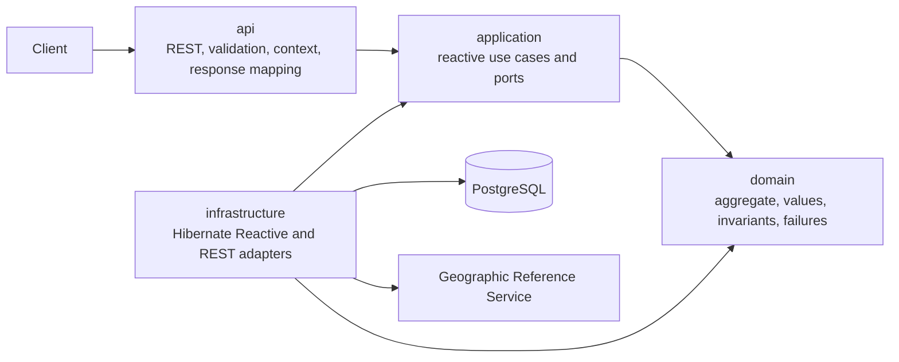
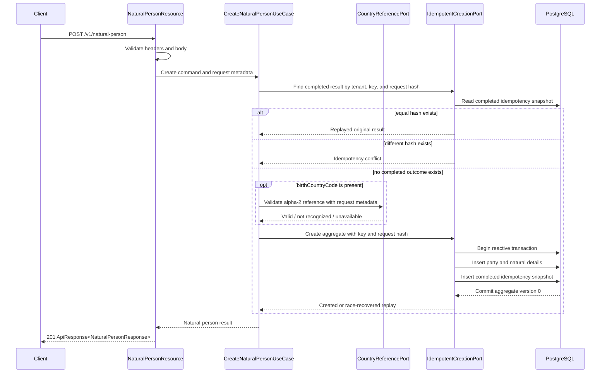
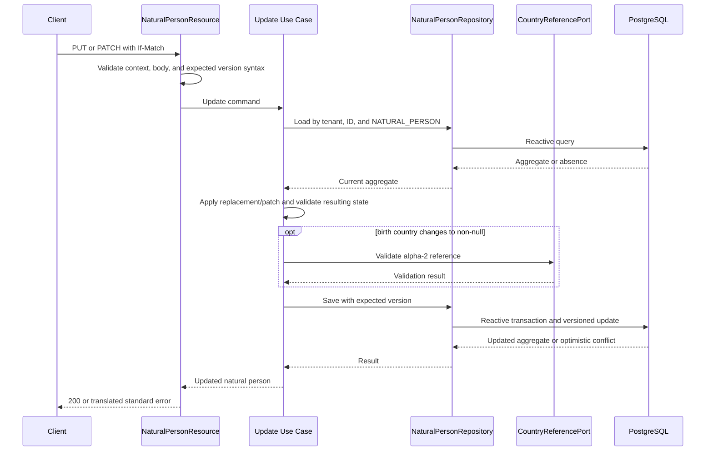

## Context

The repository currently provides the Quarkus 3.33.3.1 runtime baseline, Java 25 toolchain, approved static OpenAPI contract, PostgreSQL schema, shared API response dependencies, and packaged integration-test source set. It intentionally contains no production Java implementation for business endpoints.

The immutable `V1__create_party_registry_schema.sql` migration already defines `parties` and `natural_person_details`, UUIDv7 identifiers, audit columns, aggregate versions, lifecycle-date constraints, and deferred triggers that reject a mismatch between party type and detail type. A new migration is required only for HTTP creation idempotency; existing tables and `V1` must not be edited.

The service has explicitly selected the reactive profile. Request processing must therefore remain non-blocking from Quarkus REST through application orchestration, the Geographic Reference Service client, and Hibernate Reactive persistence. JDBC remains restricted to Flyway startup migrations.

The architecture model establishes Geographic Reference Service as the authority used to validate country codes during party creation and update. Authentication is handled outside this feature's business behavior; this change validates the trusted request context and preserves standard handling for any authentication failure raised by the configured platform security boundary.

## Requirements Traceability

| Requirement | Design Element |
|---|---|
| Trusted request context | `RequestContextFilter`, request-scoped `RequestMetadata`, MDC propagation |
| Natural-person request validation | API request models, Bean Validation, strict Jackson configuration, API mapper |
| Natural-person lifecycle date consistency | `NaturalPerson` aggregate invariants, injected `Clock` |
| Birth-country validation | `CountryReferencePort`, Geographic Reference REST adapter |
| Natural-person creation | `CreateNaturalPersonUseCase`, domain factory, reactive persistence adapter |
| Idempotent natural-person creation | `IdempotentNaturalPersonCreationPort`, Flyway `V2` idempotency table, unique-key recovery flow |
| Natural-person retrieval | `GetNaturalPersonUseCase`, tenant-and-type-scoped repository query |
| Complete natural-person replacement | `ReplaceNaturalPersonUseCase`, aggregate replacement behavior, optimistic persistence |
| Partial natural-person update | Presence-aware patch request, `PatchNaturalPersonUseCase`, aggregate patch behavior |
| Optimistic concurrency | `If-Match` parser, party aggregate version, conditional persistence and failure translation |
| Natural-person and legal-entity exclusivity | Fixed domain type, tenant/type-scoped queries, existing deferred database triggers |
| Standard API responses | `NaturalPersonResource`, response DTO mapper, CDI `ResponseManager`, shared global error module |

## Goals / Non-Goals

**Goals:**

- Implement the four approved natural-person operations end to end with Mutiny and Hibernate Reactive.
- Keep domain rules independent from Quarkus, Mutiny, HTTP, Jackson, and persistence APIs.
- Enforce tenant isolation, type exclusivity, lifecycle dates, country references, idempotency, and optimistic concurrency at their appropriate boundaries.
- Use the shared response and global error modules for every business JSON response.
- Preserve native-image compatibility and verify the behavior in JVM, packaged, and native test paths.
- Keep `V1` immutable and add only the persistence structure required by the approved behavior.

**Non-Goals:**

- Implement legal-entity, generic party, nationality, identifier, lifecycle-status, search, messaging, or outbox-publication behavior.
- Add a new authentication protocol or direct Keycloak integration.
- Add an idempotency retention or cleanup policy not defined by the requirements.
- Refactor the existing database schema outside the additive idempotency migration.
- Generate endpoint code from OpenAPI or expose domain or persistence objects from REST resources.

## Architecture

The implementation follows strict Clean Architecture under the root package `com.alexastudillo.partyregistry`:

- `domain` owns synchronous natural-person behavior and transport-neutral failures.
- `application` owns reactive orchestration, commands, results, and output ports. Mutiny is permitted here by the project's explicit reactive profile.
- `api` owns HTTP models, header and body validation, path/header parsing, API error translation, and response envelopes.
- `infrastructure` implements application ports with Hibernate Reactive, PostgreSQL, and the reactive REST client.

No domain type depends on Mutiny. No application type depends on Quarkus REST, Hibernate, Jackson, `ApiResponse`, or HTTP status types.

## Components and Responsibilities

### NaturalPerson Aggregate

**Responsibility:** Represent one tenant-scoped party permanently classified as `NATURAL_PERSON`; apply create, replacement, and patch invariants synchronously; derive display names; preserve audit state; and reject impossible lifecycle dates.

**Collaborators:** Domain value objects such as `PartyId`, `TenantId`, `NaturalPersonDetails`, `PartyVersion`, and transport-neutral domain failures.

The aggregate factory receives the request evaluation date rather than reading the system clock. Replacement and patch methods validate the complete resulting state, including retained values. The aggregate never contains legal-entity details and exposes no operation that changes party type.

### Natural-Person Use Cases

**Responsibility:** Orchestrate each application operation as a returned `Uni` pipeline.

**Collaborators:** `NaturalPersonRepository`, `IdempotentNaturalPersonCreationPort`, `CountryReferencePort`, `Clock`, and domain types.

- `CreateNaturalPersonUseCase` computes the idempotency fingerprint and first resolves any completed tenant/key outcome. Equal hashes replay the original result and unequal hashes fail without external validation. Only a new key validates a non-null country reference, builds the aggregate, and requests one atomic idempotent creation.
- `GetNaturalPersonUseCase` retrieves by tenant, party ID, and natural-person type.
- `ReplaceNaturalPersonUseCase` loads the current aggregate, applies complete replacement, validates a changed country, and persists with the expected version.
- `PatchNaturalPersonUseCase` loads the current aggregate, applies presence-aware changes, validates the complete resulting date state and any changed country, and persists with the expected version.

The use cases emit transport-neutral failures: natural person not found, invalid lifecycle, country not recognized, dependency unavailable, idempotency conflict, and version precondition failure.

### Application Output Ports

**Responsibility:** Define infrastructure capabilities needed by use cases without exposing implementation details.

**Collaborators:** Domain aggregates and application commands/results.

- `NaturalPersonRepository` retrieves and updates tenant-scoped aggregates.
- `IdempotentNaturalPersonCreationPort` resolves completed tenant/key outcomes before external validation and atomically persists a new aggregate with its replay snapshot when no completed outcome exists.
- `CountryReferencePort` confirms whether an uppercase alpha-2 code is a valid country reference.

All I/O port methods return `Uni`; the interfaces do not expose Panache entities, Hibernate sessions, REST-client DTOs, SQL exceptions, or API envelopes.

### NaturalPersonResource

**Responsibility:** Implement the four OpenAPI operations, map HTTP input to application commands, translate known failures, map application results to response DTOs, and construct successful envelopes.

**Collaborators:** Natural-person use cases, API mapper, API error translator, and CDI-managed `ResponseManager`.

Every method returns `Uni<RestResponse<ApiResponse<NaturalPersonResponse>>>`. `POST` uses `ResponseManager.customHttp` with a service-owned successful `201` code; `GET`, `PUT`, and `PATCH` use `ResponseManager.successHttp`. The resource does not build envelopes manually and does not catch unexpected failures.

### RequestContextFilter

**Responsibility:** For non-`/q` requests, validate exact header cardinality and values, initialize request metadata and MDC, record completion, echo an accepted `Process-Id`, and clear only the context it owns.

**Collaborators:** Request-scoped `RequestMetadata`, shared API error contract, Quarkus context propagation, and MDC.

The filter performs canonical UUID round-trip validation for tenant and process IDs and rejects blank, oversized, or control-character-bearing user IDs. It records whether the process ID was accepted before adding the response header. Invalid requests fail through `ApiResponseException`; no overlapping local global exception mapper is added.

### API Request and Response Models

**Responsibility:** Represent the OpenAPI transport contract and isolate it from application/domain models.

**Collaborators:** Bean Validation and the API mapper.

- Create and PUT models use records with declarative field constraints.
- The PATCH model is a Jackson-bound class that records field presence independently from value, allowing absent, explicit null, and non-null states without a third-party nullable wrapper.
- Response records mirror `NaturalPersonResponse` and are produced only by the API mapper.
- Jackson rejects unknown properties globally so unknown-only PATCH bodies cannot satisfy the minimum-property requirement.

### Hibernate Reactive Persistence Adapter

**Responsibility:** Map domain aggregates to persistence entities, run reactive sessions and transactions, enforce tenant/type predicates, and translate named persistence conflicts.

**Collaborators:** Hibernate Reactive with Panache, PostgreSQL, persistence mappers, and application output ports.

`PartyEntity` owns the aggregate version through `@Version`. Every detail update also changes the party audit columns, guaranteeing a party-row update and one version increment. Reads join `parties` and `natural_person_details` while filtering by `tenant_id`, `id`, and `NATURAL_PERSON`; legal entities and cross-tenant parties are therefore indistinguishable from absent natural persons.

Write adapter methods use `Panache.withTransaction` or one consistent supported reactive transaction boundary. No transaction includes the remote country call. SQL/JDBC APIs are never used on request paths.

### Geographic Reference REST Adapter

**Responsibility:** Call `GET /api/v1/countries/by-alpha2/{alpha2Code}` non-blockingly and translate its response into the `CountryReferencePort` contract.

**Collaborators:** Quarkus REST Client, Geographic Reference client DTOs, and request metadata.

The adapter forwards the accepted tenant, user, and process values explicitly. HTTP `200` confirms the reference, `404 country-not-found` becomes a transport-neutral unrecognized-country result, and connection failures, timeouts, and dependency `5xx` responses become dependency-unavailable failures. Remote response types remain in infrastructure.

### NaturalPersonApiErrorTranslator

**Responsibility:** Translate known domain/application failures into service-owned `ApiResponseCode` values through `ApiResponseException` at the API boundary.

**Collaborators:** Natural-person resources and the shared global error module.

The translator is not an exception mapper. The shared mapper remains solely responsible for producing final error envelopes and sanitizing unexpected failures.

## Interfaces and Contracts

The implementation targets the approved operations exactly:

| Method | Path | Success |
|---|---|---|
| `POST` | `/v1/natural-person` | `201 successful` |
| `GET` | `/v1/natural-person/{partyId}` | `200 successful` |
| `PUT` | `/v1/natural-person/{partyId}` | `200 successful` |
| `PATCH` | `/v1/natural-person/{partyId}` | `200 successful` |

All success bodies use `ApiResponse<NaturalPersonResponse>`. Error bodies are produced as `ApiResponse<Void>` by the shared global mapper and contain no `data`.

The static OpenAPI document remains authoritative and will receive only the clarifications required by the approved specification:

- define `Process-Id` as a UUID and document exact header cardinality;
- define nonblank `Idempotency-Key` and decimal `If-Match` constraints;
- reject additional properties in natural-person request schemas;
- document PUT clearing and PATCH presence/null semantics;
- constrain natural-person success data to type `NATURAL_PERSON`;
- document lifecycle, country-reference, `503 dependency-unavailable`, and supported framework-level error behavior.

The Geographic Reference client contract is isolated under infrastructure. Its base URL and finite connect/read timeouts are external configuration, with no production fallback URL.

## Data Model

The domain aggregate maps to the existing schema:

| Domain concept | Existing persistence |
|---|---|
| Party identity, tenant, type, display name, status, version, audit | `parties` |
| Given/family/preferred names, lifecycle dates, birth country, detail audit | `natural_person_details` |
| Type immutability and incompatible-detail protection | Existing `trg_parties_type_immutable` and deferred detail-shape triggers |

`V1__create_party_registry_schema.sql` remains unchanged.

A new immutable `V2__create_api_idempotency_records.sql` migration adds a generic table suitable for this operation without coupling it to an API DTO:

| Column | Purpose |
|---|---|
| `tenant_id uuid` | Tenant isolation and idempotency scope |
| `operation varchar(64)` | Stable operation key, initially `CREATE_NATURAL_PERSON` |
| `idempotency_key varchar(128)` | Client-provided key |
| `request_hash char(64)` | SHA-256 of the canonical effective create command |
| `party_id uuid` | Created party reference |
| `result_snapshot jsonb` | Infrastructure serialization of the immutable application creation result |
| `created_at timestamptz` | Operational retention timestamp for a future policy |
| `created_by varchar(128)` | Audit subject of the original request |

The primary key is `(tenant_id, operation, idempotency_key)`. Checks enforce nonblank operation/key/audit values and a lowercase 64-character hexadecimal request hash. `party_id` references `parties(id)` with restrictive deletion behavior.

The result snapshot represents an application result, not `ApiResponse` or an API DTO. The API layer rebuilds the envelope and echoes the current accepted process ID on every replay. No cleanup job or retention duration is added in this phase.

## Interaction Flows

### Create Natural Person

The completed-result preflight guarantees that a retry does not depend on the current availability or response of Geographic Reference Service. It also gives idempotency conflict precedence over validations in a different payload. If concurrent requests both observe no completed outcome, the idempotency unique key remains the race arbiter: the losing transaction rolls back completely, and the adapter reads the committed row in a new reactive session. An equal request hash returns the stored result; a different hash emits an idempotency conflict.

### Replace or Patch Natural Person

Remote validation occurs before the write transaction. A concurrent change between load and save is detected by the expected party version and returned as `412 precondition-failed`.

## Error Handling

| Condition | Expected handling |
|---|---|
| Missing, duplicate, or invalid trusted context | API filter raises `400 bad-request`; invalid process ID is not echoed |
| Malformed JSON, unknown field, invalid body/path/header syntax | API validation raises `400 bad-request` |
| Missing/invalid authentication reported by platform security | Shared security/error boundary returns `401 unauthorized` |
| Natural person absent, cross-tenant, or actually a legal entity | Application emits not-found; API translates to `404 not-found` |
| Reused idempotency key with different effective command | Application emits idempotency conflict; API translates to `409 conflict` |
| Missing/malformed `If-Match` | API validation raises `400 bad-request` |
| Stale or concurrently lost expected version | Persistence translates optimistic failure; API returns `412 precondition-failed` |
| Invalid lifecycle or unrecognized country | Domain/application failure maps to `422 unprocessable-entity` |
| Geographic Reference timeout, connection failure, or `5xx` | Infrastructure translates to dependency unavailable; API returns `503 dependency-unavailable` |
| Unsupported method | Shared HTTP failure handling returns `405 method-not-allowed` |
| Named database invariant unexpectedly rejects a valid flow | Infrastructure translates to a sanitized application/infrastructure failure; no SQL detail escapes |
| Unexpected failure | Shared global mapper logs internally and returns `500 server-error` |

No resource recovers an error into a bare DTO or raw `Response`. No local global exception mapper, success filter, authentication handler, or failure filter overlaps the shared module.

## Security

- Every repository lookup and mutation includes `tenant_id`; legal and cross-tenant records return the same not-found result.
- Trusted context is validated before application execution and excluded only for `/q` management endpoints.
- User and process values are used for audit and correlation only after validation.
- The service does not log request bodies, natural-person names, dates, country payloads, authorization headers, credentials, or internal exceptions in client-facing responses.
- Authentication protocol configuration remains outside this feature because the approved OpenAPI document defines no security scheme. Any security failure raised by the platform is handled through the shared standard envelope.
- Geographic Reference credentials, if later required by deployment, must come from configuration or a secret provider and never from source code.

## Resilience

- The Geographic Reference client uses finite connection and response timeouts and propagates cancellation through the returned `Uni`.
- Phase one performs no automatic retry. This avoids multiplying latency and load; callers receive `503 dependency-unavailable` and can retry the original operation safely when it is a create with an idempotency key.
- Country validation is not cached in phase one, preventing stale validity decisions.
- The idempotency primary key serializes concurrent identical create attempts at the database boundary. A losing transaction is rolled back before replay/conflict resolution.
- A completed-result idempotency preflight occurs before country validation, so retries replay the immutable original result without depending on current reference-service availability. Database uniqueness still resolves concurrent preflight misses.
- Optimistic concurrency is enforced by the party version rather than locks held across remote I/O.
- No blocking call, synchronous wait, manual subscription, or JDBC access is permitted in request processing.

## Observability

- The request filter sets `processId`, `userId`, and `tenantId` MDC values and preserves the required console log format.
- Completion logs include operation, HTTP status, stable response code, and duration without sensitive request content.
- Metrics cover operation count/duration/outcome, validation failures by stable code, idempotency replay/conflict, optimistic conflict, and Geographic Reference latency/outcome.
- OpenTelemetry spans cover each use case, the reactive PostgreSQL operation, and the Geographic Reference call, with correlation context propagated across asynchronous boundaries.
- Unexpected failures are logged with internal diagnostics and correlation identifiers; public responses remain sanitized.

## Testing Strategy

### Unit Tests

- Test domain construction, immutable party type, display-name derivation, required names, future dates, death-before-birth, complete replacement, patch retained/null semantics, and version-independent domain behavior without Quarkus.
- Test each use case with output-port doubles using Mutiny subscribers and finite timeouts.
- Test country not recognized/unavailable translation, idempotency outcomes, not-found concealment, and expected-version failures.
- Test API mappers, `If-Match` parsing, canonical UUID checks, user safety checks, and presence-aware PATCH mapping.
- Add ArchUnit tests for package direction, domain framework isolation, application infrastructure isolation, and package cycles.

### Integration Tests

- Use `@QuarkusTest`, PostgreSQL Dev Services, `@RunOnVertxContext`, and `UniAsserter` for reactive persistence tests.
- Verify Flyway applies `V1` and `V2`, Hibernate validates the schema, and no automatic DDL is generated.
- Verify natural-person creation is atomic, audit fields are populated, the type/detail triggers remain effective, and tenant/type-scoped reads conceal legal and cross-tenant parties.
- Verify identical, conflicting, and concurrent idempotency requests produce one party and the required replay/conflict outcomes.
- Verify two concurrent updates using one version permit at most one success and increment the winner's version once.
- Test the Geographic Reference adapter against a controlled HTTP server for `200`, `404`, timeout, connection failure, malformed response, and `5xx` translation.

### Contract Tests

- Exercise every natural-person success and error scenario through HTTP and assert shared `status`, `code`, and `data` rules plus HTTP/body status equality.
- Verify exact trusted-header cardinality, canonical UUID rules, process echo/omission, strict unknown-field rejection, path/body validation, all declared business failures, 404 concealment, 405, and sanitized 500 behavior.
- Parse the packaged OpenAPI document and verify all four operations and clarified schemas/responses remain valid.
- Extend packaged JVM and native integration tests with representative create, retrieve, update, validation, and error-envelope smoke paths. Correct the stale OpenAPI title assertion and stale `/api/v1/not-implemented` path expectation.

## Decisions

### Decision: Keep reactive contracts outside the domain

**Choice:** Domain behavior remains synchronous; application use cases and I/O ports use Mutiny `Uni`; adapters implement non-blocking I/O.

**Rationale:** This preserves domain independence while satisfying the service's explicit end-to-end reactive profile.

**Alternatives considered:**

* Put `Uni` on domain repositories, rejected because it couples domain policy to the runtime.
* Use worker or virtual threads with blocking persistence, rejected because the project mandates Hibernate Reactive request processing.

### Decision: Persist application-result snapshots for idempotency

**Choice:** Store a canonical request hash and immutable application creation result under a tenant/operation/key primary key in PostgreSQL.

**Rationale:** This returns the original creation result even if the party is updated later, scopes keys by tenant, and makes concurrent requests deterministic without persisting an API envelope.

**Alternatives considered:**

* Store only `party_id` and reload current state, rejected because it would not reproduce the original creation result after later updates.
* Keep idempotency in memory, rejected because it fails across replicas and restarts.
* Add a distributed cache, rejected because PostgreSQL already owns the atomic party transaction and no cache is justified for phase one.

### Decision: Use database uniqueness as the idempotency race arbiter

**Choice:** Insert the completed idempotency record in the same transaction as party creation; recover a named unique-key loss by loading the committed winner in a new reactive session.

**Rationale:** PostgreSQL guarantees one winner and rolls back every losing party/detail write atomically.

**Alternatives considered:**

* Hold an application lock, rejected because it is not safe across instances.
* Commit an in-progress reservation before party creation, rejected because it introduces abandoned-reservation recovery behavior not required by the specification.

### Decision: Resolve completed idempotency outcomes before external validation

**Choice:** Compute the effective-command hash and query for a completed tenant/operation/key outcome before country validation. Equal hashes replay immediately, unequal hashes fail with idempotency conflict, and only absence proceeds to external validation and atomic creation.

**Rationale:** A completed retry must reproduce the original result even when Geographic Reference Service is currently unavailable or its reference data has changed. Conflict detection must likewise remain deterministic for a reused key. The preflight does not replace the database uniqueness arbiter; concurrent requests that both observe absence still converge through atomic creation and named unique-key race recovery.

**Alternatives considered:**

* Validate country before every idempotency lookup, rejected because an identical retry could return `422` or `503` instead of the original `201` and a conflicting retry could avoid the required `409`.
* Reserve an in-progress idempotency row before validation, rejected because it introduces abandoned-reservation ownership and recovery behavior outside phase one.

### Decision: Represent PATCH with explicit presence tracking

**Choice:** Use an API-only Jackson model that records whether each supported field was absent, null, or supplied.

**Rationale:** Java null or `Optional` alone cannot distinguish omitted fields from explicit null, which is required to clear nullable fields.

**Alternatives considered:**

* Use `JsonNode` throughout the resource, rejected because it weakens the typed API boundary.
* Add a third-party nullable wrapper, rejected because a small native-compatible API model is sufficient.

### Decision: Use `404` for wrong-type and cross-tenant access

**Choice:** Query by tenant and `NATURAL_PERSON` type and translate every absence to `404 not-found`.

**Rationale:** This matches the GET contract and prevents disclosure that another tenant's party or a legal entity exists.

**Alternatives considered:**

* Return `409` or `422` for a legal entity, rejected because it reveals party classification and GET does not define those responses.

### Decision: Use OpenAPI `412` for optimistic precondition failure

**Choice:** Missing/malformed `If-Match` is `400`; a valid but stale expected version is `412 precondition-failed`.

**Rationale:** This is the explicit operation-level OpenAPI contract and therefore narrowly overrides the project-wide default `409 version-conflict` mapping.

**Alternatives considered:**

* Return `409 version-conflict`, rejected because it conflicts with the more specific approved natural-person contract.

### Decision: Do not retry country validation in phase one

**Choice:** Apply finite timeouts and return `503 dependency-unavailable` without an internal retry.

**Rationale:** This bounds latency and avoids retry amplification while idempotency makes a later caller retry safe.

**Alternatives considered:**

* Retry all failures, rejected because validation and `404` are permanent failures and dependency overload could worsen.
* Cache country references, rejected because cache validity and invalidation behavior are not specified.

## Risks / Trade-offs

| Risk / Trade-off | Mitigation |
|---|---|
| Idempotency records grow without bound | Keep schema ready for future age-based cleanup, monitor table growth, and do not invent a retention window in this phase |
| A result snapshot schema may evolve | Store an explicit snapshot schema version and keep decoding compatible while retained records exist |
| External country validation increases latency and availability coupling | Use finite timeouts, dependency metrics/tracing, cancellation, and deterministic `503` translation |
| Application date rules are stronger than existing database checks | Keep rules in the domain with exhaustive tests; retain database ordering checks as defense in depth |
| PATCH presence tracking adds API-model complexity | Confine it to one request model and cover absent/null/value behavior with mapper and HTTP tests |
| PostgreSQL enum and deferred-trigger mappings can fail late in a transaction | Use named-constraint translation, force flush before returning, and integration-test real PostgreSQL behavior |
| Authentication behavior is deployment-dependent | Do not add an unapproved protocol; verify shared handling when a platform security failure is present |
| Existing packaged tests reference a stale title and path | Update them as part of this change and add natural-person JVM/native smoke coverage |
| OpenAPI currently omits some clarified constraints | Update only natural-person and shared parameter/error details required by the approved EARS requirements, then validate the document in tests |

## Migration / Rollback

- Add `V2__create_api_idempotency_records.sql`; never edit or reorder `V1`.
- Deploy the additive migration before or with the application version that writes idempotency records.
- Roll back application code by redeploying the prior version; it safely ignores the additive table.
- Do not drop the idempotency table during rollback because doing so would destroy replay guarantees for already accepted keys.
- Any later schema correction must use a new forward-only Flyway migration.
